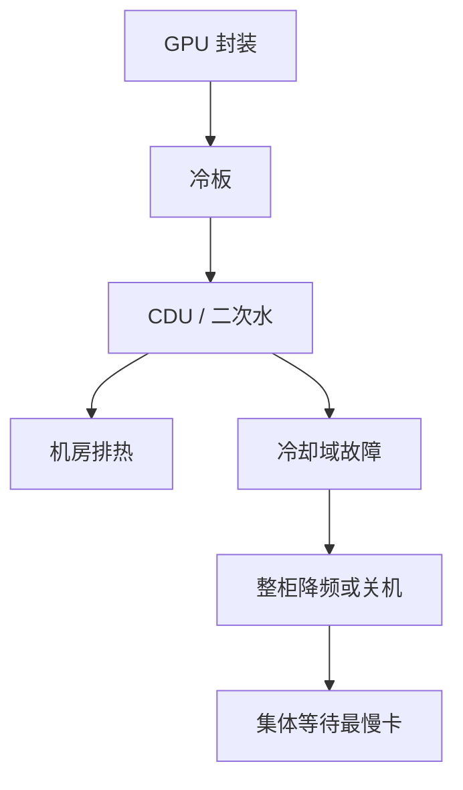
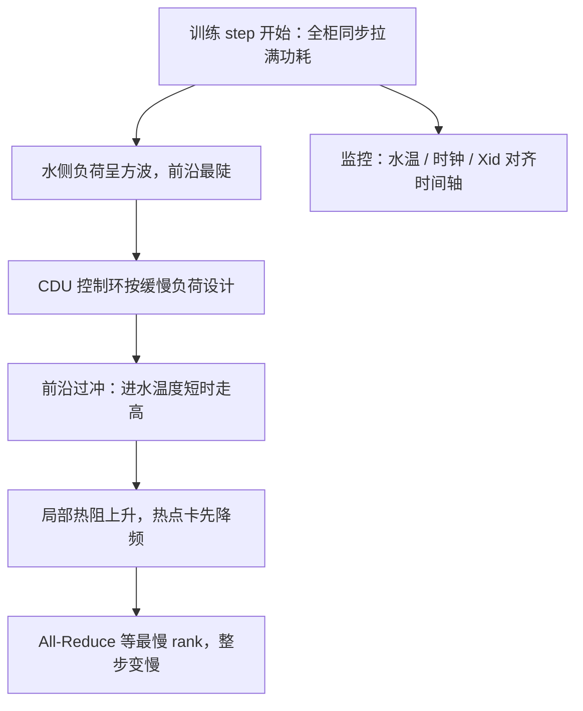

# 液冷与热设计

风冷的极限是机柜能带走的热；液冷换的是传热介质，不是把热力学取消。水侧一停，加速器域比风扇停得更彻底。

<footer>—— 对照高密度 GPU 机柜的冷板 / CDU 公开形态；功率密度见上一课</footer>

[上一课](/llm/rack-power-density) 把卡数上限写成电。本课写热：同样的千瓦必须离开芯片。缺口是液冷如何改变故障模式与维护，而不是科普「水比空气热容大」。超节点产品形态公开为液冷托盘；[NVLink](/llm/nvlink) 域、供电域、冷却域往往重叠成**同一个爆炸半径**。

## 问题

风冷在 15 kW 以上机柜开始吃力：风量、噪声、热通道温度、以及 GPU 因进风不均而降频。冷板液冷把热从封装接到二次水，机柜可以堆到公开超节点那种密度。代价是：泄漏、水质、冷凝、CDU（分配单元）成为单点；维护要从「热插拔风扇」变成「关水、排液、换冷板」。问题是把冷却当成与 NCCL 同级的可用性输入：一次 CDU 故障可以让整柜 GPU 过热关机，step 丢失，等价于一次超大规模集体超时。

数字实例：同样一升流体升温 10 度，水能带走约 42 千焦热量，空气只有约 12 焦——差三千多倍。这就是「风冷 15 千瓦就吃力、冷板液冷机柜能上几十上百千瓦」的物理来源：不是水更「凉」，而是单位流量能搬走的热多得多。

冷热不均同样有害：同一域里一张卡降频，All-Reduce 等最慢 rank，整步变慢。热设计失败表现为通信墙一样的症状，根因在进水温度与流量，不在算法。

一次水 / 二次水、CDU、歧管、冷板是常见分层。本课不画未公开的管路直径与流量公式。规划用厂商允许的进水温度范围与机房能否提供该水为准。

## 方法

把冷却域画进拓扑图：哪些 GPU 共享 CDU、哪些共享歧管。故障演练按域下电，而不是按单卡。监控进水温度、回水温度、流量、泄漏传感器，与 GPU 热点、时钟、Xid 对齐时间轴——热事件往往先于 CUDA 错误。

作业调度避免在冷却余量不足时打满 Tensor Core 训练；降功率模式是保护，应告警为设施事件。液冷不能当「无限密度」：机房排热（冷却塔、外水）仍是屋顶线。PUE 变好只说明风扇电少了，厂级排热仍在。

PUE（电源使用效率）= 机房总耗电 ÷ IT 设备耗电，1.5 就是「每给 GPU 一度电，设施侧再烧半度」。冷板液冷把风扇电省掉、PUE 逼近 1.1，但热本身没有消失——只是从「机房风扇搬」变成「冷却塔和外水搬」，账单只是换了地方。

```mermaid
flowchart TD
  DIE["GPU 封装"] --> PLATE["冷板"]
  PLATE --> CDU["CDU / 二次水"]
  CDU --> FAC["机房排热"]
  CDU --> FAIL["冷却域故障"]
  FAIL --> RACK["整柜降频或关机"]
  RACK --> STEP["集体等待最慢卡"]
```

风冷机柜与液冷机柜混部时，不要按同一套进风假设做容量。也不要把液冷 GPU 插进只有风冷的机架——这不是软件开关。

## 机制

芯片功耗变成热流，冷板靠接触与流量带走。流量不足或气泡导致局部热阻上升，热点降频。同步训练让整柜同时进入高功耗，水侧看到的是方波；CDU 控制环若按缓慢的数据中心负荷设计，会在方波前沿过冲。这与网络拥塞控制环慢于集体脉冲是同一类「控制环跟不上训练时钟」的问题。

```mermaid
flowchart TD
  TR["训练 step 开始：全柜同步拉满功耗"] --> SQ["水侧负荷呈方波，前沿最陡"]
  SQ --> CTL["CDU 控制环按缓慢负荷设计"]
  CTL --> OS["前沿过冲：进水温度短时走高"]
  OS --> HOT["局部热阻上升，热点卡先降频"]
  HOT --> SLOW["All-Reduce 等最慢 rank，整步变慢"]
  TR --> MON["监控：水温 / 时钟 / Xid 对齐时间轴"]
```

直觉类比：同步训练像一支并排跑的队伍，水冷系统是按「散步节奏」调的空调——每次发令枪一响（step 开始），全柜功耗瞬间打满，空调来不及反应，队伍里最怕热的那个（热点卡）先减速，而全队必须等他。降的不是平均性能，是最差那一卡的短板。

泄漏检测必须比电气保护更快：水进电是安全事件。因此液冷域的维护窗口更长，调度要预留，不能按风冷的热插拔 SLA 写训练作业的恢复时间。

浸没式冷却是另一条产品线，故障与维护模型又不同。没有部署就不要把浸没的营销 PUE 写进当前风冷/冷板机房的规划。

## 边界

不要用液冷当节能的唯一理由——主因是密度。不要忽略凝露：进水过冷、机房露点高，冷板会结露。不要把未公开的「某代 120 kW 机柜」数字写进课；用你合同里的规格。下一课 GPU 故障模式包含热相关的 Xid 与静默错误，冷却是诱因之一。

常见误区：初学者容易以为液冷是「水直接浇在芯片上」。冷板方案里，水从头到尾不接触芯片——冷板是一块带流道的金属板贴在芯片封装上，热经金属传给板内水流。真正泡在冷却液里的是另一条「浸没式」路线，故障模型完全不同，两者不要混着讨论。

## 小结

- 液冷支撑功率密度，把故障域收成 CDU / 机柜级。
- 单卡降频通过集体同步变成整步变慢。
- 监控水侧与 GPU 时钟对齐；控制环必须扛住训练方波。
- 维护与 SLA 不能按风冷热插拔来写。
- 出处：公开超节点液冷形态；设施进水温度与泄漏保护实践。
