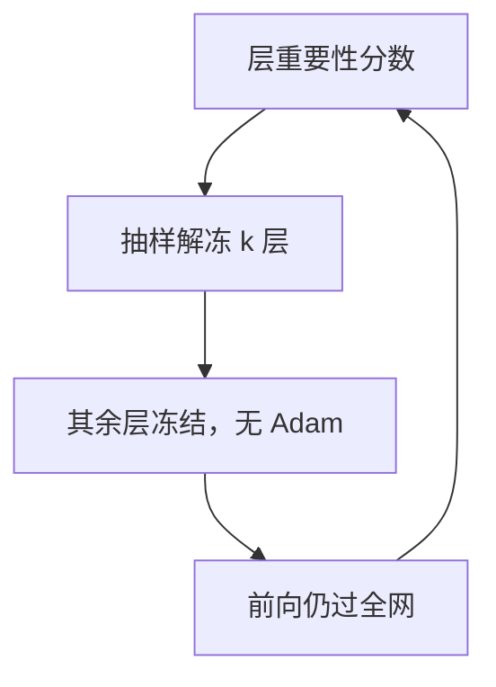

# LISA

同一时刻不必训所有层：按重要性抽样解冻一层或几层，显存接近只训切片，而长期仍能扫过整网。

<footer>—— Pan 等，LISA: Layerwise Importance Sampling for Memory-Efficient Large Language Model Fine-Tuning，2024</footer>

[GaLore](/llm/galore) 在层内压缩优化器状态，所有层仍同时活着。再省一步是**层间时间分片**：大多数层冻结，只有被抽中的层收梯度。Pan、Liu、Diao 等人的 LISA（Layerwise Importance Sampling）按层重要性抽样解冻，而不是永远只训最后几层。缺口：固定「只训顶层」会让底层领域特征不动；同时训所有层又回到全参显存。本课写层抽样，不把 ReLoRA 的秩累积提前讲完。名勿与医学影像 LISA 或其它缩写混淆。

## 问题

全参 SFT 的激活与梯度随深度线性涨（再加检查点策略）。经验上指令梯度在上层更强，但底层仍承担格式无关的特征。永远冻底层，等于线性探针加顶层微调，领域词与长程特征改不到。[领域 DAPT](/llm/domain-adaptation-ft) 尤其吃亏。永远全解冻，显存打满。

需要一种日程：步 $t$ 只让集合 $S_t$ 里的层可训练，$S_t$ 随时间覆盖全体，且更重要的层被抽得更勤。重要性若用均匀，退化成随机层切换；若用启发式（梯度范数、层对损失的贡献），预算集中在真在干活的层。

### 不是 Dropout 层、也不是 Pipeline 切段

Dropout 是前向随机切激活。流水线并行是空间切层到不同卡，每层仍可能在算梯度。LISA 是优化器意义上的冻结：未选中层 `requires_grad=False`，不为其存 Adam。前向仍过全网，以提供正确的条件。

论文报告在指令微调设定下，记忆显著低于全参，质量接近。主张依赖「不是所有层每步都需要更新」——与 LoRA 的低秩假设并列，是另一条稀疏性：层稀疏。

## 方法

为每层维护重要性分数（如近期梯度范数的滑动平均）。每 $K$ 步按分数做有放回或无放回抽样，解冻 $k$ 层（常 $k=1$ 或少数），其余冻结。学习率按全参 SFT（[η 分叉](/llm/lora-vs-full-lr)），因为被解冻的权重是 $W$ 本身，不是 $BA$。可与 [LoRA](/llm/lora) 结合：只在抽中的层上挂适配器——那就变成「层抽样的 LoRA」，配方必须写清。

SFT 契约不变：[仅回复](/llm/response-only-loss)、[模板](/llm/chat-template)。抽样周期 $K$ 过短，层切换像噪声；过长，等于阶段性只训固定切片，与「只训顶层」无异。

实现：冻结层仍参与前向，激活显存未必等比例下降，除非配合检查点只存可训练层附近。LISA 的主省头是优化器状态与可训练层的梯度。声称「显存 ÷ 层数」前要测激活。

## 机制

长期看，权重更新的时间积分可以覆盖所有层，近似全参轨迹的稀疏采样版。短期看，每步是一个极深网络上的浅更新。Adam 的动量在层被冻期间如何处理（清零、冻结保存、还是层切换就丢）会影响稳定性：保存每人一份动量就回到接近全量优化器状态，省不下记忆；丢弃则每层每次被抽中都像冷启动。工程上常为**当前解冻层**才分配 Adam，接受动量间断——这是偏差来源。

重要性抽样把预算给梯度大的层。指令 SFT 上往往偏向上层，底层更新稀。若任务其实要改嵌入与底层（新特殊 token、领域词），应给底层设抽样下限，避免被分数饿死。

GaLore 与 LISA 可叠：抽中的层再对梯度做低秩投影。复杂度上升，只在显存极端时才值得同时开。

## 边界与工程取舍

预训练从随机初始化需要所有层密集更新，LISA 不适合当主预训练算法。短 SFT、数据少时，层切换引入的噪声可能大于收益，不如 LoRA。多卡同步：各 rank 必须抽同一组层，否则梯度对不齐。评测仍要通用能力：若抽样长期忽略底层，遗忘模式会像「顶层过拟合」。

下一课 ReLoRA 用时间累积**秩**；LISA 用时间累积**层覆盖**。二者都是时间换容量，对象不同。

## 小结

- LISA 按重要性抽样解冻少数层，降低优化器与梯度显存。
- 前向仍过全网；未解冻层无 Adam。
- 学习率按全参；底层可设抽样下限以免饿死。
- 动量在层切换时通常不保留，是偏差来源。
- 不适合需要全层密集更新的预训练。
- 出处：Pan 等，LISA: Layerwise Importance Sampling for Memory-Efficient LLM Fine-Tuning，2024。
