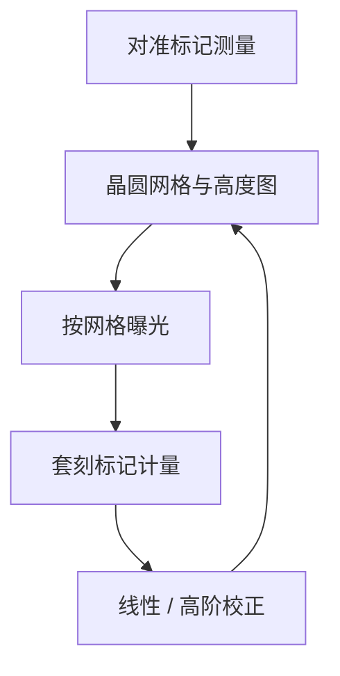

# 套刻 Overlay 与对准

多重图形把 $k_1$ 压低之后，限制成品率的往往不再是「能不能分开两条线」，而是两层或两次曝光之间能不能对准到纳米级。

<footer>—— 归纳自 ASML 对浸没平台与多重图形的公开论述（如 NXT:1950i 一代对 overlay 与 DPT 的产品说明）</footer>

分辨率回答的是同一层里相邻图形的最小半节距。套刻（overlay）回答的是：这一层图形相对上一层（或同层另一次曝光）的位置，偏离设计意图多少。对准（alignment）是测量标记、估计晶圆网格与掩模位置的动作；套刻是曝光之后用专用标记量出来的残差。两者常被口语混用，工程上必须分开。低 $k_1$ 与 [LELE](/llm/lele-multipattern) 把套刻从「后道也要管」抬成与 CD 同阶的约束。

## 问题

一层多晶硅要落在有源区上，通孔要落在金属线上，双重曝光的两套线条要拼成目标节距。位置误差来自扫描机工件台、镜头畸变、掩模、晶圆在薄膜应力与热载下的变形、以及计量本身。ASML 把贡献源分成设备、掩模与工艺。只把套刻理解成「工件台走不准」，会漏掉镜头指纹、硅片翘曲与刻蚀引起的标记不对称。

计量语言也容易误导。单机套刻（single-machine overlay）、匹配套刻（matched-machine overlay）、产品上套刻（on-product overlay）不是同一个数。前者在受控标记与相近工艺条件下刻画机台；后者包含工艺变形与层间材料。把产品规格书里的机台 overlay 直接当成芯片上两层的套准，会过于乐观。

### 对准测量的是标记，不是器件图形

对准传感器读的是晶圆与掩模上的专用光栅或结构，估计平移、旋转、放大与高阶网格。ASML 公开材料中的 SMASH、ORION 等传感器，用多波长减轻工艺层对标记对比度的破坏。测量点越多，对工艺引起的晶圆变形拟合越好；双工件台把测量放到曝光并行的另一张台上，才能在不牺牲产能的前提下加密网格。标记若被 CMP 或薄膜弄得不对称，对准会偏，套刻看起来像「机台坏了」，根子在工艺。

套刻残差通常报矢量场：每场、每片上的 $(dx,dy)$。均值与 $3\sigma$ 或同等统计必须说明是单机、匹配还是产品上。不要把不同定义的纳米数排在同一张表里比「谁更准」。

## 方法

曝光前，测量台（TWINSCAN 的第二工件台）建立晶圆表面高度图与对准网格；曝光台按该网格扫描，并叠加镜头与掩模的已知校正。曝光后，套刻量测机在专用套刻标记上读出相对上一层的位移。校正环可以是线性（放大、旋转、平移），也可以是高阶场内、场间模型。ASML NXT 平台用编码器网格替代长光程激光干涉仪，降低气流与热对位置测量的敏感——这是设备侧套刻的骨干，不是胶化学。

对 [LELE](/llm/lele-multipattern)，两次曝光的套刻误差会直接改局部节距：一条线属于掩模 A，相邻线属于掩模 B，相对位移变成 CD/节距误差。对 [SADP](/llm/sadp-saqp)，成对线条由同一 spacer 自对准，层内半节距对套刻不敏感，但整组图形相对有源区或切线层仍然要套。套刻预算必须按图形策略拆开，不能对所有层用同一个纳米配额。

### 三种套刻数字

单机套刻刻画同一台设备、通常同一卡盘上的重复能力。匹配套刻刻画两台设备之间换片后的残差，决定产线能不能混跑。产品上套刻叠加工艺变形、标记质量与层间材料。ASML 浸没产品页还给出与 EUV 机台的 cross-matching on-product overlay（例如 NXT:2000i / NXT:2050i 公开写过 2.5 nm 量级的 DUV–EUV 交叉匹配）。引用时要写清是哪一种。本篇不把这些规格换算成任何节点良率。

## 机制

光学上，套刻与分辨率正交：即使空中像把线条分开，错位的通孔仍会使电阻或漏电变坏。多重图形之后，套刻进入成像方程：LELE 的有效节距误差 $\Delta p$ 与两次曝光的相对位移同阶。焦深很浅时，调平误差会通过倾斜与场曲变成场内套刻与 CD 的耦合，所以高度图与对准网格必须一起测。浸没水层与热载会改变晶圆与工件台的瞬态变形，NXT 一代把热与编码器设计写成 overlay 的主贡献项。

工艺贡献往往大于新手预期。薄膜应力使晶圆呈碗状或鞍状；刻蚀与 CMP 使对准标记侧壁不对称，传感器读出伪位移。这些项不能靠「再买一台更准的扫描机」完全消掉，需要工艺与标记设计。计算光刻不直接减小套刻，但 SMO/OPC 改变的是图形对套刻的敏感度：某些切线方案在套刻偏移下 CD 崩溃更快。

对准成功不等于套刻合格。对准把晶圆坐标系挂到机器上；套刻是这一层相对另一层的事后计量。中间隔着镜头畸变漂移、掩模热膨胀与扫描同步误差。

### 与 CD 控制的分工

CD 控制管线宽均值与均匀性；套刻管位置。两者在工艺窗里耦合：离焦会同时改 CD 与有效套准（通过侧壁与成像位置）。计量上必须分开：CD-SEM 与套刻光学是不同工具。把所有电性失效都叫做「光刻没套准」，会把剂量、胶厚与刻蚀偏置一起误诊。

## 边界与工程取舍

套刻规格随层而变。接触孔对前层金属的要求，与非临界植入层不同。EUV 与 DUV 混跑时，还要看 cross-matching，而不是只看浸没机自己的单机套刻。ASML 公开故事里写过：NXT:1950i 一代曾给出 2.5 nm overlay 与超过 200 wph 的产能组合；后续 NXT 浸没把 overlay 与产能继续往前推。那些数字是设备规格与演示条件，不是某条 7 nm 产线的良率。

不要发明「overlay 小于 CD 的 1/3 则良率 90%」这类换算。预算怎么分，取决于设计规则、多重图形策略与可接受的电性窗口，只能由具体工艺包给出。本篇只保留：对准是测量，套刻是层间位置残差，多重图形让后者成为一阶约束。

出处中的纳米数来自 ASML 公开产品与技术故事，带机型与指标定义。不要把 2.5 nm、1 nm 等字样复制成「所有浸没机、所有层」的宇宙常数。

## 小结

- 对准是曝光前对标记与网格的测量；套刻是层间（或两次曝光间）的位置残差。
- 贡献来自设备、掩模与工艺变形；标记不对称会造成伪套刻。
- 单机、匹配、产品上、以及 DUV–EUV 交叉匹配，定义不同，不可混表。
- LELE 把套刻写成节距误差；SADP 层内自对准，层间仍要套。
- 双工件台用并行计量加密网格，是产能与套刻同时要的架构。
- 本篇不把 overlay 规格换算成节点良率。
- 出处：Mack 对套刻作为独立工艺约束的讨论；ASML TWINSCAN / NXT 公开产品页与 *TWINSCAN: 20 years of lithography innovation*。
