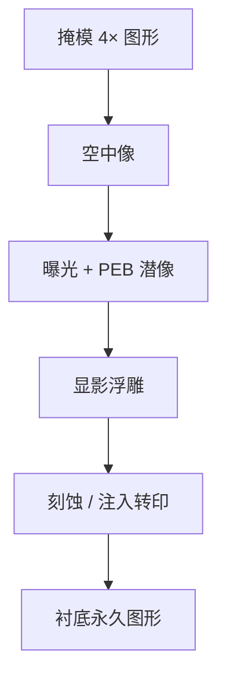

# 掩模、光刻胶、曝光、显影、刻蚀转印

光刻是把掩模上的图案，经光学成像写入光敏材料，再由显影与后续刻蚀把这层浮雕转成衬底上的永久结构。

<footer>—— 归纳自 Chris A. Mack, Fundamental Principles of Optical Lithography, Wiley, 2007，开篇对图形转印链的定义</footer>

扫描仪一次曝光并不直接「刻出晶体管」。它只在光刻胶里写下潜像。真正落到多晶硅、金属或介质上的线条，要经过掩模、涂胶、对准曝光、显影，再进入刻蚀或离子注入。Mack 把这条链拆成空中像、潜像、显影浮雕、衬底转印四段。任何一段的反差不够，前面的分辨率数字都兑现不成器件。本篇按工艺顺序把这条链钉住，并标明每一步改的是哪一个物理对象。

## 问题

讨论分辨率时，人们常停在晶圆表面的空中像：$I(x,y)$ 由照明、投影物镜与掩模衍射决定。空中像不是器件。胶有厚度、吸收、酸扩散（化学放大胶）与显影速率曲线；刻蚀有横向侵蚀与微负载。同一张空中像，换胶或换刻蚀食谱，临界尺寸（CD）可以走出完全不同的偏置。问题因此是：图形从掩模到硅片，经过哪些可分离的步骤，每一步保存或损失的是什么信息。

若把「光刻」理解成只有曝光，套刻、胶厚均匀性与刻蚀偏置都会被算到镜头头上。产线上出 CD 偏差，必须先问：偏差发生在空中像、潜像、显影后线宽，还是刻蚀后线宽。四段用不同的计量。

### 掩模不是晶圆的 1:1 照片

现代扫描投影以 $4\times$ 缩比为主：掩模（reticule）上的图形线性尺寸是晶圆目标的四倍，曝光场典型为 26 mm × 33 mm 量级（ASML 浸没机公开规格）。铬层定义透与不透；相移层、OPC 与 SRAF 已经把掩模做成计算光学的一部分，而不是设计版图的放大复印。掩模误差因子（MEF）在低 $k_1$ 时大于 1：掩模上 1 nm 的 CD 误差，会在晶圆上放大。写掩模、检验与 pellicle 保护，都属于光刻链的第一段，只是发生在掩模厂而不是晶圆厂涂胶单元。

步进机时代常见 $5\times$ 缩比；扫描机主流是 $4\times$。缩比降低掩模 CD 难度、放大掩模缺陷的相对影响。不要把掩模坐标与晶圆坐标当成同一张图来对套刻。

## 方法

标准正胶流程可以写成一条状态机。先涂覆光刻胶并前烘，赶走溶剂、定膜厚。晶圆进入扫描机：[对准](/llm/litho-overlay) 与调平之后，空中像把剂量 $E(x,y)$ 写进胶。化学放大胶还要做曝光后烘（PEB），让光酸催化脱保护反应扩散出可显影的潜像。显影液溶掉（正胶）曝光区，得到三维浮雕。硬烘或等离子体处理之后，以胶为掩模做反应离子刻蚀或注入，再去胶。负胶或负显影（NTD）只改变「谁留下」，不改变「先像后转印」的顺序。

Mack 强调空中像到潜像是曝光与化学反应，潜像到浮雕是显影动力学，浮雕到衬底是刻蚀或注入的转移函数。光学工程师优化的是空中像反差与焦深；工艺工程师优化的是胶对比度 $\gamma$、PEB 扩散长度与刻蚀偏置。把 OPC 只当成「把线条画粗一点」，忽略胶与刻蚀，是把后两段折叠进了第一段。

### 化学放大胶把「曝光」拆成光子与酸

DUV 以降的主流胶是 CAR：光子产生光酸，PEB 时酸催化许多脱保护反应，一个光子对应许多溶解性翻转。灵敏度够了，才能在 KrF/ArF 有限脉冲能量下达到剂量。代价是酸扩散会糊掉潜像的高频，成为 $k_1$ 预算里的一部分。EUV 光子更少、能量更高，随机效应另论；本篇的 DUV 链只要记住：显影看到的不是空中像的灰度图，而是酸浓度经过扩散与中和之后的阈值切割。

## 机制

空中像的调制传递决定「光学能不能分开两条线」。胶的溶解速率随剂量陡峭变化时，阈值切割能把中等反差的空中像变成陡壁浮雕——这是胶对比度对 $k_1$ 的贡献。显影后的线宽还不是栅极线宽：刻蚀会吃掉或留下一层偏置，侧壁角度决定最终 CD。多重图形里，第一次刻蚀的结果是第二次光刻的衬底形貌，反射与涂胶均匀性都会变。所以 [LELE](/llm/lele-multipattern) 不是两次独立的「曝光」，而是两次「曝光–刻蚀」串联。

剂量与焦点构成工艺窗：在可接受 CD 与侧壁的区域内，剂量轴与焦轴围出一块面积。窗的大小由空中像、胶与刻蚀共同决定。只报光学焦深而不报胶厚与 PEB，窗会看起来比产线大。扫描仪的职责是把每场的剂量与焦点重复放进这扇窗；[双工件台](/llm/twinscan-dual-stage) 把调平与对准从曝光时间里拆出去，不改变窗的物理定义。

正胶：曝光区在显影中溶解。负胶或负显影：留下曝光区。同一套光学，tone 一反，OPC 与 SRAF 规则都要重做。不要把文献里的「亮场/暗场」与正负胶随口互换。

### 刻蚀转印是光刻的最后一次「成像」

把胶图形当成理想二元掩模去刻硬掩模或衬底，只在胶够厚、选择比够高时成立。先进节点胶更薄，往往先转到 SOC/SiARC 或氮化物硬掩模，再往下刻。转移函数可以放大或缩小 CD，也可以把线边缘粗糙度（LER）部分滤掉或恶化。SADP 的 spacer 厚度在这一段定义，而不是在曝光空中像里定义。讨论「光刻分辨率」时若停在显影后 SEM，会漏掉转印对节距与 CD 的最终投票权。

## 边界与工程取舍

这条链不包含器件电学。栅氧厚度、掺杂与金属电阻率不在光刻步骤里决定。计量上，显影后（ADI）与刻蚀后（AEI）的 CD 必须分开报；把 AEI 目标当成曝光机的分辨率规格，是把刻蚀偏置算进了镜头。掩模、胶、曝光、显影、刻蚀分属不同供应商与不同机台，故障隔离必须按段进行。

计算光刻（OPC、SMO、ILT）作用在掩模与照明，目标是让空中像在胶与刻蚀之后落到设计意图。它们不替代涂胶均匀性或刻蚀腔室匹配。浸没水、气泡与浸没缺陷发生在曝光段与胶表面的界面，属于流程卫生，不是瑞利公式的一项。

不要用某一代节点的良率来证明「流程有五步所以一定差」。良率是缺陷密度、套刻与电性的积分，本篇只描述转印链。出处里的 Mack 与 ASML 公开材料也不把良率写成波长或步骤数的函数。

## 小结

- 光刻链是掩模 → 空中像 → 潜像 → 显影浮雕 → 刻蚀/注入转印，曝光只是其中一段。
- 现代扫描投影以 $4\times$ 缩比为主；掩模已含 OPC/相移，不是版图的单纯放大。
- DUV 化学放大胶把光子与酸扩散分开；显影看到的是阈值化潜像。
- ADI 与 AEI 的 CD 不同；刻蚀偏置必须从「光刻分辨率」里拆出去。
- 工艺窗是剂量–焦点平面上胶与刻蚀可接受的区域，不是镜头焦深的同义词。
- LELE、SADP 都在这条链上增加刻蚀与再涂胶，而不是只加一次快门。
- 出处：Mack, *Fundamental Principles of Optical Lithography*, Wiley, 2007；ASML 对 $4\times$ 缩比与曝光场的公开产品说明。
