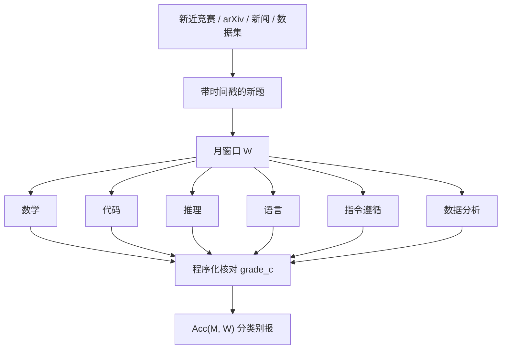

# LiveBench

    
要同时挡住测试集污染，又避开 LLM 裁判与众包偏好的偏差，基准需要三件事：题从新近公开的信息源定期更新，答案按客观标准自动打分，任务覆盖足够广且仍然很难。

    <footer>—— White, Dooley, Roberts, Pal et al., LiveBench: A Challenging, Contamination-Free LLM Benchmark, ICLR 2025, arXiv:2406.19314</footer>

静态榜把题冻住，预训爬虫与题解站迟早把准确率变成记忆。[动态基准](/llm/live-benchmarks) 用时间窗对抗这一点，但许多新榜改用 LLM 或众包当法官，难度一高，法官自己先崩。White、Dooley、Roberts、Pal 等人提出 LiveBench：按月从新近数学竞赛、arXiv、新闻与数据集出题，六类任务——数学、代码、推理、语言、指令遵循、数据分析——一律用客观标准自动评分，不用另一个模型打偏好。论文在 ICLR 2025 以 Spotlight 发表。它与 [LiveCodeBench](/llm/livecodebench) 同属「活」的协议，但 LiveCodeBench 专攻带日期的编程竞赛；LiveBench 是多任务套件，并包含从 Big-Bench Hard、AMPS、IFEval 加难而来的去污版。本篇写月更与客观分如何改变比较方式，以及总分不该吞掉类别。

## 问题

污染与裁判是两件不同的病。污染让旧题上的涨分无法解释；LLM 裁判在难题、长答案、有标准答案却表述多变的任务上不稳定，还会把文风、长度、自我偏好写进名次。Arena 一类众包适合产品体感，不适合当科学研究的唯一因变量。LiveBench 的设计目标是：经常换题，使训练截止早于题源日期的模型原则上没见过；评分函数是程序，不是法官模型。发布时即使最强闭源与开源（当时从不到十亿到四千亿参数量级）也未把总分推到轻松饱和，论文报告顶尖准确率仍明显低于满分——这保证尺子暂时还有刻度。

月更的代价是可复现性。今天的 65 分与三个月后的 65 分可能来自两套题。协议必须把分数写成 $\mathrm{Acc}(M,W)$，窗口 $W$ 是题的收割月。只报「LiveBench 分」而不报版本，等于把动态榜又冻成一个被污染的品牌名。社区排行榜若滚动显示最新月，论文则应引用冻结的发布包，与 LiveCodeBench 的共同窗口逻辑相同。

### 客观标准把任务限制在可核对

不是所有能力都能自动打分。开放写作、多轮辅导、含糊用户意图，LiveBench 故意少做。它能做的是：数学与代码的可执行或可匹配答案、推理谜题的唯一解、指令遵循的程序谓词、表格与数据操作的结构化输出、语言任务里可核对的转换。这与 [IFEval / IFBench](/llm/ifbench) 共享「谓词评分」，与 Arena 互补。缺的那一块应由专门的主观或对抗研究补，而不是强迫 LiveBench 加一个 LLM 法官「补全」。

从旧基准加难而来的任务，仍可能与旧题同构。月更降低原文泄漏，降不掉「同一推理模板换数字」。评测前仍应对新题做与训练集的重叠扫描；动态是先验更干净，不是定理上的无污染。

## 方法

题源按类别绑定新鲜事件：新的竞赛场次、新挂出的预印本、新的新闻与公开表。每题带时间戳与客观核对器。六类分开报，再平均成总分。类别内部有多个任务（论文规模约十余个任务，随后扩展），避免单一题型劫持总分。代码类与 LiveCodeBench 可能同源竞赛，但 LiveBench 的代码任务是套件的一翼，协议以该项目的月包为准，不要把两个榜的 pass 率横比成一个数。

评分不用生成式法官。数学对标准答案；代码跑测试；指令遵循跑检查函数；数据分析核对企业级表格操作的结果对象。这使难题在人类也觉得费解时仍然可机打——法官模型在难题上的方差，正是作者要避开的。公开题面、代码与模型作答，便于复现，也加速污染：月更必须真的换题，而不是只换排行榜皮肤。

$$
\mathrm{Acc}(M,W)=\frac{1}{|C|}\sum_{c\in C}\frac{1}{|Q_{W,c}|}\sum_{q\in Q_{W,c}}\mathbf{1}\bigl[\mathrm{grade}_c(M(q),y_q)=1\bigr]
$$

$C$ 是六个类别。类别不加权时，数学涨、指令遵循跌，总分可以不动——必须看雷达图。工具（代码执行、检索）若允许，应分表；默认是否带工具以官方脚本为准。解码温度、pass@k 同样要钉死，否则测试时计算被偷运进基座比较。

### 与 IFEval、LiveCodeBench、污染检测如何分工

IFEval 冻结了一组公开谓词，适合回归门禁，也容易被 RL 对着 verifier 过拟合；IFBench 留出新约束。LiveBench 的指令遵循类是持续换题的客观套件，可当作第三条时间轴，不替代留出测试。[训练—评测污染检测](/llm/eval-contamination) 仍要对每月新包跑一遍：新竞赛题可能是旧题换皮。LiveCodeBench 按竞赛日切、强调自修复与执行场景；LiveBench 代码类通常更短、嵌入多任务平均。HumanEval 一类静态函数题继续测泄漏极高的旧分布。产品结论需要几行并列，而不是「LiveBench 第一所以编码最强」。

## 机制

月更改变实验室行为。针对固定编号调提示的收益下降，因为下个月题面变了；针对**任务生成器**过拟合的收益仍在——如果每月数学题都是同一类竞赛风格。作者计划持续加更难任务，使饱和后仍有区分力，这是动态基准的第三层（换分布，不只换题号）。客观评分使排行榜可脚本化、可进 CI，适合作为发布门禁的一列，但门禁必须锁窗口，否则每次 CI 跑的是不同考试。

公开作答有双重效应：社区能做错误分析，蒸馏者也能把作答当监督。LiveBench 选择公开，是用月更换透明度。比较闭源系统时，训练截止往往不可审计，时间切分从证明变成声明——与所有动态榜相同。带浏览的模型若直接搜到当月题解，应算工具协议下的分，并与禁网闭卷分拆开。

「Contamination-free」是论文标题的志向。后续版本有时改称 contamination-limited，更诚实：无法证明未来语料不含改写。阅读分数时把它当成限制污染的协议，而不是无污染证书。

### 总分会掩盖指令遵循与数据操作

六个类别对产品的权重不同。助手失败经常是格式与约束，不是不会微积分；数据分析失败是列名与单位，不是不会写 Python。只宣总分领先，可能在 IF 类落后却被数学托起。发布模型卡时应贴类别表，并注明对应 LiveBench 的哪一个月包。与 [MMLU](/llm/mmlu) 的关系是：MMLU 测静态学科记忆，LiveBench 测新鲜、可核对的综合；两者同时跌或同时涨才值得讲「全面进步」。

## 边界与工程取舍

客观可核对排除了开放对话。多模态、长上下文仓库工程、浏览多跳，要另接 [SWE-bench](/llm/code-bench)、[BrowseComp](/llm/browsecomp)、长上下文尺子。月更提高主办方负担，题质可能波动；个别月包过易或过难会让曲线跳，不应解释成能力跳。社区分叉（自己加任务）必须改名，以免 LiveBench 一词失去窗口含义。

不要把 Arena 名次与 LiveBench 名次的差解释成「一个造假」：一个测偏好，一个测可核对任务，相关但不是同一随机变量。不要用过期月包给新模型「刷」与旧论文可比的分却不声明。门禁用途下，冻结 $W$ 比永远追最新更可复现。

赞助与作者单位应写入引用，不影响客观核对器的数学，但可能影响任务选择。复现实验应跑官方脚本与官方月包，而不是再实现一套「类似 LiveBench」的内部题。

## 小结

- LiveBench（White 等，ICLR 2025）用月更新题加客观自动评分，同时针对污染与 LLM 裁判偏差。
- 分数必须带窗口 $W$；六类应分报，总分会掩盖指令遵循与数据任务。
- 与 LiveCodeBench、IFEval/IFBench、MMLU、Arena 互补，不互相替代。
- 公开题与作答服务复现，也加速泄漏，因此月更必须真实发生。
- 动态是限制污染，不是无污染证明；仍要做重叠审计。
- 门禁应冻结月包与解码设置，避免每次 CI 换考卷。
- 出处：White et al., *LiveBench*, ICLR 2025 / arXiv:2406.19314；对照 Jain et al., LiveCodeBench；Zhou et al., IFEval。
