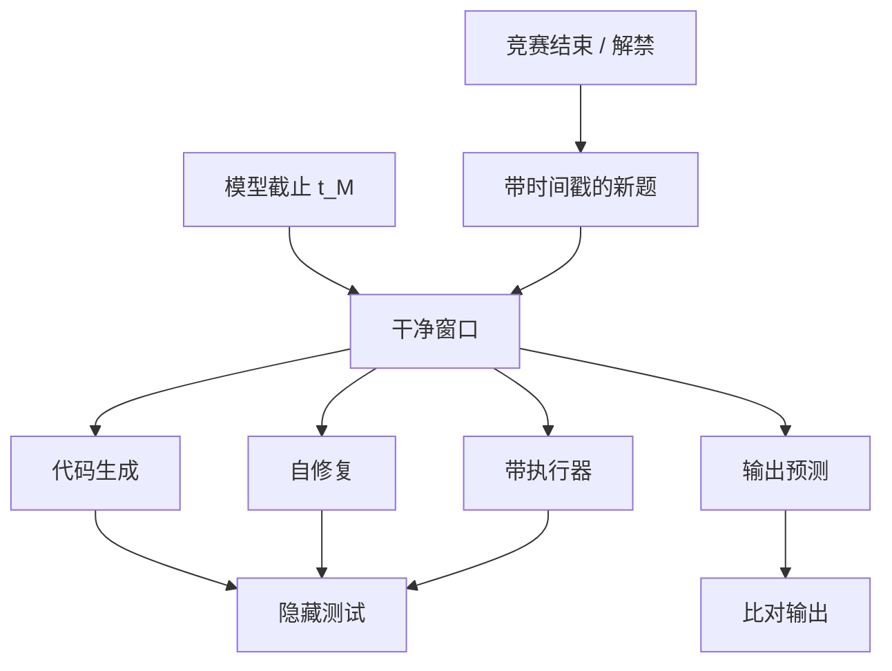

# LiveCodeBench

代码榜一旦冻结，题解博客和 GitHub 副本就会赶在下一轮预训练之前把题喂给模型；按竞赛日期收题，评测窗口才能落在训练截止日期之后。

<footer>—— LiveCodeBench 把「活的编程比赛」写成持续去污协议</footer>

HumanEval、MBPP 曾经够用，因为模型几乎写不出能过隐藏测试的函数。题量小、题面短、互联网复制极广之后，代码准确率变成污染与记忆的混合体。LiveCodeBench 的做法属于[动态基准](/llm/live-benchmarks)：从 LeetCode、AtCoder、Codeforces 等平台持续收割新场次，按题目发布日期切窗口，只让训练截止之后的题进入当期评测。Jain 等人还不止测「从零生成一遍」，而是把同一批新题做成多种场景——生成、自修复、测试输出预测、执行——避免单一 pass@k 概括编码智能。本篇讲日期协议如何成立、场景为何要拆，以及它仍覆盖不了的仓库级工程。

## 问题

函数级基准的失败模式有三。第一，泄漏：标准答案以 gist、题解站、教材的形式进入语料，模型复述签名与循环结构即可过测试。第二，饱和：几十道短题被刷到 90% 以上，分差小于解码温度。第三，任务过窄：真实开发是读错误信息、改已有代码、写测试、在仓库里找调用点，不是在空文件里实现 `twoSum`。前两件事可以用时间切分缓解，第三件必须换基准，见 [SWE-bench Verified](/llm/swebench-verified)。

LiveCodeBench 主攻前两件。它假设：竞赛平台在某日 $t$ 才公开的题，截止日期早于 $t$ 的模型不应在预训练里见过题面。该假设对开源、有卡片的模型近似可检查；对持续训练、会检索网页的系统会变软。因此协议必须同时声明窗口与工具：是否允许上网搜同场题解，是否允许本地编译执行。执行器是编码评测的正当工具，搜索题解则把动态基准打回泄漏。

### 竞赛题仍是题，不是产品代码

竞赛风格强调算法与边界条件，仓库风格强调依赖、构建与他人意图。LiveCodeBench 分数高，不蕴涵能修 Kubernetes 工单。它的合法性在于：竞赛有稳定的新题水龙头、有测试用例、有相对明确的对错，适合做时间切分的自动考场。用它代理「软件工程能力」是范畴错误，用它代理「未被污染的算法代码生成」才对口。按日期切分前，仍应对题面做 [n-gram 扫描](/llm/contamination-ngram)：有的竞赛题是旧题换皮，或与教材例题同构。动态不等于免疫，只是把新公开文本的先验污染压下去。

## 方法

收题流水线监视竞赛结束或题目解禁时间，拉取题面、时间限制、官方或社区测试。每道题带时间戳 $\mathrm{time}(q)$。对模型 $M$ 的截止 $t_M$，当期集合为 $\{q:\mathrm{time}(q)>t_M\}$。不同模型因 $t_M$ 不同，可比集合不同——这是动态协议的代价。实务上常报两个数：在「共同窗口」（所有对比模型都能测的最近时段）上的分，以及各自最大干净窗口上的分。只报后者会让晚发布的模型看起来更难、分数更低，造成不公平的「越新越弱」幻觉。

评分以执行准绳。生成场景：模型写程序，在隐藏测试上跑，计 pass@1 或 pass@k。自修复：把第一次的失败日志喂回去再生成。测试输出预测：给定程序与输入，问输出，考的是心智执行而非合成代码。执行场景则把解释器交给模型当工具。四条曲线分开画，才能看出「会写但不会改」「会写但不会模拟」。

$$
\mathrm{pass@}k=1-\frac{\binom{n-c}{k}}{\binom{n}{k}}
$$

其中 $n$ 次采样中有 $c$ 次通过。报 pass@k 必须钉死 $n$、温度与核采样，否则测试时计算被偷运进基座比较，见[测试时缩放](/llm/test-time-scaling)。

### 共同窗口与各自窗口要并排

论文表格若只列「我们在自己 cutoff 之后的题上 52%」，读者无法知道对手在同一批题上是多少。主办方应发布按月或按场次的分桶准确率，使后来者可以重切窗口。这比维护一个永远最新的总分更科学：总分混合了不同难度的月份，竞赛难度并不平稳。分桶还能暴露「某月题特别难」造成的排名抖动。

## 机制

时间切分切断的是「题面作为训练 token」的通道，切不断「算法模式作为分布知识」的通道。模型可以从未见过某道图论新题，但仍会写 DFS，因为训练里有成千上万道旧图论。LiveCodeBench 测的是新题面下的组合与实现，不是从零发明算法。若某月题目风格突然转向交互题或特殊评测器，分数下跌可能来自分布偏移而非污染消失——要看同窗口上人类或强工具基线是否也跌。

多场景拆分针对的是单一生成指标的不可识别性。pass@1 低，可能是语法差、算法错、或测试太狠。自修复若大幅回升，说明模型能读编译器，缺的是一次写对。输出预测若很差，说明执行痕迹没有内化，写对代码可能靠的是模板。工具执行若再抬一截，说明瓶颈在心智模拟，产品上应默认给解释器而不是把「无工具分」当能力上限。

### 隐藏测试与公开样例的间隙

竞赛常给样例输入。模型过样例、不过隐藏测试，是经典过拟合。评测应禁止把隐藏测试喂进提示，并防止模型通过多次提交探测（若接口类似在线评测）。本地复现需要发布测试套件时，延迟发布或哈希承诺可以减少即时泄漏，但延迟一过，该窗口对后续模型贬值。这是动态代码榜的固有半衰期，只能靠持续收题续命。允许执行器时，要把标准库、网络、文件系统权限写进协议。能 pip install 再下载题解的「编码智能体」，测的不是 LiveCodeBench。沙箱是评分器的一部分，不是运维细节。

## 边界与工程取舍

平台条款与版权限制收题范围。不能假定所有竞赛都允许把题面二次发布；内部评测可以按日期收、不公开题，外部论文必须遵守许可。这会导致公开 LiveCodeBench 只是平台子集，与私有竞赛池不可比。

难度与语言分布不均。某月可能全是实现题，某月全是数论；Python 解最多，系统编程题少。跨窗口比较趋势时，应做难度归一或至少报告题型构成。多语言生成要用对应编译链，不能只跑 Python 再宣称代码能力。

它测不到：多文件重构、性能测试、可读性、安全补丁、与人对着 issue 讨论。SWE-bench 一类补的是这些。也不测规范证明或竞赛级数学构造，那是 [AIME](/llm/aime-contest-math) 与证明器的领域。LiveCodeBench 在能力地图上的位置是：干净的、可执行的、算法向的代码生成与修复。

污染扫描仍要对历史窗口做，否则无法解释旧论文里的 HumanEval 数字。Canary 可埋进内部题面，检测评测集是否回流。对闭源、无 cutoff 的聊天产品，LiveCodeBench 分数只能当「今天的系统表现」，不能当「参数里的无污染能力」。pass@1 与 pass@10 之间的缺口，写的是采样是否买得到正确实现。缺口大，说明模型「会」但一次写不对，产品上更该给重试与测试反馈，而不是只升级基座。缺口小且都低，才是算法能力不够。

## 小结

- LiveCodeBench 按竞赛日期切窗口，减轻静态代码榜的泄漏与饱和。
- 必须同时报共同窗口与各自干净窗口，并按场次分桶，避免难度漂移冒充能力变化。
- 生成、自修复、输出预测、带执行器应分列，pass@k 须钉死采样预算。
- 时间切分不断算法先验；同构旧题仍需 n-gram 与人工抽检。
- 沙箱权限属于协议；能上网搜题解则动态性作废。
- 函数级竞赛不是仓库级工程，SWE-bench 是另一把尺。
- 出处：Jain 等人提出的 LiveCodeBench 持续收题与多场景协议。
