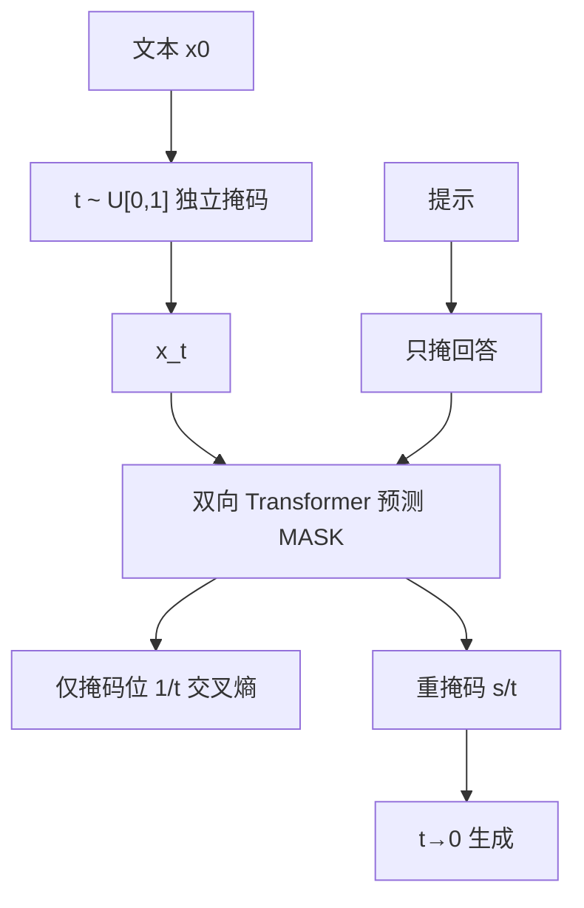

# LLaDA

    
我们质疑「大模型能力必须绑在自回归上」：从零训练的掩码扩散，走预训练加 SFT，就能做出有原则的生成推断。

    <footer>—— Nie et al., Large Language Diffusion Models, arXiv:2502.09992</footer>

自回归因式分解支撑了当下几乎所有通用语言模型。Nie、Zhu、You 与李崇轩等把掩码扩散做到 $8$B：前向按比率 $t\sim U[0,1]$ 独立掩码，Transformer 无因果掩码、一次预测所有 MASK，损失只在掩码位上、权重 $1/t$，构成负对数似然上界。预训练 $2.3$T token、$0.13$ 百万 H800 GPU 小时；SFT $450$ 万对。LLaDA $8$B 在多数零/少样本任务上超过 LLaMA2 $7$B，与 LLaMA3 $8$B 同档；GSM8K（$4$-shot）$70.7$ 对 LLaMA3 的 $53.1$。逆向作诗上超过 GPT-4o（$42.4$ 对 $34.3$）。项目页 ml-gsai.github.io/LLaDA-demo。它把 [MDLM](/llm/mdlm) 一类目标接到标准 LLM 流水线，而不是再做一个 $110$M 的困惑度模型。

## 问题

作者的论点是：可扩展性、指令跟随、上下文学习，首先来自「用足够表达的模型做似然训练」与 Transformer，而不是来自 $p(x^i\mid x^{\lt i})$ 这一条因式。视觉里扩散 Transformer 已经能规模化；语言若只有自回归能出现这些能力，需要实证。自回归的代价也具体：逐 token 解码；左到右导致逆向诅咒——正向「A 的作者是 B」学不会「B 写了 A」。

掩码语言模型用固定掩码率，不是完整生成模型，也没有与 LLM 相同的预训练—SFT 故事。要把扩散当成 LLM，必须：随机掩码率、$t$ 从 $0$ 到 $1$，似然界，以及只掩回答的条件 SFT。

### 双向注意力换掉的不只是生成顺序

LLaDA $8$B 刻意不用分组查询注意力：与 KV 缓存不兼容，键值头数与 LLaMA3 $8$B 不同，注意力参数更多，于是缩小 FFN 以保持总参数可比。词表因自有分词略有差异。架构「像 LLM」不等于可以套用自回归推理栈。评测协议与 LLaMA2/3 在作者复现下对齐，数据封闭，领域强弱会反映配比，不能把 GSM8K 领先写成掩码扩散的定理。

预训练 $2.3$T，LLaMA3 $8$B 公开写的是约 $15$T。同尺寸对比不是同数据量对比。原文用自建 ARM、同数据做缩放图，那条才是「扩散对自回归」的干净轴；与 LLaMA3 的表是产品级参照。

## 方法

前向：每个 token 独立以概率 $t$ 变成 MASK。掩码预测器 $p_\theta(\cdot\mid x_t)$ 同时预测所有掩码位。预训练损失

$$
\mathcal{L}(\theta)=-\mathbb{E}_{t,x_0,x_t}\Big[\frac{1}{t}\sum_{i=1}^{L}\mathbf{1}[x_t^i=\mathrm{M}]\log p_\theta(x_0^i\mid x_t)\Big]
$$

是 $-\mathbb{E}\log p_\theta(x_0)$ 的上界。$1\%$ 预训练序列长度在 $[1,4096]$ 均匀抽，以适应变长。学习率 Warmup-Stable-Decay：先升到 $4\times 10^{-4}$，在 $1.2$T 后降到 $1\times 10^{-4}$，最后 $0.3$T 降到 $1\times 10^{-5}$。AdamW，权重衰减 $0.1$，全局 batch $1280$。$8$B 只跑一次，无超参搜索。另有 $1$B 变体做同架构对照。

SFT 把提示 $p_0$ 保持干净，只对回答 $r_0$ 按同样 $t$ 掩码。短序列补 EOS 当普通 token 训练，采样时去掉，用来结束回答。SFT 三轮，学习率峰值 $2.5\times 10^{-5}$，全局 batch $256$。数据含代码、数学、指令与结构化理解，流程跟常见 LLM SFT 对齐，不为扩散单独发明技巧。

### 采样：重掩码与半自回归块

从全 MASK 回答出发，把时间从 $1$ 离散到 $0$。每步预测全部掩码，再按期望把 $s/t$ 比例的预测重新掩上，使离散转移与前向一致。默认均匀时间网格。低置信重掩码：揭开置信最高的位置。SFT 后可用半自回归：序列分块，从左到右块内做扩散。生成长度是超参，因训练含变长，结果对长度不极端敏感。条件似然评估用低方差等价式：均匀抽掩码个数 $l$ 再无放回掩 $l$ 个位置，并可加无监督 classifier-free guidance。

## 机制

缩放图在 $10^{20}$–$10^{23}$ FLOPs 上与同数据 ARM 总体可比；MMLU、GSM8K 上扩散斜率甚至更陡，PIQA 上较小模型落后、大算力时差距收窄。Nie 等更早工作曾估计 MDM 要约 $16\times$ 算力才能追平 ARM 似然；本篇指出似然与下游不完全一回事，且扩散优化的是界，缩放区间也更大。

Base：$8$B、MMLU $65.9$（$5$-shot）对 LLaMA3 $65.4$、LLaMA2 $45.9$；GSM8K $70.7$ 对 $53.1$ 与 $14.3$；HumanEval $33.5$ 对 $34.2$；CMMLU $69.9$ 对 $50.7$。Instruct 仅 SFT、无 RL：GSM8K $78.6$ 与 LLaMA3 Instruct $78.3$ 接近，HumanEval $47.6$ 对 $59.8$，MMLU 略降，作者怀疑 SFT 数据。多轮对话个案显示指令跟随成立。逆向诅咒：正向作诗 GPT-4o $82.7$、LLaDA $48.8$；逆向 GPT-4o $34.3$、LLaDA $42.4$，双向更对称。

HumanEval-FIM $73.8$ 接近 LLaMA3 $73.3$，符合填空与掩码扩散同构。不要用 FIM 优势去断言 HumanEval 从左到右生成也更强。Instruct 表上其他模型多含 RLHF，LLaDA 没有，落后不能单归因于扩散。

### 重掩码策略不是温度的别名

随机重掩码对应前向的无偏逆；低置信是确定性退火，提高可读性，可能偏离精确采样。半自回归把全局双向限制在块内，换的是与从左到右用户习惯更接近、以及块级缓存，失去的是跨块同时修订。步数是质量—延迟旋钮，与自回归的 token 数不是同一单位。

## 边界与工程取舍

无 KV 缓存，服务形态与自回归不同；延迟必须按步数×整句前向测。数据配比不透明，数学/中文强、部分英文常识弱，可能是语料而非目标。SFT 无 RL。$8$B 一次训练，无消融预算。不要把 iLLaDA（后续 12T、GQA）写进本篇。

与 MDLM 的关系：同属掩码扩散 + 似然界；LLaDA 用 $1/t$ 加权与随机 $t$，规模与 SFT 协议是新的。与 [SEDD](/llm/sedd-diffusion-lm) 的比率参数化不同，这里直接预测 token。不要声称「已取代自回归」，原文写的是可行替代、挑战「能力必然绑定 ARM」。

采样可视化里，颜色深浅对应揭开的先后：模型不必从左到右写完一句。这解释了填空与逆向补全为何不别扭，也解释了为何服务端不能直接套 GPT 式的流式一个 token 一条增量——中间步的许多位置仍是 MASK，面向用户的流式要等块或等置信。似然评估用抽 $l$ 个位置掩码的等价式，方差低于按连续 $t$ 积分的原始上界，适合选择题打分；这与自回归的 teacher forcing 对数概率不是同一估计量，排行榜要对齐协议。

出处：Nie, Zhu, You, Zhang, Ou, Hu, Zhou, Lin, Wen, Li，*Large Language Diffusion Models*，arXiv:2502.09992（ICML 2025 关键词栏）。掩码扩散引用 Austin、Lou、Sahoo、Ou 等。LLaMA2/3 数字来自作者同一评测协议下的复测，带星号的表不要与模型卡混用。

## 小结

- LLaDA 用随机掩码率与掩码交叉熵上界，从零预训练加 SFT，做成 $8$B 扩散语言模型。
- 无因果掩码；推理靠逐步揭开与重掩码，步数换质量。
- 同数据缩放与 ARM 总体相当；$8$B 少样本与 LLaMA3 同档，逆向任务更对称。
- 与 LLaMA3 的数据量不对齐；Instruct 无 RL。
- 双向模型不能套 KV 缓存式部署。
- 出处：Nie et al.，*Large Language Diffusion Models*，arXiv:2502.09992。
