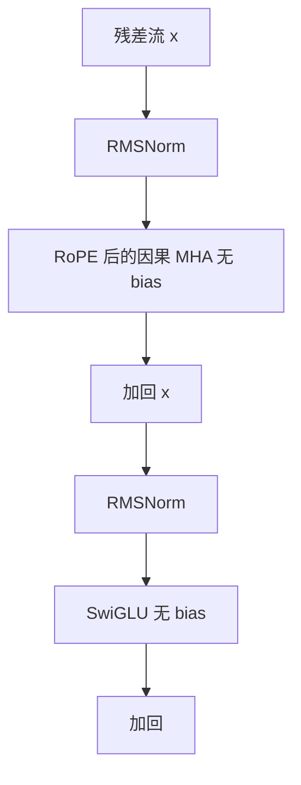

# Llama 1 架构选择

我们沿用 Transformer，并采纳随后提出的若干改进：Pre-normalization、SwiGLU、旋转位置编码；开源实现里线性层还不设偏置。

<footer>—— 综合 Touvron et al., LLaMA, 2023 与公开实现</footer>

2023 年 2 月，Touvron 等人发布 LLaMA（后称 Llama 1）：解码器-only 基础模型，尺寸 7B、13B、33B、65B，强调在公开数据上把密集 Transformer 训到与当时闭源大模型可比较的水平。它几乎没有发明新模块，而是把已经分开验证过的选择收成一套可复现配方：[Pre-LN](/llm/pre-ln-post-ln) 用 [RMSNorm](/llm/rmsnorm)、[RoPE](/llm/rope)、[SwiGLU](/llm/swiglu)，以及线性层无 bias。这套配方后来成为开源稠密模型的默认起点。本篇只写 Llama 1 的架构选择与它们为何被捆在一起，不进入对话对齐，也不把后续代际的上下文或混合专家写进来。

## 问题

2022 年底的公开模型要么小、要么数据与结构不透明。要在学术可引用的设定下回答「密集解码器在公开语料上能走多远」，必须先锁住一块计算图：残差怎么归一化、位置怎么进注意力、FFN 用什么激活、线性层有没有偏置。每一项当时都有文献，但组合并不唯一。Post-LN 的原版 Transformer、绝对位置、ReLU 或 GELU MLP、带 bias 的 GPT-2 风格投影，都可以训，只是深了之后稳不稳、同 FLOP 下困惑度好不好、推理内核好不好写，差一截。

Touvron 等人的问题不是再提一个注意力变体，而是选一条已经在 GPT-3、PaLM、GPT-Neo 上分别出现过的改进，用同一套超参训四个尺寸，并公开权重。架构选择因此是工程收敛：减少自由度，把差异留给数据与尺度。

### 四项选择针对四个不同故障

Pre-LN 针对深层梯度被残差后 LN 切断。[RoPE](/llm/rope) 针对绝对位置在外推与相对几何上的弱点。SwiGLU 针对单支激活把「内容」与「门」绑死。无 bias 针对多一套加法参数带来的内核分支与训练噪声，并与 RMSNorm 的仿射共同管理尺度。四项不是互为替代，缺一项就会回到 2018–2020 年的某一种已知痛点。

论文正文点名的三项改动写着出处：Pre-normalization 来自 GPT-3 实践，RMSNorm 来自 Zhang 与 Sennrich 2019；SwiGLU 来自 Shazeer 2020 与 PaLM；RoPE 来自 Su 等 2021，论文写 GPT-Neo 用过。无 bias 是发布代码与随后复现里一致的默认，和这三项一起构成「LLaMA 块」。

## 方法

块结构是 Pre-RMSNorm 的解码器层。子层 $F$ 为因果多头注意力或 SwiGLU FFN：

$$
x \leftarrow x + F\bigl(\mathrm{RMSNorm}(x)\bigr).
$$

注意力仍是 [MHA](/llm/mha)，不是分组查询。位置不把向量加到嵌入上，而在 $Q,K$ 上施加 RoPE。FFN 为

$$
\mathrm{SwiGLU}(x)=\bigl(\mathrm{SiLU}(xW) \odot (xV)\bigr)W_2,
$$

中间维取 $\tfrac{2}{3}\times 4d=\tfrac{8}{3}d$ 再按硬件对齐，使参数量与两层宽 $4d$ 的 ReLU FFN 同量级。线性映射不设 $b$，包括注意力投影与 FFN；RMSNorm 保留缩放 $\gamma$，出口再加一次归一化后接词预测头。词表约 32k，SentencePiece BPE。上下文长度 2048。7B/13B 约 1T token，33B/65B 约 1.4T。优化器 AdamW，$\beta_2=0.95$，余弦衰减到峰值学习率的 10%。

### 无 bias 与 Pre-LN 如何配合

带 bias 的线性层在 Pre-LN 里会给子层输出一个与输入无关的偏移，残差流的均值可以随层漂移，RMSNorm 又不减均值，偏移会累积。去掉 $b$，尺度主要交给 $\gamma$ 与残差本身，内核少一次加向量，张量并行切分更干净。这不是理论必需，而是与 RMSNorm、无 Dropout 的解码器一起出现的简洁化：能省的加法都省掉，让大矩阵乘占满时间。

## 机制

Pre-LN 给残差一条不经过归一化的公路，65B、80 层量级才能用论文里的学习率起步。RMSNorm 比 LayerNorm 少一次减均值，带宽更省，LLaMA 把它写成默认，而不是再做一次「要不要中心化」的消融——消融已经在 RMSNorm 原文与 GPT-3 实践里做过。RoPE 让内积只含相对位移，2048 的训练长度下相对几何是稳的；更长外推不是 Llama 1 的设计目标，公式却为后来改基数留下了旋钮。

SwiGLU 在同参数下优于 GELU MLP，是 PaLM 已经付过的实验税。LLaMA 把中间维按 $\tfrac{8}{3}$ 对齐，避免「我们用了门控所以参数多 1.5 倍」这种不可比。无 bias 再减掉与 $d$ 成正比的一小撮参数，四个尺寸的参数表更好对上「纯宽度 × 层数」的心算。

Llama 1 仍是满 KV 头的 MHA。服务期缓存按 $h_q$ 计，70B 级尚未出现；当时的矛盾是训练吞吐与公开数据质量，不是 decode 带宽。把 GQA 提前写进 Llama 1 会错代。

### 数据与架构哪一项在说话

论文用公开混合语料（CommonCrawl、C4、书籍、维基、代码等）训到 1–1.4T token，并论证较小模型在足够 token 上可以追上更大而训不足的模型。架构配方的作用是：让这些 token 能稳定地变成深度。若换回 Post-LN 加绝对位置，同样数据也可能训崩或外推更差，于是人们会误判数据不行。把配方固定，后续工作才能把差异算在数据清洗、词表和对齐上。

## 边界与工程取舍

Llama 1 的许可证与权重传播路径后来引发争议，那是发布策略问题，不是 Pre-LN 的数学问题。上下文 2048、MHA、32k 词表，都是 2023 年初的工作点：长文档、多语压缩、decode 缓存都还没成为这套权重的主约束。英文为主的数据配比会在非英语与代码上留下分词碎片，那是词表问题，留给数据与 tokenizer 专文，不是 RoPE 能修的。

没有 bias 并不禁止所有仿射：RMSNorm 的 $\gamma$ 还在。移植权重时若在 `nn.Linear` 里打开 bias，形状对不上检查点。从 GPT-2 式带 bias 模型蒸馏到 LLaMA 块，必须丢掉或吸收 $b$，不能当无成本。并行 Attention-FFN、Sandwich-LN、GQA 都不在 Llama 1 块内；它们是别的模型或后代的选择。

论文写 33B，社区常说 30B/32.5B，是因为公开配置与四舍五入。引用尺寸时跟 Touvron 等 2023 的表：7B、13B、33B、65B。不要把后代的 8B/70B 倒填进来。

训练稳定性仍依赖 warmup、梯度裁剪与数据清洗，Pre-LN 不是免责声明。65B 在 2048 张 80GB A100 上训约三周，说明配方再干净，尺度仍是集群问题。复现若只抄四项架构、用小数据，得不到论文表格，却仍能验证：块是稳的、无 bias 检查点能加载。

## 小结

- Llama 1 是公开数据上的密集解码器，架构收敛为 Pre-RMSNorm、RoPE、SwiGLU、线性无 bias。
- 注意力是因果 MHA，上下文 2048，词表约 32k SentencePiece。
- SwiGLU 中间维按 $\tfrac{8}{3}d$ 对齐参数；RoPE 只转 $Q,K$。
- 四项选择分别稳住深度、相对位置、FFN 质量与内核简洁，而不是新注意力。
- 7B/13B 约 1T token，33B/65B 约 1.4T；配方为后续开源稠密模型提供默认块。
- 本篇不覆盖对话 SFT，也不覆盖更长上下文或 MoE。
- 出处：Touvron 等，*LLaMA: Open and Efficient Foundation Language Models*，2023。RMSNorm、RoPE、SwiGLU 分见 Zhang 与 Sennrich 2019，Su 等 2021，Shazeer 2020。
