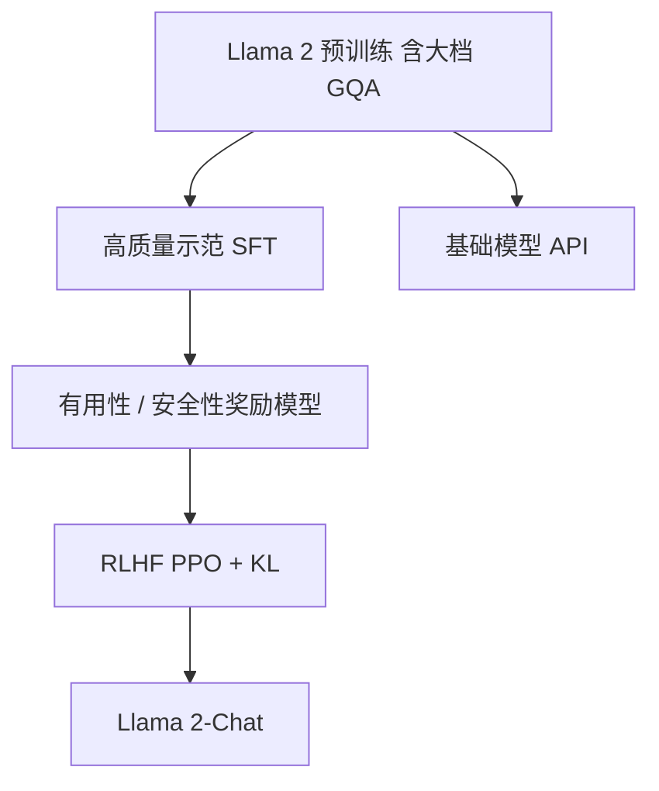

# Llama 2 GQA 与对话

我们发布 Llama 2 基础模型与从中微调的对话模型；较大档用分组查询注意力压 KV，对话档用 SFT 与 RLHF 对齐到有用且更安全的助手。

<footer>—— 综合 Touvron et al., Llama 2, 2023</footer>

Llama 1 把密集块定下来，但服务 70B 级生成时，[MHA](/llm/mha) 的 KV 缓存随头数膨胀，而基础模型也不会聊天。Touvron 等人 2023 年 7 月的 Llama 2 做了两件产品上必须同时交的事：把 34B 与 70B 的注意力改成 [GQA](/llm/gqa)，并把同一套预训练权重送进监督微调与基于人类反馈的强化学习，得到 Llama 2-Chat。上下文从 2048 加到 4096，预训练约 2T token。本篇只写 GQA 与对话对齐这两条，不把下一代的词表与数据规模提前写进来。

## 问题

70B 若仍 64 个 KV 头，decode 每步要搬的字节把并发和上下文长度一起卡死。MQA 把头压到 1，带宽最低，质量掉得明显，张量并行也不好切。需要一档中间共享：查询头保持容量，KV 头降到可服务的整数。Ainslie 等人 2023 年的 GQA 已经给出分组结构；Llama 2 要决定在哪些尺寸启用、组数取多少，以及预训练是否从零按 GQA 训（而不是只在推理时改图）。

第二问题是基础模型的接口。预训练最大化 $p(x_{t+1}\mid x_{\le t})$，不会拒绝有害请求，也不会按「助手」口吻结束回合。对话产品需要另一套目标：在提示格式下更有用、更安全，且多轮时不忘掉系统约束。这不能靠再堆 2T 网页解决，必须用人标数据改策略分布。

### 两条线不要并成一句「Llama 2 更强」

GQA 几乎不改「会什么」，改的是 70B 能不能上线。SFT/RLHF 几乎不改「KV 多少字节」，改的是会不会当助手。评测应分开：预训练基准上看 GQA 档与 MHA 小档的知识；对话基准上看 Chat 相对基础模型的有用性与安全。用 Chat 的 MT-Bench 去证明 GQA 正确，或用 MMLU 去证明 RLHF 成功，都是张冠李戴。

公开权重是 7B、13B、70B；论文写了 34B 也用 GQA，但该档未作为同样的开放下载强调。7B/13B 仍是 MHA。不要写成「Llama 2 全部 GQA」。

## 方法

**GQA.** 34B 与 70B 使用分组查询：查询头 $h_q$ 分成 $h_{\mathrm{kv}}$ 组，70B 取 $h_{\mathrm{kv}}=8$，组大小 $g=h_q/h_{\mathrm{kv}}$。组内

$$
\mathrm{head}_i=\mathrm{softmax}\bigl(Q_i K_g^\top/\sqrt{d_k}\bigr)V_g.
$$

预训练即按此结构训，不是把 Llama 1 的 65B MHA 临时改图。块的其余部分沿用 Llama 1：Pre-RMSNorm、RoPE、SwiGLU、无 bias。上下文 4096，RoPE 的可表示相对距离跟着加长。

**对话。** 先收集高质量指令示范做 SFT。论文强调示范质量优于堆数量，SFT 标注大约 2.7 万量级的高质样本，而不是百万级嘈杂指令。然后训奖励模型，用人类对同一提示下两个回复的比较，分别针对有用性与安全性，再以 PPO 一类 RLHF 最大化奖励、并用 KL 项把策略留在 SFT 附近：

$$
\max_\pi\;\mathbb{E}\bigl[r(x,y)\bigr]-\beta\,\mathrm{KL}\bigl(\pi(\cdot\mid x)\|\pi_{\mathrm{SFT}}(\cdot\mid x)\bigr).
$$

多轮对话用 Ghost Attention 一类技巧，把系统消息在后续轮次里重新插入注意力，减轻「第一轮遵守、第三轮忘掉人设」的漂移。迭代：新策略出样本，再标、再训奖励、再 PPO。

### 为何大档才 GQA

小模型 decode 的 KV 绝对值还没把显存打满，MHA 的质量边际更值钱。70B 的层数与头数把缓存变成服务约束，8 个 KV 头把体积打到 MHA 的一个分数，同时保留多套键子空间。这与 GQA 原文的「质量–带宽甜点在中等 $h_{\mathrm{kv}}$」一致。从零训 GQA 避免了均值池化转化的创伤，代价是不能把 Llama 1 65B 当初始化——尺寸与头结构都对不齐，Llama 2 是新预训练。

## 机制

GQA 组内像 MQA：多个查询抢同一份记忆；组间像 MHA：8 套记忆可分化。70B 的 8 KV 头成为后来开源稠密大模型的默认抄作业数字，不是因为 8 有理论最优，而是因为它在张量并行（例如 TP=8 时每卡一头 KV）与质量曲线上同时好用。上下文 4096 使 RoPE 在更长相对距离上要保持可用分数，这是位置几何问题，靠更长预训练窗口而不是靠 GQA。

RLHF 改的是 $y$ 的分布，不是注意力头数。SFT 已经把格式、拒答、逐步推理的种子种上；奖励模型把人类比较变成可微标量；PPO 在 KL 球里推策略。安全与有用分开建奖励，是因为两者经常打架：过度安全的模型会拒答无害请求。Ghost Attention 针对多轮：系统约束若只出现在很早的 token，后续查询对它的注意力会稀释，显式重插等于把约束又放进近期 KV。

约 2.7 万 SFT 样本能工作，前提是标注极干净且覆盖产品意图。这不能推广成「指令微调都不需要大数据」。嘈杂公开指令集仍常被用来做 ablative 对照，论文的观点是：脏数据堆上去会污染风格，RLHF 也救不回。

### 基础模型与 Chat 不要混着量化

服务时 Chat 与基础模型检查点不同，词表相同、结构相同，KV 形状相同，所以 GQA 内核可共用。系统提示、停止符、安全分类器是 Chat 路径上的附加物。对基础模型做补全评测时加 Chat 模板，分数会失真；对 Chat 做纯续写评测时去掉模板，也会失真。GQA 的正确性应用 decode 显存与吞吐说话，对话质量应用人类或裁判模型说话。

## 边界与工程取舍

GQA 不减少随长度线性增长的那一维，只减小斜率。4096 仍短，长文档要切段。RLHF 不能当知识注入：事实仍主要来自 2T 预训练，对齐阶段数据小，胡编可以通过拒答与风格被压，但知识截止日期不会因此变成标注日。奖励模型过拟合、策略对奖励 hacking，是 RLHF 的常规失败，论文用迭代与分开的安全奖励缓解，不是根除。

34B 未同样开放，使「GQA 从哪一档开始划算」少了一个公开锚点。7B Chat 仍有用，但 KV 收益主要在 70B。许可证相对 Llama 1 更面向商业可接受使用，那是发布政策，不改变 GQA 公式。多轮 Ghost Attention 是训练/推理约定，迁移到其他对话模板时要复现插入规则，否则系统人设仍会漂。

不要把 Llama 2-Chat 的 RLHF 写成后来所有对话模型的同款配方。DPO 等直接偏好优化是后续路线。本篇停在 2023 年论文采用的 SFT + 奖励模型 + PPO。

比较 Llama 1 65B 与 Llama 2 70B 时，同时变了数据量、上下文、GQA 与对齐，无法做单因素消融。能单独说的只有：大档结构是 GQA；对话产品走 SFT/RLHF。其余增益要当捆绑包。

## 小结

- Llama 2 大档（34B/70B）用 GQA，70B 为 8 个 KV 头；7B/13B 仍为 MHA。
- 预训练约 2T token，上下文 4096，块配方继承 Llama 1。
- 对话模型经高质量小规模 SFT，再经有用性/安全性奖励与 PPO 式 RLHF。
- GQA 解决 decode 缓存；SFT/RLHF 解决助手行为，评测必须拆开。
- Ghost Attention 一类方法针对多轮系统约束被稀释。
- RLHF 不延长知识截止日期，GQA 不解决长度平方级注意力。
- 出处：Touvron 等，*Llama 2: Open Foundation and Fine-Tuned Chat Models*，2023；GQA 结构见 Ainslie 等，2023。
