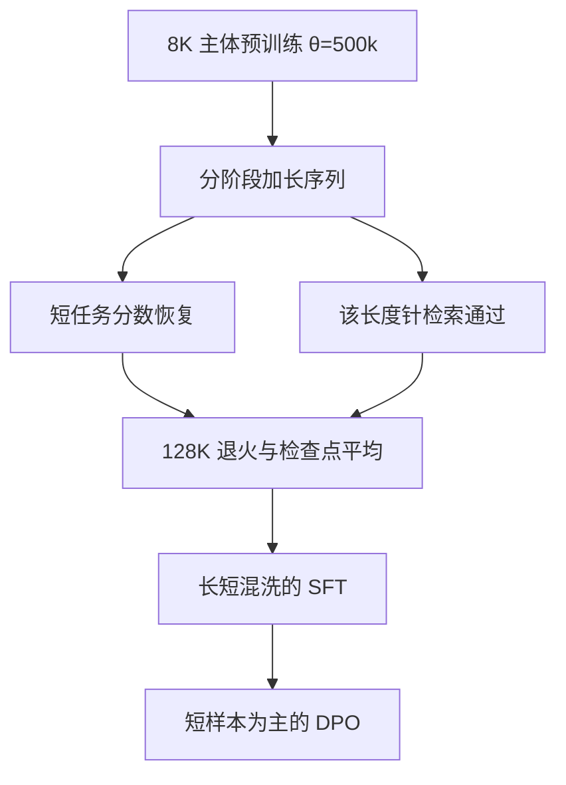

# Llama 3.1 长上下文

    
标准预训练在 8K 窗口上完成，随后用持续预训练把支持的上下文逐步拉到 128K。

    <footer>—— Grattafiori 等，The Llama 3 Herd of Models，arXiv:2407.21783</footer>

Llama 3.1 把「能读多长」写成产品规格：公开权重覆盖 8B、70B 与 405B，窗口标称 **128K token**。论文把评测表里的结果都算在 Llama 3.1 上，并声明为行文方便仍称 Llama 3。长窗口不是把 `max_position_embeddings` 改成 131072 再直接推理——那会把 [RoPE](/llm/rope) 的相位送出训练支撑。真正改的是两件事：预训练后期用更长序列做持续训练；位置通道用高基数与按维缩放，把外推与插值拆开处理。本篇只谈这条 8K→128K 的工程，不把 405B 的数据配比或后训练工具调用写成另一篇综述。

## 问题

Llama 3 主体预训练在 **8K** 上做 next-token prediction（405B 约 15.6T token）。自注意力按长度二次涨，一开始就按 128K 训，同样 token 预算下步数会少一个数量级。短窗模型若在推理时把位置下标直接用到 $L'=128\mathrm{K}$，高频旋转角走出训练弧长，点积不再编码相对距离，这是 [朴素外推](/llm/position-extrapolation) 的典型失败。

另一方面，把所有频率按 $8\mathrm{K}/128\mathrm{K}$ 线性压缩（位置插值）能把相位映回原窗口，但高频邻域被抹平，近距离复制与局部语法会伤。需要的是一条**可验收的拉长课程**：每加一档长度，短任务分数要回到原水平，长任务上「大海捞针」一类检索要过关，而不是只看能不能把 KV 塞进显存。

### 128K 是训练出来的窗口，不是配置项

标称上下文是模型在该长度上被训过、并且用检索与长文档基准验收过的上限。推理框架把缓存开到 128K，只说明数值与掩码允许前向。没有分阶段适应时，困惑度会在某一长度陡升；有适应但后训练全是短对话时，模型会把后半段当噪声。Llama 3.1 把长序列放到预训练**最后阶段**，再在后训练里单独配长上下文 SFT，就是在避免这两种假窗口。

论文写明：过早用长序列不划算，因为注意力计算随长度二次增长。长上下文是课程的最后几课，不是第零课。

## 方法

### 高基数 RoPE 先把外推余量留出来

Llama 3 把 RoPE 基数从 Llama 2 常用的 $10^4$ 提到 $\theta=500{,}000$。Xiong 等人（2023）表明，提高基数有利于把窗口做到数万 token 量级。高 $\theta$ 让同一下标对应的高频转得更慢，8K 预训练里相位尚未把后续拉长用尽。这是**外推友好的尺子**，本身还不等于 128K 已经可用。

### 分阶段持续预训练

405B 的长上下文阶段大约用 **800B token**，从 8K 起分 **六档** 加长，直到 128K。每一档的验收有两条：(1) 短上下文评测完全恢复；(2) 直到该长度的 needle-in-a-haystack 能完美取回。不满足就继续在该档上训，而不是一次跳到 16 倍。退火阶段仍保持 128K，并上采样高质量数据。上下文并行（context parallelism）按序列维切块，使 128K 训练在显存上可行。

后训练里，SFT 要显式混入 16K、32K、64K、128K 档的样本，以免对齐把长程注意力洗掉。论文观察到：只要 SFT 的长上下文已经够好，DPO 只用短样本也不至于把长能力打崩——DPO 步数更少。这是配方观察，不是「DPO 天然保护长窗口」的定理。

### 推理期的按维频率缩放

发布权重在推理实现里并不对所有旋转维做同一缩放。官方配套方案（transformers 中 `rope_type=llama3`）按波长分段：波长短于原窗口某一阈值的维**保持原频率**（保局部、接近外推）；波长长的维把频率除以缩放系数（低频插值）；中间段斜坡混合。这与 [NTK-aware](/llm/ntk-aware-interpolation) / [YaRN](/llm/yarn) 的「高频少压、低频多担外推」同族，但是 Llama 3.1 自己的一套系数，写进配置而不是另训一份位置网络。训练课程与推理缩放必须配对：用 8K 的 RoPE 核去跑 128K 的 3.1 权重，相位会错。

不要把 $\theta=500{,}000$ 写成「已经等于 128K」。高基数是 8K 预训练时的外推余量；128K 来自分阶段持续预训练。推理缩放是第三块拼图，缺一角就会在某一频段上重复插值或重复外推的失败模式。

## 机制

记原窗口 $L=8192$，目标 $L'=131072$。朴素外推使用真实下标 $p$ 与原 $\theta_i$，失败在高频。全局插值使用 $p\cdot L/L'$，失败在高频被压缩。Llama 3.1 的组合是：先用很大的基数降低「同一 $p$ 上转得有多快」，再用持续训练让注意力权重看见过 $L'$ 量级的键集合，最后在推理把低频维按比例放慢、高频维尽量不动。低频负责「文档前部还是后部」，高频负责「差几个 token」。分段以后，softmax 才同时保得住远距检索与近距语法。

针检索完美，只说明存在一条高分路径能把插入句取回。多针、长文档 QA、需要综合多段的任务，才测「窗口里的内容有没有被用上」。论文在 InfiniteBench、ZeroSCROLLS 等长上下文基准上另外报表，并讨论 DocQA 与 many-shot 上的安全：上下文变长后，有害示范与文档内对抗问题会进入同一窗口，安全后训练必须覆盖长前缀，不能只做短对话拒绝。

### 与「开源侧插值补丁」的差别

2023 年社区把 Llama 2 拉到 16K/32K，多用位置插值或改基数再少量微调。Llama 3.1 把同类几何放进**官方预训练课程**，用的 token 量是「微调几千步」的许多倍，并且用短任务回归当门禁。效果上 128K 是一等公民；代价是训练集群必须支持上下文并行与长序列通信。不能把 3.1 的 128K 理解成「在 3.0 8K 权重上套一层 YaRN」。

## 边界与工程取舍

128K 的 KV 按层、按 [GQA](/llm/gqa) 头数线性涨。405B 即使用分组 KV，服务 128K 仍是带宽与显存问题，多数业务到不了标称上限。针检索过关不等于代码仓库级推理过关：仓库补全还依赖数据里是否出现过跨文件模式。后训练若把长样本洗掉，窗口规格还在卡上，行为回到短对话模型。

分阶段门禁依赖针任务，会偏向「能定位一句」而不是「能维护万 token 的约束」。评自己的 3.1 部署时，应同时看短任务回归、针检索、以及需要综合的长文档，三张表缺一不可。

Llama 3.1 的多模态实验在论文里是组合式适配器，不是原生早融合；长上下文规格首先是语言模型窗口。不要把 128K 自动写成「128K 图像 token」。

## 小结

- Llama 3.1 把上下文从 8K 拉到 128K：主体仍在短窗预训练，长序列放在持续预训练与后训练。
- RoPE 使用 $\theta=500{,}000$，为后续拉长留外推余量；真正的 128K 靠分阶段加长与约 800B token（405B）的长上下文阶段。
- 推理配套按波长分段缩放频率：低频插值、高频少动，避免单一的外推崩溃或插值糊掉。
- 验收要短任务恢复加针检索；安全评测必须覆盖长文档与 many-shot。
- 出处：Grattafiori 等，*The Llama 3 Herd of Models*，arXiv:2407.21783（文中评测对应 Llama 3.1）。RoPE 缩放实现见官方权重配置与推理代码；对照 Chen 等位置插值（2023）、Peng 等 YaRN（2023）、Xiong 等长上下文 RoPE（2023）。
