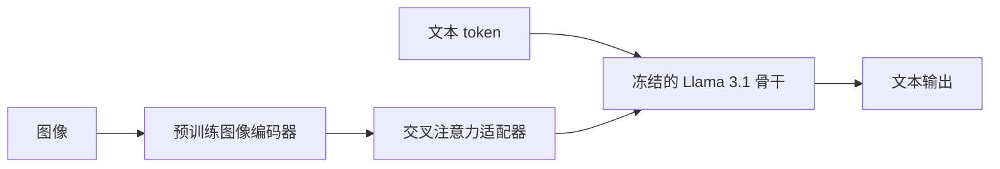

# Llama-3.2 视觉

为了支持图像输入，我们训练一组适配器，把预训练图像编码器接到预训练语言模型上；适配器训练时更新编码器，但有意不更新语言模型参数。

<footer>—— Meta，Llama 3.2 发布博客，2024 年 9 月 25 日</footer>

Llama 3.1 把稠密文本做到 8B / 70B / 405B 与 128K 窗口。2024 年 9 月 Meta 发布 Llama 3.2：一边是可上边缘设备的 1B / 3B **纯文本**，一边是 11B / 90B **视觉**模型（图像+文本入，文本出）。视觉档是系列里首次公开支持看图。官方写法很明确：在冻结的 Llama 3.1 语言模型上插入交叉注意力适配器，接入预训练图像编码器；对齐图文时更新编码器与适配器，不改语言模型，以便文本能力近似可当 3.1 的替换。本篇只依据该博客与模型卡写视觉架构与任务，不把 1B/3B 蒸馏当视觉，也不把后来 [Llama 4](/llm/llama-4) 的早融合 MoE 写进来。

## 问题

开源 Llama 到 3.1 仍是文本自回归。要看图，有两条结构路。早融合从预训练起就把视觉 token 与文本放进同一骨干，能力齐、训练贵、也难保证「加视觉之后纯文本分数不掉」。晚融合冻结大语言模型，只用轻量接口把图像表示打进去，文本侧可复用已有 3.1 权重与后训练。Llama 3.2 选后一条，产品目标是：11B / 90B 能做图像理解、文档与图表、配图说明和视觉定位，同时开发者可以把视觉档当作 3.1 文本的 drop-in，而不是一套不会聊天的新模型。

分辨率与窗口必须一起交代。模型卡与实现支持较高分辨率输入（常见到约 1120×1120 量级的切块方案），文本上下文仍是 **128K**。图像变成多少视觉 token、多图如何交错，由处理器与适配器层数决定；博客没有把每一层插入位置写成可复现表，本文不编。

### 11B 与 90B 对应哪一档文本骨干

公开叙述是：视觉模型建在 Llama 3.1 文本模型之上，用适配器接入编码器。体量上，11B 视觉对应 8B 级文本骨干加视觉模块，90B 视觉对应 70B 级文本骨干加视觉模块——参数量「多出来」的部分主要是编码器与交叉注意力，而不是又训了一个从零开始的 90B 稠密 LM。因此显存与 decode 成本仍按文本骨干主导，图像只在预填充阶段多一次编码器与若干交叉注意力。无图请求理论上可以少走视觉支路；是否在实现里真正跳过，以具体运行时为准。

「不更新语言模型参数」指适配器对齐那一阶段。指令微调视觉档时，官方仍使用 SFT 与 RLHF 一类后训练；那是在已经接上视觉的模型上对齐帮助性与安全，不要理解成视觉 Instruct 权重与 3.1 Instruct 逐参数相同。

## 方法

### 编码器加交叉注意力适配器

图像经预训练视觉编码器（公开资料与社区实现多对应 ViT 一类骨干）得到表示。适配器是一组**交叉注意力层**：文本侧隐状态作查询，图像表示作键值，把视觉信息注入 Transformer。训练在图文对上对齐两种表示；此阶段更新编码器与适配器，语言模型冻结。这保持了 3.1 已经学好的语言建模与工具向后训练，避免视觉数据把文本流形洗偏。博客强调由此得到「文本能力得以保留」。

$$
h' = h + \mathrm{XAttn}(h,\, E_{\mathrm{img}}(I))
$$

上式概括注入方式。$E_{\mathrm{img}}$ 是否含全局/局部双塔、图像如何切块与补纵横比，以发布配置与 HuggingFace `Mllama` 实现为准，博客只保证「有编码器、有适配器、LM 冻结对齐」。

### 后训练与官方能力范围

指令视觉档针对视觉识别、图像推理、配说明、以及关于图像的一般问答。Meta 文档还列出：文档级理解（含图表）、复杂 OCR（90B 更强）、视觉定位（按语言描述在图中指物）。输入可多图，视处理器与上下文预算而定。知识截止与 3.1 文本侧一致，模型卡写预训练数据来自公开来源；视觉数据配比的完整表未在博客展开，本文不补。许可是 Llama 3.2 社区许可，与权重一并发布。

边缘侧的 1B / 3B 是同期发布的**纯文本**小模型（剪枝与蒸馏自更大 3.1），服务端视觉请求不应指望它们看图。混用版本号时，要看仓库名里的 `Vision` 与 `Instruct`。

## 机制

机制是「用冻结 LM 当语言与对齐的锚，用可训的视觉接口把像素变成该锚能读的键值」。交叉注意力让文本 token 按内容选取图像区域，而不必把整图强制展成与文本同质的超长自注意力序列——后者会把 128K 预算很快吃光。编码器仍按块读取高分辨率，适配器再压缩进 LM。文本 decode 与普通 Llama 相同：自回归、GQA、RoPE 基数与 3.1 同族，窗口 128K。无图时交叉注意力的键为空或走掩码，行为应退回文本模型；若实现仍插入空图像占位，延迟会莫名变差，这是工程问题不是论文公式。

相对后来 Llama 4 的早融合，3.2 视觉是明确的适配器世代：训练便宜、文本可复用、模态耦合更浅。深度的图文交错推理、原生视频，不是这代博客宣称的中心。文档 OCR 能做，但不等于专用 OCR 流水线；复杂版面应以 90B 与真实扫描件回归，不要只用自然照片 VQA 分数代替。

视觉预填充的墙钟常被低估：高分辨率切块会让编码器本身可比一小段文本预填充更贵。产品上应把「首 token」拆成编码时间与 LM 预填充时间，否则会误判是不是该降分辨率。

### 和 3.1 文本栈的兼容

词表、对话模板、工具调用头，官方意图是与 3.1 对齐，以便同一套应用逻辑加图。实际服务里仍要把图像字节、MIME 与多图顺序写进聊天模板；漏掉占位符会导致交叉注意力对错位置。安全策略在视觉档上多了一条：图中文字、图中人物、图文不一致的注入。模型卡要求按负责任使用指南部署，不能只复用文本侧的拒绝样本。

## 边界与工程取舍

博客与模型卡没有把适配器插入的每一个层号、编码器参数量、训练图文对数写成完整技术报告。缺的部分不要用第三方博客的猜测填进规格。11B 视觉在单卡上可玩，90B 仍按 70B 级骨干加视觉模块来备显存。长文档加多页图会同时吃视觉 token 与 128K 文本；页数预算要从处理器的 token 计数反推。Llama 4 起架构换了，3.2 视觉权重不能当 4 的编码器来用。

不要把「LM 冻结」理解成视觉 Instruct 对纯文本基准与 3.1 Instruct 逐项相同。冻结发生在适配器对齐；后训练仍可能移动语言行为。对比文本能力应查当时官方表，而不是从结构推断零差异。也不要假设开源 11B 达到闭源多模态旗舰的 OCR；官方定位是可定制的开放权重视觉 LLM。

HuggingFace 类名是 `Mllama`，与后来的 Llama 4 处理器不同。加载错族会在视觉张量形状上直接报错。写依赖时钉模型 ID，例如 `Llama-3.2-11B-Vision-Instruct`，不要只写「Llama 3.2」。

## 小结

- Llama 3.2 视觉档为 11B / 90B，在 Llama 3.1 文本骨干上加图像编码器与交叉注意力适配器，上下文 128K。
- 适配器对齐阶段更新编码器、冻结语言模型，意图保留文本能力并降低训练成本。
- 官方任务：识图、推理、配说明、文档与图表、定位；90B 更偏复杂可视化。
- 同期 1B / 3B 是边缘纯文本，不是视觉模型。
- 结构是晚融合适配器，与 Llama 4 早融合不是同一代；规格以 2024-09-25 博客与模型卡为准。
- 出处：Meta，*Llama 3.2: Revolutionizing edge AI and vision with open, customizable models*（2024-09-25）及 Llama 3.2 Vision 模型卡。
