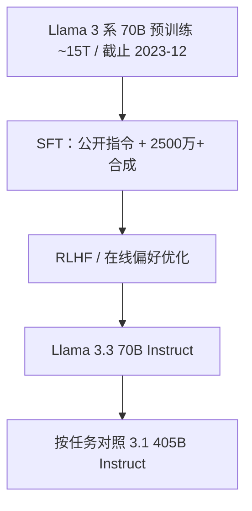

# Llama-3.3

Llama 3.3 是一个 70B 模型，能达到我们 405B 的表现，却更容易、更省成本地运行；靠的是包括在线偏好优化在内的后训练进展。

<footer>—— Ahmad Al-Dahle（Meta 生成式 AI），Llama 3.3 发布说明，2024 年 12 月 6 日</footer>

Llama 3.1 已经给出 8B / 70B / 405B 与 128K 窗口；405B 质量高，服务贵。2024 年 12 月 6 日 Meta 发布 **Llama 3.3 70B Instruct**：稠密、纯文本、多语对话向，公开权重只有这一档指令模型。官方叙事不是新骨干或更长预训练，而是用更新的后训练（SFT、RLHF，以及 Al-Dahle 点名的 online preference optimization）把 70B 的核心任务推到接近 3.1 405B Instruct。本篇只写模型卡与发布说明里能核对的规格和表，不把 3.3 说成新的 15T 从头预训练，也不把 [Llama 4](/llm/llama-4) 的 MoE 提前安到这一代。

## 问题

3.1 70B Instruct 在通用知识上已经强，但指令遵循、数学、代码相对 405B 仍有缺口；405B 的显存、能耗与延迟让很多部署直接放弃。产品问题是：能否在**同一套 70B 稠密 Transformer** 上，只改后训练配方，把缺口补到「多数工作负载可以下换」？若可以，开源栈的缺省服务档就不必上 405B。若不可以，3.3 只是一次小幅刷分。

第二个问题是预期管理。「达到 405B 表现」是发布用语，模型卡里的表是分项的：有的指标 3.3 70B 超过 405B，有的仍落后。工程上必须按任务看表，不能把一句营销当成每一项基准的支配。

### 3.3 不是新的视觉型号，也不是新的 405B

3.3 模型卡：文本入 / 文本与代码出，无图像。视觉仍停在 [Llama 3.2](/llm/llama-3-2-vision)。没有 3.3 8B 或 3.3 405B 的同期公开指令档。架构栏写明 GQA、128K 上下文、15T+ token 量级的公开数据预训练、知识截止 **2023 年 12 月**——与 3.1 70B 同族。词表仍是 128256 量级 BPE。可以把它理解成 3.1 70B 骨干上的指令后训练升级版，而不是一次 Kaplan 曲线上的新预训练点。

HuggingFace 上检查点参数量常显示约 71B，来自实现计数；Meta 表写作 70B。配资源按 70B 稠密 BF16 规划即可，不要以为存在一个更小的「真·70B」隐藏档。

## 方法

### 后训练配方（公开到的部分）

模型卡：在公开指令数据以及超过 **2500 万** 条合成样本上微调；对齐使用 SFT 与 RLHF，目标是帮助性与安全。Al-Dahle 额外指出采用包括 **online preference optimization** 在内的最新后训练技术。在线偏好相对离线 DPO 一类方法，会在训练过程中用当前策略采样再比较，数据分布跟着策略走，通常更贵，也更贴部署时的回复风格。具体学习率、偏好对数量、是否与 3.1 论文里的拒绝采样同一套流水线，官方没有写成可复现附录，本文不编。

预训练叙述与 3 系一致：约 15T 公开在线数据混合，截止 2023 年 12 月。3.3 的增量来自后训练，不应解读为又吃了新的一年互联网——知识截止没有前移到 2024。

### 模型卡上的分项对照

下列数字摘自 Meta Llama 3.3 模型卡（Instruct 档）。同一指标下同时列出 3.1 70B 与 3.1 405B，避免只报 3.3。

- MMLU CoT：3.3 与 3.1 70B 同为 86.0；405B 为 88.6。
- MMLU-Pro CoT：3.3 为 68.9，高于 3.1 70B 的 66.4，低于 405B 的 73.3。
- IFEval：3.3 为 92.1，高于 405B 的 88.6 与 3.1 70B 的 87.5。
- GPQA Diamond CoT：3.3 为 50.5，略高于 405B 的 49.0。
- HumanEval pass@1：3.3 为 88.4，接近 405B 的 89.0，明显高于 3.1 70B 的 80.5。
- MATH CoT：3.3 为 77.0，高于 405B 的 73.8 与 3.1 70B 的 68.0。
- BFCL v2 工具：3.3 为 77.3，与 3.1 70B 的 77.5 持平，低于 405B 的 81.1。
- MGSM 多语：3.3 为 91.1，接近 405B 的 91.6。

读法：指令遵循与数学上，70B 后训练升级甚至超过 405B；较难的综合知识（MMLU-Pro）与工具调用上，405B 仍领先。发布用语成立的范围是「核心对话与推理工作负载可下换」，不是「所有基准支配 405B」。

## 机制

机制是「容量已经够的 70B，瓶颈在对齐与推理格式，不在再堆稠密层」。3.1 70B 与 405B 的差距里，有一块可以被更好的 SFT 混合、合成思维链、在线偏好推平——尤其是 IFEval、MATH 这种对格式和步骤敏感的任务。MMLU-Pro 仍吃广度与参数，后训练补不齐。服务上 70B 的 KV、TP 宽度与能耗都按小一档计，这才是「更省成本」的物理含义：同一套 GQA、80 层量级、隐宽 8192 的 3.1 70B 配置，decode 带宽远低于 405B。

支持语言与 3.1 多语承诺一致：英语之外官方列德语、法语、意大利语、葡萄牙语、印地语、西班牙语、泰语。模型卡声明：其他语言或许能生成，但未达安全与帮助性门槛，不鼓励在未做微调与系统控制时当产品语言。上下文 128K 继承 3.1 的长窗课程，不是 3.3 新拉的窗口。RoPE 基数与 Llama 3 的高 $\theta$ 同族。

合成数据超过 2500 万条。许可上 Llama 社区许可允许用输出去训自己的模型，但应用侧仍要处理合成痕迹、评测污染与用户数据隔离。条数大不等于领域覆盖全，代码与工具要用自己的回归集。

### 和 3.1 70B Instruct 替换时要注意什么

聊天模板、工具 JSON、系统提示若仍写 3.1 的习惯，3.3 通常能接，但 IFEval 变强也可能让模型更「较真」地执行过时系统提示。温度与 nucleus 应重扫，不要沿用 3.1 70B 的采样。安全分类器与 Llama Guard 版本要按 3.3 模型卡建议更新。知识仍停在 2023-12，需要 2024 事件的应用必须外挂检索，不能靠换 3.3 解决。

## 边界与工程取舍

没有官方 3.3 Base 对照表时，不要假设继续预训练会自动继承 Instruct 的数学增益。静态模型，线下数据，后续安全补丁以新版本为准。基准表是 Meta 自己的设定（shot 数、度量名称），第三方复现可能有差，引用应指向模型卡而不是二次图表。405B 在 MMLU-Pro 与 BFCL 上的领先对「硬知识 + 工具」产品仍有意义，下换前要在自己的工具集上测，不要只看 MATH。

不要把 3.3 写成 MoE 或视觉。不要把 Al-Dahle 的「405B 表现」理解成延迟也相同——70B 更快正是卖点。量化 4-bit 后与 3.1 70B 的相对排名可能变，后训练增益不是量化不变的。许可证是 Llama 3.3 社区许可，商用门槛与 3.1 类似，以当时文本为准。

服务引擎里 3.3 与 3.1 70B 的张量形状通常可共用同一套 TP/KV 内核。真正要换的是权重、tokenizer 配置里的特殊符号版本，以及聊天模板字符串。漏换模板会把「更强的指令遵循」用在错误的角色分隔符上，表现为胡言或拒答，而不是算力问题。

## 小结

- Llama 3.3 公开的是 70B Instruct：稠密纯文本、GQA、128K、知识截止 2023-12，2024-12-06 发布。
- 增量主要在后训练（SFT、RLHF、在线偏好优化与大规模合成数据），不是新的预训练体量。
- 模型卡上 IFEval、MATH、HumanEval 接近或超过 3.1 405B；MMLU-Pro 与工具调用仍是 405B 领先。
- 「达到 405B」指可下换的核心负载与成本，不是逐项支配。
- 无官方视觉档；语言支持八种达到门槛的语种。
- 出处：Meta Llama 3.3 模型卡；Ahmad Al-Dahle 2024-12-06 发布说明。
