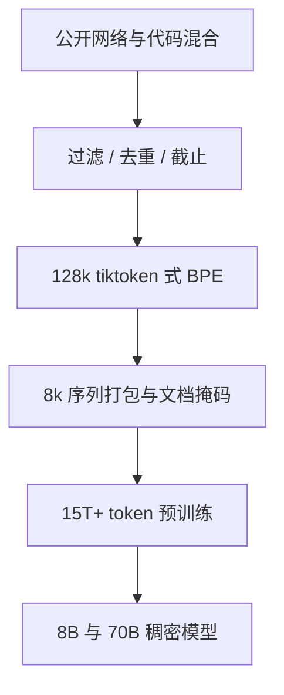

# Llama 3 数据与 tokenizer

Llama 3 在公开来源上预训练超过 15 万亿 token，并把词表扩到 12.8 万；同样 8B 与 70B 两个稠密档，编码效率比 32k SentencePiece 高一截。

<footer>—— Meta Llama 3 发布说明与 2024 年技术报告</footer>

Llama 1/2 把块结构定成开源默认之后，下一档可公开核对的跳跃主要不在再发明注意力，而在**数据规模**与**切词**。2024 年 Meta 发布 Llama 3 的 8B 与 70B：预训练超过 15T token，序列长度 8192，词表约 128k（实现上 128256），分词器改为 tiktoken 风格的 BPE，两个尺寸都用 GQA。本篇只写数据与 tokenizer 这两项如何改变有效上下文与多语/代码密度，不把更长窗口或后续混合专家写进这一代。

## 问题

32k SentencePiece 对英语尚可，对代码、非拉丁脚本和混合文本会产生碎 token：同样 2048 或 4096 的「长度」里，装下的自然语言更少，梯度浪费在子词噪声上。词表太小还会把字节级回退变得频繁。与此同时，Llama 2 的约 2T token 在 70B 上已经显示「还没把密集模型喂饱」——同等参数继续加数据，基准仍涨。2024 年要回答的是：公开网络数据还能不能再挖一个数量级，以及词表扩到 12.8 万之后，嵌入矩阵变大是否被更短的序列长度赚回来。

第二个问题是污染与截止。15T 比 2T 更容易撞上评测集、版权区和私有用户数据。技术报告与模型卡必须写清来源类型、是否含 Meta 用户数据、知识截止月份，否则 15T 只是不可审计的大数。

### 词表变大不是免费午餐

嵌入与输出头参数约为 $2Vd$。$V$ 从 3.2 万到 12.8 万，这一项大约四倍，对 8B 不是小数，对 70B 相对更小。收益是压缩率：同样字节的文本变成更少 token，注意力的 $n$ 下降，等于把 8k 窗口换成更多可读内容。若压缩率提不上来，只是白白养了一张大表。

习惯说 128k 词表，实现常数是 128256，含保留特殊符号。写配置时应对齐 `vocab_size`，不要按 $2^{17}$ 心算完再差 256 导致嵌入加载失败。

## 方法

**数据。** 8B 与 70B 都在超过 15T 的公开在线数据混合上预训练。相对 Llama 2，代码占比大约四倍，并包含覆盖三十余种语言的高质量非英语数据（约占百分之五量级，以发布说明为准）。token 只计预训练，不含后期指令数据。知识截止：8B 约 2023 年 3 月，70B 约 2023 年 12 月。模型卡写明预训练与微调数据都不含 Meta 用户数据。打包时使用 8192 的序列长度；文档边界上的掩码避免把无关文档当成连续因果上下文——这是数据管线而不是新注意力。

**Tokenizer。** 采用 128k 级词表的 BPE，实现对齐 tiktoken（字节级、GPT-4 一类词表的近亲），而不是 Llama 1/2 的 SentencePiece 32k。训练分词器时向代码、多语与数字倾斜，使那些域的平均 token/字节下降。特殊符号为对话模板、工具调用预留槽位，但本篇把它们当成词表容量，不展开对话格式。

$$
n_{\mathrm{tok}} \approx C \cdot \mathrm{bytes}(x),\qquad C_{\mathrm{L3}} < C_{\mathrm{L2}}
$$

$C$ 是压缩系数。英语大约可少约 15% 的 token；代码与部分非英语下降更明显——具体百分比随语料变，方向稳定：同样 8k 位置，Llama 3 装得下更多源代码和更多非英语句子。

### 15T 与 128k 必须一起读

若只扩数据、不改词表，多语和代码会被切碎，15T 里很大一部分梯度花在无意义子词上。若只扩词表、数据仍是 2T 英语网页，大词表的长尾 token 学不饱，嵌入噪声。Llama 3 把两项绑在同一代：数据覆盖为长尾 token 提供计数，词表为数据提供更短的序列。8B 在 15T 上训，是「小模型、过训练」路线的极端化，对标的是「同推理成本下尽量强」，而不是再堆一个中档尺寸。

## 机制

BPE 词表更大，高频词与常见代码片段变成单 token，注意力可以直接把它们当原子。碎片减少后，RoPE 的相对距离也更接近「语言学距离」而不是「字节距离」：一句德语少切几个子词，同一 8k 窗口里跨句依赖更短。这不是新位置编码，是 tokenizer 改了 $n$ 的语义。GQA 在 8B 与 70B 全开，则是服务侧为 8k 解码准备的斜率；它与 15T 无直接因果关系，但与「产品要能跑 8k」同时出现。

数据规模改变的是拟合与记忆。15T、多数 token 过一遍或少数 epoch，70B 仍处在欠拟合曲线的右侧相对 Llama 2 的 2T。代码加倍以上，解释了为何同等尺寸上 HumanEval 一类跳得比常识问答更狠——那是配比，不是突然会推理。非英语 5% 看起来小，但相对旧代几乎纯英语已经是质变；它不够训成均衡多语系统，只是让分词器和表示不再把非英语当噪声。

指令微调另有公开指令集与逾千万人类标注量级（以 2024 年模型卡为准），那是对齐数据，不要加进 15T。把 SFT 算进预训练 token，会同时夸大预训练、低估对齐成本。

### 截止与评测泄漏

8B 与 70B 截止不同，同一条新闻在两个尺寸上「知不知道」可以不一致，这是数据快照问题。15T 抓取必须做去污，技术报告描述了过滤管线，外部无法逐条审计。引用基准提升时，应优先看截止之后的集、或明确的污染分析；只看与网页重叠高的旧选择题，15T 的优势可能被背诵夸大。Tokenizer 也会改基准：同样字符预算下题面更短，等于变相加长上下文，和「模型更聪明」缠在一起。公平对比应对同一分词器重算长度，或报告字节数而不是只报告 token 数。

## 边界与工程取舍

Llama 3 的 8k 不是长上下文产品工作点；本篇不把窗口再扩一个数量级写成这一代的故事。128k 词表使嵌入在小模型上更贵，量化与张量并行要单独切词表，旧的 32k 词表工具链不能热切换。tiktoken 与 SentencePiece 的预处理（NFKC、前导空格、字节回退）不同，用 Llama 2 模板硬套会切出未见过的特殊符号 ID。

15T 公开数据仍有版权与质量长尾。模型卡给出的是来源类别与用户数据否定句，不是可下载的 15T 副本。复现「数据规模」只能到订单：比 2T 大一个数量级，代码更密，词表 128k。精确配比、去重阈值、是否含某些基准，外部不应编造。8B 过训练会记住更多表面模式，不一定在每个推理任务上都单调优于「更大但吃得少」的旧模型；论文表格支持总体提升，个案仍要测。

不要把 405B、十万级上下文或 MoE 路线写进 Llama 3 这一代的数据故事。那些是后续发布的轴。这一篇的两个数字就是 15T+ 与 128k 词表，模型锚点就是 8B 与 70B。

嵌入表变大后，未充分训练的长尾 token 会在生成里变成乱码或异常概率。解码端要保证特殊符号不会从普通 BPE 路径打出。多语 5% 解决不了低资源语言的事实覆盖，只解决「切得动」。若产品主市场是某一低资源语，仍要另加数据，而不是假设 128k 词表等于多语能力完成。

## 小结

- Llama 3 的 8B 与 70B 在超过 15T 公开 token 上预训练，序列 8k，知识截止按尺寸分别为 2023 年 3 月与 12 月。
- Tokenizer 为约 128k（128256）的 tiktoken 式 BPE，替换 Llama 1/2 的 32k SentencePiece，提高英语、代码与多语压缩率。
- 代码配比约四倍于前代，非英语高质量数据约占百分之五量级，二者都依赖更大词表才吃得进窗口。
- 词表扩大增加 $Vd$ 参数，用更短 $n$ 换回注意力与有效内容。
- 对齐数据不得计入 15T；评测需警惕泄漏与分词器改变的长度语义。
- 本篇不讨论更长上下文窗口与后续架构分叉。
- 出处：Meta，Llama 3 发布说明与 2024 年技术报告（8B/70B 模型卡：15T+ token、128k 词表、8k 上下文）。前代对照见 Touvron 等 2023 的 Llama 1/2 论文。
