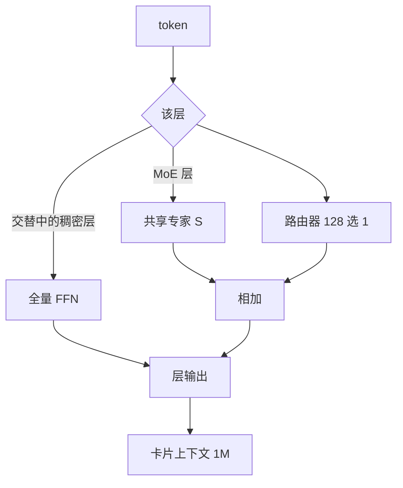

# Llama 4 Maverick

Llama 4 Maverick：170 亿激活、128 个路由专家加共享专家、约 4000 亿总参；每个 token 走共享支路再 128 选 1，FP8 可放进单台 H100 DGX。

<footer>—— Meta，The Llama 4 herd（2025-04-05）；官方模型卡 Llama 4 Maverick 17Bx128E</footer>

Maverick 是 Llama 4 开权档里的**质量锚**：与 [Scout](/llm/llama-4-scout) 同为约 17B 激活，专家库从 16 扩到 128，总量约 **400B**。博客把它写成「同档多模态最好」，并报过实验聊天版 LMArena Elo 1417；STEM 上对标 DeepSeek V3 的「一半激活」。卡片：上下文 **1M**、约 **22T** token、知识截止 2024 年 8 月。族级结构见 [Llama 4](/llm/llama-4)。本篇只写 Maverick 这一档已写明的布局与表，不编层号。

## 问题

Scout 用少专家换单卡；Maverick 要用**同一激活预算换更大零件库**，让编码、推理、多语、图像同时上去，并仍能在一台 DGX 主机上用 FP8 推理。稠密 405B 每次前向跑全量 FFN；这里把「更大」改成「更多专家驻留」，FLOPs 跟 17B 走。代价是路由失败会浪费 400B 磁盘，以及交替稠密层使激活不能按 1/128 去估。

上下文叙事与 Scout 分叉：Maverick 卡片写 1M 而不是 10M。不要把 iRoPE 的千万演示自动安到 128E 档。训练 token 卡片写 ~22T，少于 Scout 的 ~40T——这是检查点口径，不是「Maverick 少训所以更弱」的证明。

### 共享专家 + 单路由 + 交替层

博客对 Maverick 的 MoE 层写得很具体：128 个路由专家加**一个共享专家**；每个 token 必走共享，再走 128 选 1。层间**交替**稠密 FFN 与 MoE，大约一半层仍是全量 MLP。激活量必须把共享支路、选中专家、以及稠密层 FFN 加在一起理解，「17B」是官方汇总，不是「只算一个专家」。族级数据混合超过 30T、多语相对 Llama 3 约十倍；视觉早融合与 MetaCLIP 适配同 Scout。训练：**238 万 H100-小时**。发布 BF16 与 FP8；FP8 宣称进单主机且保质量，评测在 BF16。

$$y = S(x) + E_{i^*(x)}(x),\quad i^*(x)=\arg\max_i r_i(x)$$ 概括「共享 + 单一路由」。$S$ 与 $r$ 的参数化未公开。$k=1$ 的组合数等于专家数，细粒度不如 top-8 开源 MoE。

## 方法

超参选择写成 **MetaP**：层学习率与初始化可在不同 batch、宽、深、token 量之间迁移——稳定性声明，不是可复现 μP 附录。精度：FP8 预训练不牺牲质量的族级句，Behemoth 侧还报过峰值吞吐；Maverick 自己的 FP8 更多作为**推理发布格式**出现。中训用长上下文专项抬窗口。后训练：轻 SFT（自身当裁判，丢掉过半过易样本）→ 多模态在线 RL（中等偏难、训练—再过滤）→ 轻 DPO 修回复边角。Behemoth 教师共蒸馏：软硬目标动态加权。教师当时仍在训练、不开放。

### Instruct 表：这档真正拉开的地方

预训练：MMLU 85.5（Llama 3.1 405B 为 85.2）、MMLU-Pro 62.9、MATH 61.2、MBPP 77.6、ChartQA 85.3、DocVQA 91.6。Instruct：MMMU 73.4、MMMU Pro 59.6、MathVista 73.7、LiveCodeBench **43.4**（Scout 32.8，3.1 405B 27.7）、MMLU Pro 80.5、GPQA Diamond **69.8**（Scout 57.2，3.1 405B 49.0）、MGSM 92.3。MTOB 长短书 chrF 高于 Scout。博客还把 Maverick 写成对 GPT-4o / Gemini 2.0 Flash 的广泛基准领先，以及编码推理上接近更大的 DeepSeek V3——这是发布营销句，协议与社区复核存在争议时，以卡片表 + 自有回归为准。

图像：官方支持测试到 5 张输入；族级预训练最多约 48 张、后训练测到 8 张。输出是多语文本与代码，不是图像生成模型。

## 机制

$k=1$ 加共享专家：公共变换从路由里拿出来，专项走离散选择，通信是单专家而不是 top-8 的多路。交替稠密层提供不经过离散门的梯度路径，也让推理实现必须同时跑两种 FFN。激活 17B 与 Scout 对齐，意味着**加专家几乎不加每 token 计算、只加显存与路由熵**。质量差来自更大库 + 蒸馏，而不是更高 FLOPs。

1M 窗口没有 Scout 那种 10M 针/NLL 主展示；卡片把长上下文能力写在 MTOB 等行。不要假设 iRoPE 的全部外推实验在 128E 上重复过一遍。早融合的干扰在后训练用课程压：图、推理、闲聊之间的平衡失败时，会出现「认图差」或「闲聊腔污染代码」。系统提示被卡片写成可steer、少说教拒答；这是安全微调与语气工作，不是 MoE 机制。博客把轻 SFT 的动机写得很硬：过重的 SFT 与 DPO 会限制在线 RL 的探索，尤其伤害推理、代码与数学。因此 Maverick 的「更强 STEM」不能理解成「更多监督题」，而是教师蒸馏加在线 RL，监督集还被剪过。没有公开 RL 算法名与奖励模型结构，不能写成 PPO 或 GRPO。

数据条款与 Scout 相同：公开来源、许可数据、Meta 产品与服务中的信息（含公开帖与 Meta AI 交互）。Community License 的 7 亿月活条款同样适用。400B 权重要驻留或换入，单主机 ≠ 单卡。

### 不要按 22T 说它「没训饱」

Scout 40T / Maverick 22T 是卡片 token count。博客族级混合「超过 30T」是配方叙事。蒸馏把教师算力折进学生，token 表读不出总 FLOPs。Maverick GPU 小时（2.38M）少于 Scout（5.0M），与 token 表方向一致，仍不能反推「数据更差」。评测上 Maverick 全面高于 Scout，说明官方把算力花在了更宽的专家库与教师，而不是比拼谁的 token 计数更大。

## 边界与工程取舍

装载与专家并行是第一约束。按 17B 稠密去写流水线会在 MoE 层 OOM 或死锁。1M KV 在满注意力下不可交互；真正可用长度取决于实现。路由、容量因子、负载损失未写成可复现超参。交替层的层号未公布。Behemoth 的 GPT-4.5 / Claude 3.7 / Gemini 2.0 Pro STEM 对照属于教师，不能贴到 Maverick 发布名下当已开放权重的分数。

安全微调与 Scout 共用三层叙事：给开发者一个已经拒答过的底座、挡住对抗用户、再靠系统护栏。卡片强调降低对良性提示的误拒、去掉说教语气、加强系统提示可steer。Maverick 更常被当成「主聊天模型」，误拒与说教会直接出现在产品里；这与 MoE 布局无关，是后训练语料。开发者仍须在应用层加护栏，开权不等于开箱即合规。

不要给 400B 编一层层宽。不要把 Scout 的 10M 写成全系列窗口。不要把 Arena Elo 1417 当成 Instruct 权重的误差条（博文写 experimental chat version）。视觉超过 5 图、视频时序建模，均属未声明区。训练排放卡片记 Maverick 约 645 吨 CO2eq（位置基准），市场基准 0。状态写成静态离线检查点，后续行为改进可能另发调优版，不要假设 4 月 5 日权重会静默替换。

出处：Meta，*The Llama 4 herd*，2025-04-05；`meta-llama/Llama-4-Maverick-17B-128E-Instruct` 模型卡。单卡档见 [Llama 4 Scout](/llm/llama-4-scout)。

## 小结

- Maverick：17B 激活 / 128 路由 + 共享 / 400B 总量；交替稠密与 MoE；FP8 单 DGX 主机。
- 卡片上下文 1M、约 22T、截止 2024-08；约 238 万 GPU 小时。
- Instruct GPQA Diamond 69.8、LiveCodeBench 43.4，明显强于 Scout 与 Llama 3.1 405B 的对应行。
- 质量含 Behemoth 共蒸馏；部署成本由 400B 驻留决定，不是由 17B 激活决定。
- 出处：2025-04-05 博客与官方模型卡。
