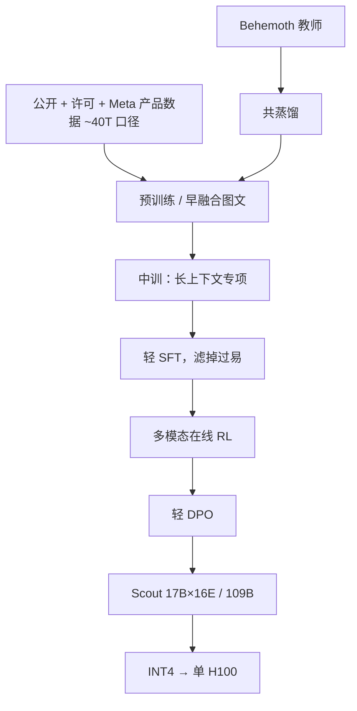

# Llama 4 Scout

Llama 4 Scout 是 170 亿激活、16 个专家的原生多模态 MoE：BF16 发布，INT4 可进单张 H100；预训练与后训练看见 256K，输入上下文被写成千万量级。

<footer>—— Meta，The Llama 4 herd（2025-04-05）；官方模型卡 Llama 4 Scout 17Bx16E</footer>

Llama 4 族里，**Scout** 是为「单卡可放」切的那一档：约 **17B 激活、16 专家、总参约 109B**。同日的 [Maverick](/llm/llama-4-maverick) 激活量接近、专家库大四倍；教师 Behemoth 当时不开放。族级叙事见 [Llama 4](/llm/llama-4) 与 [技术报告笔记](/llm/llama4-report)。本篇按 2025-04-05 博客与 Hugging Face / `llama-models` 卡片写 Scout，不编未公布的层宽。

## 问题

Maverick 的 400B 总量即使激活只有 17B，也要一整台 H100 主机。Scout 要回答：在**同一量级的每 token FLOPs**上，把专家数降到 16、总参降到约 109B，质量能否仍明显高于 Llama 3.3 70B 稠密，并顺带把图文早融合和超长输入做进开权默认。INT4 单卡是部署约束，不是训练精度。

另一条轴是上下文。卡片把 Scout 的 context length 写成 **10M**、token count 约 **40T**、知识截止 2024 年 8 月。博客把**训过的窗口**写成 256K，10M 是长度泛化主张，证据是针检索与长代码 NLL。工程必须把两数分开，否则会按 10M 全量 KV 去采购 HBM。

### 博客与卡片对得上的数字

博客：首次 MoE；Scout 17B 激活 / 16 专家 / ~109B；原生多模态 early fusion；视觉编码器基于 MetaCLIP，对着冻结 Llama 骨干适配；iRoPE；预训练混合超过 30T 的族级叙述。卡片：输入为多语文本与图像，输出为多语文本与代码；支持语种列出阿、英、法、德、印地、印尼、意、葡、西、他加禄、泰、越；预训练实际覆盖约 200 种语言。训练算力：Scout **500 万 H100-小时**（族合计 738 万）。量化：以 BF16 发布，提供即时 INT4 以进单卡，评测在 BF16 上做。

族级「混合超过 30T」与卡片 Scout「~40T」不是同一口径。不要用 40T 去减 Maverick 的 22T 得到 Scout 的「多训量」，也不要把 30T 加到 40T 上。

## 方法

MoE 层：16 个路由专家，激活量与 Maverick 对齐到约 17B，专家更少则并行更简单、专家利用率更高、组合更粗。博客未把 Scout 写成「共享专家 + $k=1$」那句 Maverick 专用描述；实现以发布配置为准，不要把 Maverick 的公式抄到 Scout 头上还假装来自同一段落。交替稠密 / MoE 是 Maverick 的明确句；Scout 是否每层都是 MoE，博客只给定性，本篇保持不确定。

超长：架构名 **iRoPE**——多数层 RoPE，交错插入无位置编码层，推理时对注意力做温度缩放。「i」同时指 interleaved 与 infinite 的志向。256K 是预训练/后训练见过的长度；10M 是外推点。后训练族级管道：轻 SFT（丢掉过易样本）→ 多模态在线 RL → 轻 DPO；Scout 与 Maverick 都从 Behemoth **共蒸馏**。教师未开放，学生里的 STEM 行为有一块无法从开源图还原。

### 卡片上的 Base / Instruct 表

预训练对照（卡片）：MMLU 5-shot Scout 79.6 vs Llama 3.1 70B 79.3、405B 85.2；MMLU-Pro 58.2 vs 70B 53.8；MATH 50.3 vs 70B 41.6；MBPP 67.8；ChartQA 83.4、DocVQA 89.4（3.x 无图）。Instruct：MMMU 69.4、MMMU Pro 52.2、MathVista 70.7、LiveCodeBench 32.8、MMLU Pro 74.3、GPQA Diamond **57.2**、MGSM 90.6。长上下文 MTOB 半本 / 全本 chrF 给出 10M 叙事下的翻译探针，不是综合 10M 任务集。图像理解官方测试到 **5 张输入图**；更多图属开发者自测区。预训练最多约 48 张图、后训练测到 8 张是族级博文句。

## 机制

16 专家的机制承诺是：容量来自专家库而不是激活。路由若塌成总用两三个专家，109B 只是占盘，行为退回「略宽的 17B」。少专家使 top-$k$ 的负载更易均衡，也使细技能组合少——数学与代码上卡片显示 Scout 明显弱于 Maverick（Instruct GPQA 57.2 vs 69.8，LiveCodeBench 32.8 vs 43.4），这与「同样 17B 激活」不矛盾：库更大的 MoE 在蒸馏加持下装了更多专项。

iRoPE 把局部相对几何和超长顺序拆层。RoPE 层继续提供邻域相位；NoPE 层避免所有层在千万下标上卷绕。温度缩放改 softmax 锋利度，不改相对位置。10M 没有论文级消融，不能归因成「只加了 NoPE」。早融合让视觉 token 进同一自注意力；Scout 的图文分数（ChartQA / DocVQA）说明这条在 16 专家档上也成立，只是 MMMU 仍低于 Maverick。

训练数据含 Meta 产品与公开分享的 Instagram / Facebook 帖及 Meta AI 交互——与 Llama 3 卡片「不含 Meta 用户数据」不是同一句。许可是 Llama 4 Community License，月活超 7 亿要另谈商务。再分发须保留 Notice 与 Built with Llama。

### 蒸馏与「单卡 17B」的错觉

质量有一块来自仍在训练的 Behemoth，不是 16 专家自己从 40T 里长出全部 STEM。按稠密 17B 去对标会低估存储（专家权仍要在内存或 PCIe 上），也会高估「小模型从零练到 GPQA 57」的可复现性。INT4 是推理技巧；训练与官方表是 BF16。单卡能装不等于 10M 能跑：KV 才是长度的主成本，实用长度取决于分页、稀疏或检索。中训被博客写成用专门长上下文数据再抬一截能力，同时解锁超长输入主张——与 [OLMo 2 式数学补丁](/llm/olmo2-midtrain-recipe) 不同，这里买的是窗口，不是 GSM8K。没有公开中训混合表，不能把 Dolmino 配比套过来。

## 边界与工程取舍

10M 是宣传外推，256K 是训过的窗。针测与 NLL 不能代替多跳长文档。专家并行在 16 专家上比 128 轻，但路由实现仍要正确，不能当稠密 109B 用。多语：预训练 200 语种，官方支持列表 12 种，其余要自己测安全与质量。视频被写成帧静图。Behemoth 的 MATH-500 / GPQA 对照是教师自报，不能写进 Scout 的成绩单。

硬件卡写训练在 Meta 自建 GPU 集群与生产基础设施上完成，微调、量化、标注、评测同样走生产栈。温室气体：Scout 训练的位置基准排放约 1,354 吨 CO2eq，市场基准因 100% 可再生匹配记 0。这些数字是卡片披露，不是服务质量承诺。

不要给 Scout 编一层层宽。不要把 Maverick 的 1M 写成 Scout 的窗口。不要假设许可与 3.x 逐字相同。社区对发布评测有过争议时，系统回归以自有任务为准。卡片还给出一份可改的系统提示模板，强调少说教、可闲聊、知识截止 2024-08、按用户语言回答；这是 Instruct 语气工作，不能当成 Base 检查点的默认行为。预训练权重与 Instruct 权重要分开部署：前者给续训，后者给助手。图像 caption、视觉问答、合成数据与蒸馏被写成许可内的用途；用输出再去训练公开模型时，须遵守「Llama」冠名条款。

出处：Meta，*The Llama 4 herd*，2025-04-05；`meta-llama/Llama-4-Scout-17B-16E` 模型卡。对照见 [Llama 4 Maverick](/llm/llama-4-maverick)。

## 小结

- Scout：17B 激活 / 16 专家 / 109B 总量，原生多模态 MoE，INT4 单 H100，约 500 万 GPU 小时。
- 卡片上下文 10M、约 40T token、截止 2024-08；博客训练窗 256K + iRoPE 外推。
- Instruct GPQA Diamond 57.2；图文 ChartQA / DocVQA 可用；编码与 STEM 低于 Maverick。
- 共蒸馏自未开放的 Behemoth；数据含 Meta 产品公开交互。
- 出处：2025-04-05 博客与官方模型卡。
