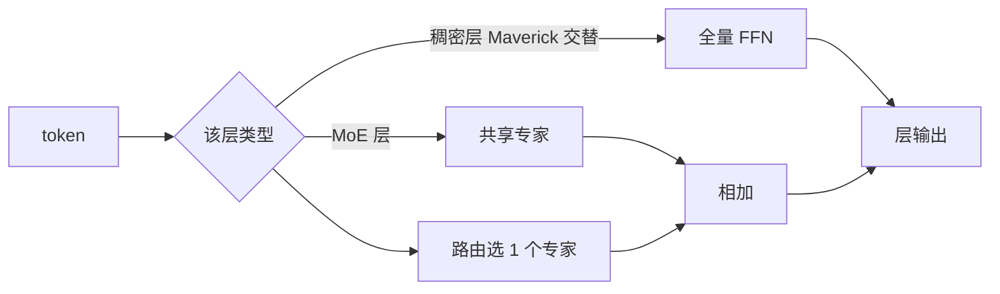

# Llama 4 与 MoE 方向

    
Llama 4 是我们第一批使用混合专家架构的模型：每个 token 只激活总参数的一部分。

    <footer>—— Meta，The Llama 4 herd，2025 年 4 月 5 日博客</footer>

Llama 1–3 是稠密 Transformer：每个 token 走过全部 FFN。2025 年 4 月 Meta 把 Llama 4 写成**原生多模态 MoE**——Scout 与 Maverick 开放权重，Behemoth 作为教师被预告。方向很清楚：用稀疏激活换总容量，用早融合把图文放进同一骨干，用交错位置方案冲击超长上下文。本篇只依据官方博客与配套模型卡里**已经写明**的结构选择；层数、隐宽、未公布的路由细节与未发布检查点，一律标成不确定，不编一套参数表来填空。

## 问题

稠密模型把「更大」直接变成「每次前向更贵」。固定训练 FLOPs 时，MoE 可以把专家库做大、每次只跑 top-$k$，同一算力预算下容量更高，这是 Switch、Mixtral 已经走过的路。Llama 3 的 405B 仍是稠密的，服务与续训都按全量 FFN 计价。Llama 4 要回答的产品问题是：开源权重能否在「单机 / 单主机可部署」的激活量上，接近上一代稠密旗舰的质量，同时把图像从适配器改成预训练期的一等模态。

另一问题是上下文。Llama 3.1 把窗口做到 128K，再往上 KV 与 RoPE 相位都吃紧。Llama 4 博客把 Scout 的输入上下文写成千万 token 量级，并引入 iRoPE。这里必须把**训练长度**和**宣传外推长度**分开写，否则工程上会按 10M 去采购缓存。

### 公开信息与不确定处

**公开（Meta 博客，2025-04-05）**：系列首次使用 MoE；Scout 为 170 亿激活参数、16 个专家、总参数约 1090 亿；Maverick 为 170 亿激活、128 个路由专家外加共享专家、总参数约 4000 亿，层间**交替**稠密 FFN 与 MoE；Behemoth 为约 2880 亿激活、16 个专家、总参数近 2 万亿，用作教师，发布时仍在训练、**当时不开放权重**。原生多模态采用 early fusion；视觉编码器基于 MetaCLIP，并与冻结的 Llama 骨干分开适配。Scout 预训练与后训练窗口为 256K，博客称其输入上下文可达 10M，并展示文本针检索与代码上千万 token 的 NLL。Maverick 每个 token 进入共享专家以及 128 个路由专家中的一个。

**不确定**：Behemoth 是否、何时以何种许可开放；10M 在真实多文档任务上的质量曲线，博客主要给检索与 NLL，不是完整的 10M 综合基准表；Scout 是否「每一层都是 MoE」、Maverick 交替层的层号与比例，博客只给定性描述；路由是否加噪声、容量因子、负载损失形式，官方文没有写成可复现超参。下列数字凡未出现在该博客或官方模型卡中的，本文不补。

「17B 激活」是每次前向真正算的专家与注意力，不是显存占用。专家权重仍要驻留或换入，Maverick 的 400B 总量决定存储，17B 决定算力。按激活量选 GPU 会低估装载成本。

## 方法

### 稀疏 FFN：Scout 与 Maverick 两条布局

MoE 层把稠密 FFN 换成专家库加路由器。Maverick 的官方叙述是：MoE 层含 128 个路由专家和 **一个共享专家**；每个 token 必走共享支路，再走 128 选 1 的路由支路。这与「纯 top-2、无共享」的 Mixtral 不同，更接近 [共享专家](/llm/shared-expert-moe) 那一类设计，但 $k=1$ 比许多开源 MoE 更稀。交替稠密层意味着大约一半的层仍是全量 FFN，激活量不能按「整网都是 1/128」去估。

Scout 用 16 个专家、同样约 17B 激活。博客强调 INT4 量化后可放进单张 H100。专家数更少，路由组合更粗，换的是更简单的并行与更高的专家利用率。二者激活量接近、总量差约四倍：同一「工作马力」、不同「零件库大小」。

$$
y = S(x) + E_{i^*(x)}(x),\qquad i^*(x)=\arg\max_i r_i(x)
$$

上式概括 Maverick 博客所写的「共享 + 单一路由专家」。$S$ 与打分函数 $r$ 的具体参数化未公开，实现应以发布配置为准。

### iRoPE 与超长上下文

Scout 的长上下文被写成架构名 **iRoPE**：多数层仍用 RoPE，**交错插入不带位置编码的注意力层**，推理时再对注意力做温度缩放以助长度泛化。「i」在博客里同时指 interleaved 与对 infinite context 的志向。无位置层走的是 [NoPE](/llm/nope) 那一类归纳：顺序靠因果掩码，减少把训练长度写进相位。256K 是预训练/后训练看见过的长度；10M 是长度泛化主张，用针检索与长代码 NLL 支撑。工程上应把 256K 当「训过的窗口」，把 10M 当「官方展示的外推点」，中间每一档自己测。

### 早融合与蒸馏

文本与视觉 token 在骨干里一起预训练，而不是 Llama 3 论文里的组合式适配器。数据混合超过 30T token，多语相对 Llama 3 加了一个数量级（博客口径）。Maverick 从 Behemoth **共蒸馏**（codistillation），用动态加权的软硬目标。教师未开放时，学生权重里已经含蒸馏过的行为，无法从开源图里把教师梯度还原出来。

后训练管道被写成轻量 SFT → 在线 RL → 轻量 DPO，并删掉模型判定为过易的样本。这是官方叙事中的对齐方向，超参与数据配比未完整公开。

## 机制

MoE 的机制承诺是：总参数变大时，FLOPs 跟激活走。路由若崩溃，有效容量退回「几个专家的稠密小网」，109B/400B 只是占盘。共享专家把每个 token 都需要的变换从路由里拿出来，减轻「专家既当公共层又当专项」的冲突。$k=1$ 让组合数等于专家数，细粒度不如 top-8 的 Qwen3-MoE，换的是路由与通信更简单。交替稠密层则保证一部分表示变换不经过离散选择，梯度完整，也让推理实现必须同时支持两种层。

iRoPE 把「局部相对几何」和「超长顺序」拆到不同层。RoPE 层继续提供邻域相位；NoPE 层避免所有层都在超长下标上卷绕。温度缩放不改相对位置，只改 softmax 锋利度，与 YaRN 的注意力温度是同一类旋钮。没有论文级消融表之前，不应把 10M 归因成「只加了 NoPE」或「只加了温度」。

早融合的机制是：视觉编码器输出与文本进入同一自注意力，图文统计在预训练就对齐。代价是模态互相干扰——后训练博客写明要用课程在图、推理、闲聊之间找平衡。这与「冻结 LLM、只训投影」的适配器路线相反。

## 边界与工程取舍

开源 MoE 的第一约束是专家并行与装载，不是激活 FLOPs。单主机能跑 Maverick，不等于单卡能装 400B。Scout 的 10M 若按全量 KV 理解，缓存不可部署；真正能用的长度取决于实现是否做稀疏注意力、分页或外部检索。博客给的是能力展示，不是 SLA。

Behemoth 的 STEM 对比（MATH-500、GPQA Diamond 等）是 Meta 自报、且对应「仍在训练」的教师，不能当作可下载检查点的分数。社区对 Llama 4 质量与评测协议有过公开争议；写系统时以自己的任务回归为准，不要把发布博文的「best in class」当可引用误差条。

视觉侧：预训练最多 48 张图，后训练测试到 8 张（博客）。超过这个基数属于未声明区。视频被写成「视频帧静图」，不是单独的视频 Transformer 论文。

不要根据「17B 激活」去对标稠密 17B 的显存配方，也不要给 Behemoth 编一层层宽。能写进架构图的，只有博客里的专家数、共享专家、交替层与 iRoPE 这几块。

## 小结

- Llama 4 把 Llama 族从稠密改为 MoE，并改为图文早融合；这是相对 3.x 的主方向。
- Scout 与 Maverick 的激活量、专家数、总量以 Meta 2025-04-05 博客为准；Behemoth 为预告教师，开放与否当时未定。
- Maverick：共享专家 + 128 选 1，且与稠密层交替；Scout：16 专家、强调单卡量化部署。
- 256K 是训过的窗口；10M 是官方长度泛化主张，伴随 iRoPE（交错 NoPE 层 + 推理温度）。
- 未公开的层表、路由超参与教师权重不要用猜测填上。
- 出处：Meta，*The Llama 4 herd: The beginning of a new era of natively multimodal AI intelligence*，2025-04-05。配套说明见 Hugging Face 对 Maverick/Scout 的发布博文。无同名完整技术报告时，不以虚构 arXiv 代替博客。
