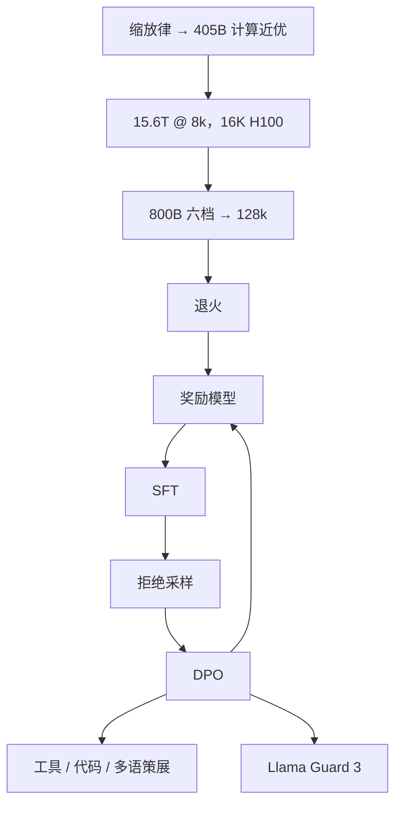

# Llama 3 技术报告

    
我们选择标准稠密 Transformer 而不是 MoE，以便把研发流程缩放到 405B；后训练保持相对简单：SFT、拒绝采样与 DPO。

    <footer>—— Grattafiori 等，The Llama 3 Herd of Models，arXiv:2407.21783</footer>

[Llama 3 数据与 tokenizer](/llm/llama-3) 写 15T 与 128k 词表；[Llama 3.1 长上下文](/llm/llama-3-1) 写 8k→128k 课程。本篇对着 **Herd 论文**写剩下的骨架：**为何 405B 稠密、表 3 的层与头、\(3.8\times 10^{25}\) FLOP、16K H100、后训练轮次、工具与 Llama Guard 3**。论文声明表中数字对应 **Llama 3.1**，行文仍称 Llama 3。不要把 2024 年 4 月仅 8B/70B、8k 窗口的首发，与 7 月 405B/128k 混成一张「都叫 3」的规格。

## 问题

Llama 2 的上限是 70B 与约 2T token。下一代若要在开源许可下逼近 GPT-4 档，需要一次**计算最优附近的旗舰宽度**，以及两个过训练的小档（8B/70B）用同一套数据与后训练。MoE 能在同样 FLOP 下堆更多参数，但论文把**训练稳定性与流程可扩展**设为一等约束，于是放弃稀疏。第二个问题是后训练：PPO 一类算法在 405B 上难稳，他们把流程收成奖励模型 + SFT + 拒绝采样 + DPO 的多轮迭代，并把工具、代码、多语、安全写进数据策展，而不是换网络。

### 三档超参是报告里最硬的表

表 3：8B 为 32 层、宽 4096、FFN 14336、32 查询头；70B 为 80 层、宽 8192、FFN 28672、64 查询头；405B 为 **126 层、宽 16384、FFN 53248、128 查询头**。三档都是 **8 个 KV 头** 的 [GQA](/llm/gqa)，[SwiGLU](/llm/swiglu)，词表 128k，RoPE \(\theta=500{,}000\)。峰值学习率随宽度下降：\(3\times 10^{-4}\) / \(1.5\times 10^{-4}\) / \(8\times 10^{-5}\)。405B 预训练 **15.6T** token、预算 **\(3.8\times 10^{25}\)** FLOP，约 Llama 2 旗舰的 50 倍。小模型在同样数据上远超计算最优步数，用旗舰在后训练里再蒸馏式地帮它们——论文把这写成刻意的推理成本最优，而不是「没算过缩放律」。

4 月的 Llama 3 8B/70B 知识截止不同、窗口 8k；3.1 把三档都拉到 128k 并放出 405B。许可为更新后的 Llama 3 Community License，不是 Apache。Guard 3 是配套安全分类器，不是语言模型本体。

## 方法

预训练三阶段（405B）：(1) 主体 next-token，AdamW，8k 步热身，余弦到 \(8\times 10^{-7}\)，约 120 万步；batch 从 4M token × 4k 长，经 8M × 8k，再到 16M，以稳住前期。(2) 长上下文约 **800B** token，六档加长到 128k，门禁为短任务恢复 + 针检索，详见长上下文专文。(3) 退火，并上采样高质量域；小模型退火对 GSM8K/MATH 有明显增益，405B 上增益可忽略。训练在最多 **16K 张 H100**（Grand Teton，NVLink 机内，RoCE 400Gbps 机间）上进行；小档用 InfiniBand 集群。并行含张量、流水、数据与上下文并行；MFU 与切分表见论文表 4。54 天窗口里约 78% 意外中断被归为硬件。

### 后训练：多轮 SFT + RS + DPO

每轮：在预训练检查点上训奖励模型（人类偏好）；SFT 指令数据；拒绝采样造优质轨迹；[DPO](/llm/rafailov-dpo) 对齐。多轮迭代把工具使用、代码、推理、事实性、多语、长上下文与精确遵嘱的策展数据加进去。论文明确不把 PPO 当默认，理由是更不稳、更难扩。工具调用成为一等能力：模型学习何时调用、如何填参、如何根据工具结果继续，评测含该协议。安全写进第 5.4 节与 Guard 模型，输入输出都可过滤。组合式多模态（图像/视频/语音适配器）是论文中的实验系统，**不是** 3.1 文本权重的默认前向，不要写成原生早融合。

人类评测与表 2 把 8B / 70B / 405B 分到三个等价班，对照 Gemma 2、Mixtral、GPT-4、Claude 3.5 等。旗舰叙事是「在大量任务上与 GPT-4 可比、接近 SOTA」。小档「同参数班第一」。这些是 2024-07 的表，提示协议（是否 CoT、shot 数）印在脚注里，引用时不要丢掉。代码与推理的增益被明确写成后训练策展的结果，而不是 126 层突然会搜索；多语 8 种工作语言是 Instruct 产品范围，预训练里更多语种只保证切得动。安全评测覆盖短对话与长前缀、many-shot 有害示范——窗口拉长后，文档内对抗与恶意示范会进入同一上下文，Guard 3 必须跟长窗一起发。

8B/70B 预训练含多语，但 4 月版产品意图偏英语；3.1 Instruct 才把德、法、意、葡、印地、西、泰等列为支持对话语种。覆盖面仍不是 119 语种故事。

## 机制

选稠密的机制是优化器与并行栈的确定性：每个 token 走全部 FFN，没有专家负载塌缩，故障重启与检查点形状更简单。代价是同等 FLOP 下总参数少于稀疏旗舰，服务 405B 必须模型并行。GQA 8 KV 头把 decode 缓存打到可接受斜率，与 128 个查询头的表达力折中；头维 \(16384/128=128\)。高 \(\theta\) RoPE 为后续拉窗留相位余量，真正的 128k 仍靠持续预训练。

DPO 直接在偏好对上拟合，避开在线 RL 的价值估计；拒绝采样用奖励模型或校验器筛轨迹，等于在 SFT 前做一次「只留高分续写」。工具的机制是把调用格式写进后训练分布，推理侧仍要约束解码与沙箱——权重不会执行 HTTP。IsoFLOPs 在高预算下变平，所以 405B 对「再宽一点或再多一点 token」不敏感，这是他们敢钉这个宽度的理由。

### 过训练的 8B 不是缩小的 405B

同样 15T+，8B 重复看数据更多，记忆与表面模式更强；405B 更接近计算最优，泛化与复杂推理更强。后训练用旗舰造数据喂小模型，使 8B Instruct 超过「纯小模型自己 RL」。因此不能用 8B 的 HumanEval 外推 405B，也不能用 405B 的电费去骂 8B 的本地部署。

## 边界与工程取舍

Llama 4 的 MoE 路线与本报告的「为稳定而稠密」是后续决策，不能回写。组合多模态实验不是 3.1 发布权重。Community License 有用户数与可接受使用限制。15.6T 公开来源仍不可逐条审计；污染分析以论文为准。405B 的 128k 服务是带宽问题，多数业务用不到标称上限。RoCE 上训 405B、IB 上训小档，复现基础设施成本不在开源包里。环境温度造成的 1–2% 日周期吞吐波动被写进基础设施章节，提醒超大作业的「MFU」含数据中心气候，不是纯算法常数。检查点平均与退火是收尾稳定性手段，不能当成又一种架构。

不要把 4 月博客的 8k 窗口写成 Herd 论文的默认产品规格。3.2 / 3.3 是后来的视觉与指令快照，见各专文。

真实编号：arXiv:2407.21783。数据与切词细节见 [llama-3](/llm/llama-3)；窗口几何见 [llama-3-1](/llm/llama-3-1)。论文作者行为 Grattafiori 等 / Llama 团队。

## 小结

- Llama 3.1 三档稠密：8B / 70B / 405B（126 层、宽 16384、128Q/8KV），GQA + SwiGLU + RoPE \(\theta=5\times 10^5\)。
- 405B 用 \(3.8\times 10^{25}\) FLOP、15.6T token、最多 16K H100；刻意选稠密以稳定扩展。
- 后训练多轮：RM、SFT、拒绝采样、DPO；工具与 Guard 3 随报告发布。
- 评测表对应 3.1；4 月 8B/70B 8k 首发是另一快照。
- 出处：Grattafiori 等，*The Llama 3 Herd of Models*，arXiv:2407.21783。
