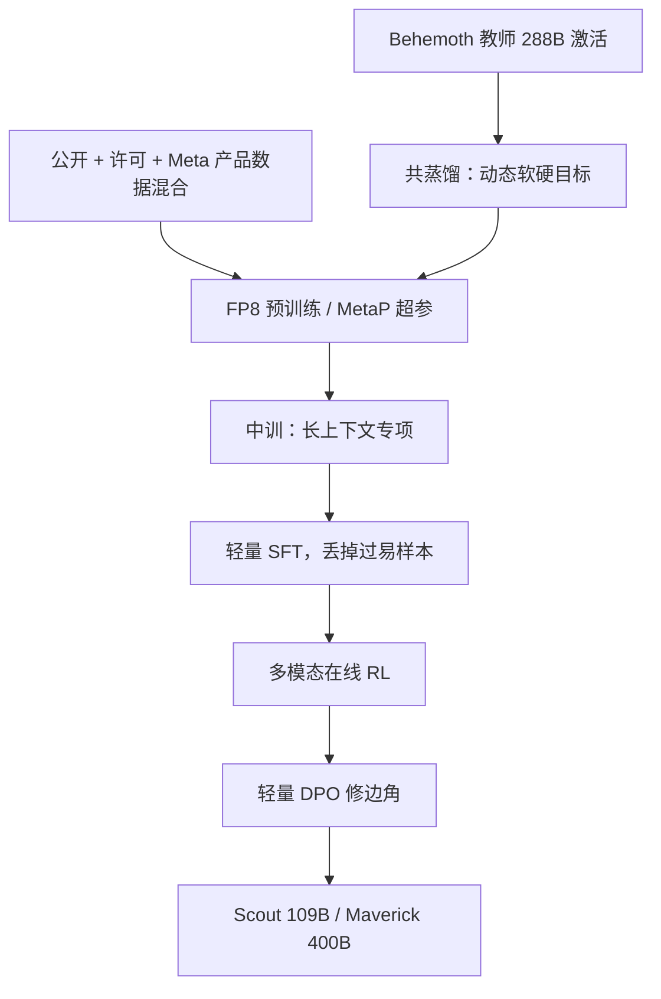

# Llama 4 技术报告

Llama 4 是我们第一批使用混合专家架构的模型：每个 token 只激活总参数的一部分。

<footer>—— Meta，The Llama 4 herd，2025 年 4 月 5 日博客</footer>

Llama 1–3 把稠密解码器做成开源默认之后，2025 年 4 月 Meta 把下一代写成**原生多模态 MoE**。公开交付物是 Scout 与 Maverick 的开源权重，以及仍在训练、当时不开放的教师 Behemoth。没有同名完整 arXiv 技术报告时，可核对的「报告」就是官方博客加 `llama-models` 模型卡。方向概览见 [Llama 4 与 MoE](/llm/llama-4)；本篇按那两份文本把预训练、中训、后训练与未公开处摊开，不编一层层宽表。

## 问题

稠密 405B 把「更大」直接变成每次前向更贵。固定训练 FLOPs 时，MoE 可以把专家库做大、每次只跑一小截，同一算力预算下容量更高。Llama 4 要回答的产品问题是：开源权重能否在「单卡 / 单主机可部署」的激活量上接近上一代稠密旗舰，同时把图像从适配器改成预训练期的一等模态。

另一条轴是上下文。Llama 3.1 的 128K 再往上，KV 与 RoPE 相位都吃紧。博客把 Scout 的输入上下文写成千万 token 量级，并引入 iRoPE。工程上必须把**训练长度**和**宣传外推长度**分开，否则会按 10M 去采购缓存。

### 两份文本对得上、对不上的数字

**博客（2025-04-05）**：首次 MoE；Scout 约 17B 激活、16 专家、总参约 109B；Maverick 约 17B 激活、128 个路由专家加共享专家、总参约 400B，层间交替稠密 FFN 与 MoE；Behemoth 约 288B 激活、16 专家、总参近 2T，用作教师。原生多模态走 early fusion；视觉编码器基于 MetaCLIP，与冻结的 Llama 骨干分开适配。Scout 预训练与后训练窗口 256K，博客称输入可达 10M。整体数据混合超过 30T，多语相对 Llama 3 约十倍，覆盖约 200 种语言（逾 100 种各超过 10 亿 token）。Behemoth 预训练用 FP8、约 32K GPU，峰值约 390 TFLOPs/GPU。

**模型卡**：Scout 上下文栏写 10M、token 计数约 40T；Maverick 上下文栏写 1M、约 22T；知识截止均为 2024 年 8 月。输入为多语文本与图像，输出为多语文本与代码。Scout 以 BF16 发布、INT4 量化可进单张 H100；Maverick 另提供 FP8，宣称可放进单台 H100 DGX 主机。

30T、40T、22T 不是同一口径。博客的「混合超过 30T」是配方叙事；模型卡的 token count 按检查点计。不要把三数加总，也不要用 40T 去反推 Maverick 的 22T 是「少训了」。

## 方法

### MetaP、FP8 与中训

博客把超参选择写成 **MetaP**：按层学习率与初始化尺度可在不同 batch、宽度、深度与 token 量之间迁移。这是训练稳定性声明，不是一篇可复现的 μP 附录。精度上强调 FP8 预训练不牺牲质量，并给出 Behemoth 的 GPU 吞吐数字。中训（mid-training）用专门长上下文数据把核心能力再抬一截，同时解锁 Scout 的超长输入主张。

Maverick 的 MoE 层：128 个路由专家加**一个共享专家**，每个 token 必走共享支路，再走 128 选 1。交替稠密层意味着大约一半层仍是全量 FFN，激活量不能按「整网都是 1/128」去估。Scout 专家更少（16），换更简单的并行与更高专家利用率。二者激活量接近、总量差约四倍。

$$
y = S(x) + E_{i^*(x)}(x),\qquad i^*(x)=\arg\max_i r_i(x)
$$

上式概括 Maverick 所写的「共享 + 单一路由专家」。$S$ 与打分函数 $r$ 未公开，实现以发布配置为准。

### 后训练：轻 SFT、在线 RL、轻 DPO

相对 Llama 3 的重 SFT，Llama 4 把管道改成轻量监督微调 → 在线强化学习 → 轻量 DPO。关键观察是：SFT 与 DPO 会过约束，限制在线 RL 的探索，尤其伤害推理、代码与数学。他们用 Llama 自身当裁判，丢掉超过一半被标成「太易」的数据，只在更难的集合上做轻 SFT。随后的多模态在线 RL 继续筛中等偏难提示，并交替「训练—再过滤」。DPO 只处理回复质量的边角，用来在智能与闲聊之间找平衡。Behemoth 一侧更极端：SFT 数据剪掉约 95%（小模型约 50%），并重写异步在线 RL 基础设施，博客称相对前代约 10 倍训练效率。

Scout 与 Maverick 都从 Behemoth **共蒸馏**（codistillation）。教师前向的软目标与硬标签动态加权；学生训练里已含的数据，教师前向成本被摊掉，新数据再补教师 logits。教师未开放时，无法从开源图还原教师梯度。

iRoPE：多数层仍用 RoPE，交错插入不带位置编码的注意力层，推理时再对注意力做温度缩放。「i」同时指 interleaved 与对 infinite context 的志向。256K 是训过的窗口；10M 是长度泛化主张，支撑是针检索与长代码 NLL，不是完整 10M 综合基准表。

## 机制

MoE 的机制承诺是：总参数变大时，FLOPs 跟激活走。路由若崩溃，有效容量退回「几个专家的稠密小网」，109B/400B 只是占盘。共享专家把每个 token 都需要的变换从路由里拿出来；$k=1$ 让组合数等于专家数，细粒度不如 top-8 的开源 MoE，换的是路由与通信更简单。交替稠密层保证一部分表示变换不经过离散选择。

早融合把视觉 token 与文本放进同一自注意力，图文统计在预训练就对齐。代价是模态互相干扰——后训练必须用课程在图、推理、闲聊之间找平衡。视觉编码器不与骨干联合从零训，而是基于 MetaCLIP、对着冻结 Llama 适配。预训练最多约 48 张图，后训练测到 8 张；视频被写成视频帧静图。

iRoPE 把局部相对几何和超长顺序拆到不同层。RoPE 层继续提供邻域相位；[NoPE](/llm/nope) 层避免所有层都在超长下标上卷绕。温度缩放不改相对位置，只改 softmax 锋利度。没有论文级消融表之前，不应把 10M 归因成「只加了 NoPE」或「只加了温度」。

### 蒸馏把教师的 STEM 写进学生权重

Behemoth 在 MATH-500、GPQA Diamond 上相对 GPT-4.5 / Claude Sonnet 3.7 / Gemini 2.0 Pro 的对照，是 Meta 自报、且对应「仍在训练」的教师。Scout / Maverick 的质量里有一块是蒸馏过来的行为，不是 17B 激活自己从网页长出来的。评测协议与社区争议存在时，写系统应以自己的任务回归为准，不要把发布博文的「best in class」当误差条。

## 边界与工程取舍

开源 MoE 的第一约束是专家并行与装载，不是激活 FLOPs。单主机能跑 Maverick，不等于单卡能装 400B。按「17B 激活」去对标稠密 17B 的显存配方会低估。Scout 的 10M 若按全量 KV 理解，缓存不可部署；真正能用的长度取决于实现是否做稀疏注意力、分页或外部检索。

模型卡写明训练数据含公开来源、许可数据以及 Meta 产品与服务中的信息（包括公开分享的 Instagram / Facebook 帖与 Meta AI 交互）。这与 Llama 3 模型卡「不含 Meta 用户数据」不是同一句话。再分发与商用要读当时 Llama 许可，不能假设与 3.x 条款逐字相同。

不要给 Behemoth 编一层层宽，也不要把 Maverick 的 1M 与 Scout 的 10M 写成全系列同一窗口。能写进架构图的，只有博客里的专家数、共享专家、交替层、iRoPE、MetaP 与后训练三段式。

路由是否加噪声、容量因子、负载损失形式，官方文没有写成可复现超参。层号与「Scout 是否每一层都是 MoE」，博客只给定性描述。这些空不要用开源配置文件的一次快照去回填成「报告原表」。

## 小结

- Llama 4 把族从稠密改为 MoE，并改为图文早融合；可引用文本是 2025-04-05 博客与官方模型卡，当时没有同名完整技术报告。
- Scout：17B 激活 / 16 专家 / 109B 总量，训 256K，宣传外推 10M；Maverick：17B 激活 / 128 路由 + 共享 / 400B，模型卡上下文 1M。
- Behemoth 约 288B 激活、近 2T 总量，作共蒸馏教师，发布时仍在训练、不开放权重。
- 后训练为轻 SFT → 在线 RL → 轻 DPO，并丢掉过易样本；Behemoth 侧 SFT 剪得更狠，RL 基础设施重写。
- 256K 是训过的窗口；10M 是官方长度泛化主张，伴随 iRoPE。
- 出处：Meta，*The Llama 4 herd*，2025-04-05；配套见 Hugging Face / `meta-llama` 模型卡。无同名完整技术报告时，不以虚构 arXiv 代替。
