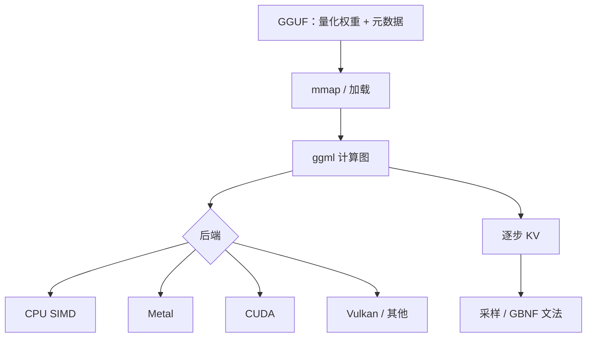

# llama.cpp / ggml

用一份轻量张量库把量化后的权重放进普通进程；CPU、Metal、CUDA、Vulkan 都是后端，模型文件是 GGUF，而不是 Python 虚拟环境。

<footer>—— Georgi Gerganov，ggml 与 llama.cpp 仓库</footer>

llama.cpp 把 LLaMA 一类因果 LM 的推理收成 C/C++ 程序：依赖少、能在笔记本、手机、树莓派和带桌面 GPU 的机器上跑。底层张量库是 ggml（以及后续 ggml-org 生态），提供量化数据类型、计算图和各硬件后端。模型以 GGUF 容器分发，里面是分块的量化权重与元数据。它不是集群里的 vLLM 替代品，而是 **本地优先** 的运行时：进程内加载、单用户或轻度并发、用量化换内存。本篇按仓库与社区格式写 ggml 张量、GGUF、量化与后端，不编造会议论文——Gerganov 的工作以开源实现为出处。

## 问题

2023 年初，能跑 7B 级模型的主流路径是 PyTorch + 数 GB 的 FP16 权重 + CUDA。消费级机器的痛点是：没有那张卡，或有卡但不想装一套深度学习栈，或想在 Apple 的统一内存上用 Metal 而不是经过 CUDA 翻译层。服务引擎假设 HBM 池、连续批、分页 KV 的调度器；本地聊天假设「一个模型文件 + 一条命令」。两者的优化目标不同：前者摊权重到多条请求，后者让 **单条请求** 在内存预算内尽快出字。

量化是本地路径的第一刀。4-bit 权重大约把 7B 从十余 GB 压到四 GB 量级，才能进 8–16 GB 的消费内存。量化必须是一等数据类型，而不是先加载 FP16 再临时 scale——启动要能 mmap 量化块，decode 核直接吃 `Q4_K` 一类布局。ggml 把这些 dtype 做进张量，llama.cpp 在图上选对应的 matmul。

### 格式要从 GGML 二进制走到 GGUF

早期 `.bin` / GGML 格式迭代快、兼容性差。GGUF 把张量、分词器、超参、量化方案收进带版本与键值元数据的容器，便于 mmap 与跨版本。讨论「用 llama.cpp 跑某个模型」时，指的是 **有没有对应 GGUF 以及 arch 是否已实现**，不是 Hugging Face 上的 `safetensors` 能不能直接 `dlopen`。转换脚本是生态的一部分，转换过程会固定量化类型，质量评估应在 GGUF 上做，不要用 BF16 仓库的分数代替。

ggml 不只服务 Llama。同一套张量库还长出 whisper.cpp、其他模态绑定。本篇只谈 LLM 推理侧：因果 Transformer、KV 缓存、采样与文法。不要把「ggml 能跑语音」写成 llama.cpp 的架构特性。

## 方法

计算图画在 CPU 上：Embedding、逐层注意力与 FFN、RoPE、RMSNorm、词表投影。Decode 一步追加 KV。KV 可以是 FP16 或量化缓存，这是与权重量化独立的旋钮，直接决定 [上下文预算](/llm/on-device-kv)。后端把图节点映射到：CPU（AVX / NEON 等）、Metal（Apple GPU）、CUDA、Vulkan、SYCL 等。没有后端时退回 CPU。统一内存设备（Apple Silicon）上，权重量化块与 KV 可以少一次显式拷贝，这是 Metal 路径相对「CUDA + 独立显存」的结构优势。

量化方案按块（block）存 scale 与零点，常见家族包括较老的 `Q4_0` / `Q5_0` 与后来的 k-quant（`Q4_K_M`、`Q5_K_M` 等）、以及更高比特的 `Q8_0`。块内共享 scale 会在异常通道上引入误差；k-quant 用更细的超级块结构减轻这一点。选择是内存、速度、困惑度之间的曲面，没有全局最优。推理时 GEMM 是「量化权重 × 激活」，激活通常较高精度，反量化发生在寄存器或短缓冲里，而不是先把全模型还原成 FP16。

### 服务能力是附加的，不是设计中心

llama.cpp 提供 HTTP server、简易连续批、文法约束（GBNF）、投机与多模态绑定等，社区在往「也能当小服务」走。调度与分页的完成度仍不能按 Kwon 或 Zheng 的论文来衡量：默认故事仍是单机、有限并发、KV 连续或简单分块。把它放到多租户 GPU 集群当主引擎，会缺 Radix、缺与 DistServe 同类的 PD 拆分、缺生产级抢占会计。反向把 vLLM 塞进手机，则会缺 ggml 这种可 mmap 的量化 dtype 与零 Python 运行时。

GBNF 约束解码与 Outlines 的目标相同、实现不同：在本地逐步掩码，词表扫描开销曾被 XGrammar 论文当作对照之一。复杂 JSON schema 在服务端更该接 XGrammar；在本地小词表、短 schema 上 GBNF 已经够用。见 [约束解码](/llm/constrained-decoding)。

## 机制

本地 decode 的屋顶线经常是内存带宽：每步读量化权重（体积已缩小）和 KV。量化的加速来自 **更少字节**，不是更少 FLOPs——反量化还加了整数到浮点的转换。CPU 上 SIMD 若对某种 quant 类型有特化核，墙钟可以下降；若某种类型只能标量反量化，会比稍高比特但有好核的类型更慢。因此「Q4 一定快于 Q5」不成立，要看后端是否为该格式写了核。

Apple 统一内存让 30B 级量化模型在内存够的 Mac 上变得可行：没有 24 GB 独立显卡也能驻留。这与数据中心 HBM 池是不同的容量故事，并发仍然受限——统一内存还要分给系统与 UI。移动端再叠加 NPU 时，ggml 图是否能切到神经引擎取决于后端，更多便携编译见 [MLC / TVM](/llm/mlc-tvm)；llama.cpp 的强项仍是「同一份 GGUF，多后端可执行」。

质量对比必须锁定量化类型与校准。公开 GGUF 常是对通用校准集的 round；领域任务上 4-bit 可能把长尾实体打糊。不要用「Q4_K_M 在聊天里够好」代替你的评测集。

### 与 Python 生态的边界在转换

训练、微调、PEFT 仍在 PyTorch。导出 GGUF 是单向交付：merge LoRA、选 quant、写出。运行时改权重（在线 LoRA）能力弱于 vLLM 的多适配器服务。Tokenizer 在 GGUF 元数据里，需与训练时一致，否则 [chat template](/llm/chat-template) 对不上。这是本地助手踩坑最多的一层：量化对了、模板错了，模型像变笨。

## 边界与工程取舍

不要用 llama.cpp 的单请求延迟去对比 vLLM 的高并发吞吐。分子分母都不是同一 SLA。许可证以仓库为准（ggml / llama.cpp 的 MIT 等），模型权重另有各家协议。新架构（MLA、极端 MoE）的第一实现往往先出现在 Python 引擎，ggml 要补算子与量化 kernel，会有窗口期。

GPU 后端存在不代表达到 TensorRT-LLM 的融合度。CUDA 上 llama.cpp 能跑，但 Hopper FP8 全家桶仍是厂商库的主场。选 llama.cpp 的理由应是：便携、量化格式统一、部署面从 CPU 到桌面 GPU、运维是一个二进制。选它当训练集群的推理网关，是用错了工具。

出处：https://github.com/ggerganov/llama.cpp 与 ggml 组织仓库、GGUF 规范说明。不给 llama.cpp 编造 arXiv。XGrammar 论文里把它的文法引擎当作基线之一，那是引用关系，不是 llama.cpp 自己发了结构化生成论文。

## 小结

- llama.cpp 用 ggml 计算图在本地跑量化 LLM，GGUF 是权重容器，多硬件后端可选。
- 量化 dtype 是一等公民，为的是 mmap 与逐步 matmul，不是启动后再反量化整模。
- 优化目标是单机内存与单请求延迟；连续批与分页不是它的论文级主线。
- 同一 GGUF 的速度取决于后端是否为该 quant 写了核，比特更低不必更快。
- 与集群引擎互补：转换自 PyTorch，服务并发交给 vLLM / SGLang / TRT-LLM。
- 出处：Georgi Gerganov 及贡献者的 llama.cpp / ggml 开源仓库与 GGUF 格式说明。
