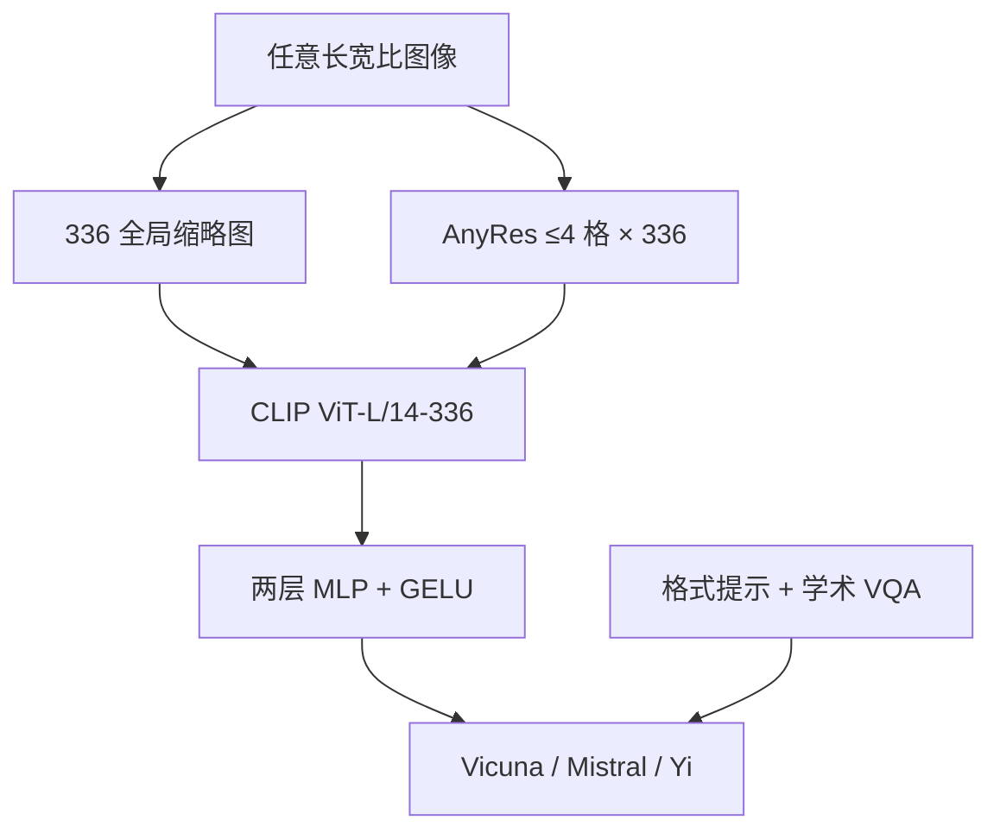

# LLaVA-1.5 / 1.6

浅连接器已经够用；把线性层换成 MLP、把 CLIP 升到 336、再把学术 VQA 写成带格式约束的指令，13B 用约 120 万公开样本、单机 8 卡一天就能打满当时 11 项基准。

<footer>—— Liu 等，Improved Baselines with Visual Instruction Tuning，arXiv:2310.03744；LLaVA-NeXT 博客，2024-01-30</footer>

初代 [LLaVA](/llm/llava-paper) 证明视觉指令微调成立，但 224 分辨率、线性投影、纯 GPT-4 合成数据把短答案 VQA 与 OCR 留在桌上。2310.03744 把同一框架做成**可控消融**：连接器仍是全连接，只是改成两层 MLP + GELU；视觉塔换成 CLIP ViT-L/14-**336px**；指令混合加入 VQAv2、GQA、OK-VQA、OCR-VQA、A-OKVQA、TextCaps、RefCOCO、Visual Genome 以及 ShareGPT 文本，并用**回答格式提示**（短词 / 句子 / Markdown）减少解析惩罚。最终 13B 检查点约 **558K 对齐 + 665K 指令**，公开数据合计约 1.2M，8×A100 约一天。2024 年 1 月的 **LLaVA-NeXT**（社区常称 1.6）再加 **AnyRes** 与更强 LLM（Mistral-7B、Vicuna-13B、Yi-34B）和约 760K 指令。本篇写这两步增量；OneVision 的多图视频另文。

## 问题

初代在对话评测上好看，在需要短答案与细字的学术表上不行。原因有三。分辨率：224 把文字糊掉。连接器：线性层对两个空间之间的弯曲拟合不够，1.5 用消融说明 MLP 更稳，而不是再引入 Q-Former。数据：GPT-4 合成偏闲聊句式，VQAv2 的「yes/no」和 OCR 的「逐字抄」需要格式提示，否则模型说一整句，精确匹配判零。

1.6 面对的是 336 仍然不够：文档、海报、宽表要 672 或更长边，但不能把 ViT 重训到任意边长。问题变成：如何在**不改 CLIP 权重输入尺寸**的前提下提高像素覆盖。

### 1.5 的三处最小改动

对齐仍约 558K，只训投影；指令阶段 665K，更新投影与 LLM，ViT 仍常冻。336² 使 patch 数从 256 升到 **576**，窗口账单立刻变贵，这是有意用上下文换细节。格式提示例：「Answer the question using a single word or phrase。」消融表明：学术 VQA 与格式提示是正交增益，和「把连接器换成重采样器、再堆亿级图文对」不是一条路。论文以此对照 InstructBLIP / Qwen-VL 的重视觉桥。

1.5 的 13B 在 MM-Vet 上相对 7B 跳得最明显，论文解读为**语言骨干**对开放视觉对话更关键。不要只引用 VQAv2 一行就说「1.5 的贡献是 MLP」——三项改动要一起写。

## 方法

### AnyRes：1.6 用切格而不是重训 ViT

NeXT 把一张高分辨率图缩成一张 336 全局缩略图，再按长宽比从网格集合 $\{2\times 2,\ 1\times\{2,3,4\},\ \{2,3,4\}\times 1\}$ 里选一档，切成最多 **4** 个 336 格，每格独立过同一 CLIP，投影后拼接。于是像素可以到 672×672、336×1344、1344×336，而编码器仍只认 336。这与 [AnyRes](/llm/anyres) 专文同一思想；1.6 的集合故意限制在 4 格，以保住初代的数据效率。指令数据扩到约 760K，加强 OCR、推理与「更像助手」的场景。LLM 换 Mistral / Yi 时，投影输出维跟着隐维变，视觉塔可共用。

训练两段仍在：558K 对齐只训连接器；第二段全模型（ViT 是否解冻随实现，博客主叙事仍是高分辨率 + 数据）。不要把后来 OneVision 的 `anyres_max_9` 与 6×6 格写进 1.6。

## 机制

MLP 相对线性多一层非线性，拟合的是 CLIP 空间到 Vicuna 空间的弯曲，仍然**不是**新的视觉计算。336 与 AnyRes 才改变编码器看见的像素：前者均匀提高采样率，后者按长宽比分配格子，减少「宽图被压方」。格式提示改变的是损失与评测之间的接口：同样答对内容，句式不合会在精确匹配里丢分；提示把监督对齐到度量。

1.6 的 4 格上限是显式取舍。超过约 768 边长的图仍被先缩小再切，文档小字会丢——2024 年 5 月的 NeXT 消融博客才讨论更大网格与池化。因此「1.6 已经原生任意分辨率」不成立：它是**有界切格**。多格拼接后，LLM 必须从序列顺序与缩略图里恢复版面；没有 2D 位置专门模块，靠的是训练数据里出现过类似拼法。

博客写 LLaVA-NeXT-7B/13B/34B 的总参数约 7.06B / 13.35B / 34.75B，视觉塔约 303.5M。34B 的跳点大量来自 Yi 的语言能力，不要把 OCR 提升全部算成 AnyRes 的功劳。

### 和 Q-Former 派、和固定 448 派

1.5 用公开数据与一天训练打 11 项基准，用来论证：在 LLaVA 框架内，数据与分辨率的回报大于再设计连接器。这不否证 InstructBLIP 在端侧固定 32 token 时的合理性，只否证「开源对话 VLM 必须先训重采样器」。Qwen-VL 当时用 256 个交叉注意 query 加 448 固定画布，路线不同：它从亿级图文对训适配器，LLaVA-1.5 从百万级指令打助手。选哪条看你有没有那批图文对、以及要不要短视觉前缀。

## 边界与工程取舍

1.5 论文对幻觉、组合性只有初步实验，不是解。336 对 A4 扫描件仍不够；1.6 四格对长 PDF 仍不够。学术 VQA 进指令混合会让模型更会考试，也可能在开放聊天里变得「只回一个词」——格式提示要按产品模式切换，不能训练用短词、上线却期望长文。NeXT 没有与 1.5 对等的单一 arXiv 新编号，架构细节以 2310.03744 更新版与 2024-01-30 博客为准。

许可随 Vicuna / Mistral / Yi 底座走。评测表上带星号的数字常表示训练见过该训练集，引用须区分零样本与污染。不要把 1.6 的网格表写成 OneVision 的 `(1x1)…(6x6)`。从 1.5 权重续训 1.6 时，序列布局多了缩略图与格边界，投影器若未在新布局上对齐会出现「能描述缩略图、读不清切格」。产品侧应把「短答案考试」和「多轮闲聊」分成两套解码提示：同一检查点在两种格式下分数可以差一截，这不是模型坏了，是 1.5 把格式写成了监督的一部分。切格数与延迟应在接口里暴露，默认四格会让缩略图聊天变贵。

LLaVA-1.5 与 LLaVA-NeXT 都不是 LLaVA-1.6 的官方论文标题。口头 1.6 ≈ NeXT 2024-01。写文献表时 1.5 用 2310.03744，NeXT 用博客与随后更新的 1.5 报告 PDF。

## 小结

- 1.5：MLP 投影、CLIP-336、学术 VQA + 格式提示；665K 指令，13B 一天 8 卡。
- 1.6 / NeXT：AnyRes 最多 4 格、更强 LLM、约 760K 指令，针对 OCR 与推理。
- 连接器仍浅；分辨率与数据是主增益，不是新注意力核。
- 四格有界，不能当成 Qwen2-VL 式原生动态分辨率。
- 出处：Liu 等，*Improved Baselines with Visual Instruction Tuning*，arXiv:2310.03744（CVPR 2024）；LLaVA-NeXT 博客，2024-01-30。
