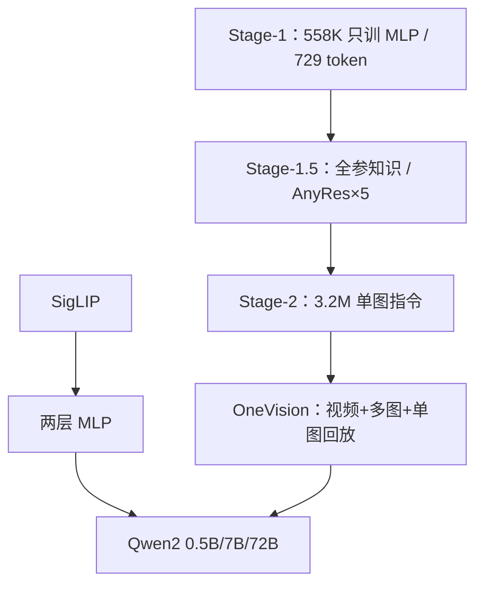

# LLaVA-OneVision

先在单图指令上把任务做满，再把视频与多图混进同一后训练阶段；浅架构不变，能力靠课程式任务迁移涌现，而不是为视频另训一条骨干。

<footer>—— Li 等，LLaVA-OneVision: Easy Visual Task Transfer，arXiv:2408.03326</footer>

LLaVA 系列把「最小连接器 + 指令数据」从单图聊天推到通用视觉任务。2024 年 8 月的 **OneVision** 仍是 SigLIP 视觉塔 + 两层 MLP + 语言模型（主叙事为 Qwen2 0.5B / 7B / 72B），不引入 Q-Former 或门控交叉注意力。新意在**课程与任务迁移**：Stage-1 只训投影、单图 729 token；Stage-1.5 全参、高质量知识、AnyRes 到约 5 倍视觉长度；Stage-2 先 320 万单图指令，再进入 OneVision 混合（视频 + 多图 + 单图回放）。论文主张这是当时最简单、也足够便宜的多图/视频赋能方式：单图学到的技能可以迁到新场景，并出现未直接监督的组合能力。本篇按 2408.03326 写；不要把 Qwen2-VL 的 M-RoPE 写进 LLaVA 的 LLM。

## 问题

1.5/1.6 把助手做成了单图专家。产品场景却是：幻灯片多页、对比两张图、短视频问答。若为视频另接时间模块、为多图另接交叉注意，LLaVA 的最小主义就散了。若直接在弱单图模型上混视频，梯度会被长序列与新域带跑，单图分数回吐。

第二个问题是分辨率课程。一上来 AnyRes 10 倍 token，投影器与 LLM 都还没对齐高分辨率网格，训练不稳定。需要把「看见多少像素」和「更新哪些模块」绑在阶段上。

### 架构仍是 LLaVA，编码器换成 SigLIP

视觉编码器取 SigLIP So400M/14，384 边长，特征取末层或倒数第二层（实现里常见 `-2`）。投影仍是 `mlp2x_gelu`。LLM 用 Qwen2 Instruct，词表与模板走 `qwen_1_5` 对话格式，最大长度可到 **32K**。AnyRes 在 OneVision 阶段放到 `anyres_max_9`，格点从 1×1 到 6×6，配合 `spatial_unpad`：去掉填充带来的假 patch，以免模型把 pad 当成版面。视频把帧当多图进同一拼接规则，而不是 3D 卷积新塔。

Stage-1 的 729 token 对应 SigLIP 384、patch 14 的单格：$27\times 27$。CLIP-336 的 576 不要写进 OneVision 默认。视觉塔学习率常设为 LLM 的 1/5，避免把已经对齐的 SigLIP 冲垮。

## 方法

Table 1 式的日程可以收成四步。**Stage-1** 语言–图像对齐：约 558K，只更新 MLP，固定 729 token。**Stage-1.5** 高质量知识学习：全参，AnyRes 至多约 5× 视觉 token，数据偏字幕、OCR、知识密集描述，用来在解冻 ViT 之前把「细字与世界知识」灌进浅桥。**Stage-2 单图**：约 **3.2M** 单图指令，覆盖多样视觉任务与偏好回答，得到强单图模型。**Stage-2 OneVision**：在单图检查点上混视频、多图、以及单图回放（约 80 万高质量重采样，防止遗忘），序列更长，AnyRes 至多约 10×。多图来自 M4-Instruct / Mantis / DEMON 一类；视频来自 LLaVA-Video-178K 等子集。这不是从零联合训三种模态，而是**先专精再扩展**。

### 任务迁移：单图技能当作视频的先验

论文观察到：在单图阶段已经会读表、会数、会跟指令的模型，进入视频混合后，用较少视频样本就能做时间问答；反向从弱单图起步则两者都差。机制解释是 LLM 自注意力并不区分「来自切格的 patch」还是「来自帧的 patch」，只要序列位置与指令说清「第几张 / 第几秒」。于是迁移成本主要在数据格式，不在新参数。涌现指的是：训练没见过的组合（多图推理步骤、视频里的单图技能）在 OV 阶段之后出现，而不是为每个组合任务单独标数据。

## 机制

空间 unpad 避免 AnyRes 在非整数格时把空白编进注意力，这是切格派的细节，却影响 OCR：假边界会变成假字符。`group_by_modality_length` 一类打包让单图短样本与视频长样本不要在同一 micro-batch 里极度不齐，否则大图/长视频钉死步时。32K 窗口是上限不是默认：一张 6×6 格的高清图可以吃掉数千视觉 token，多图再乘，视频帧数必须先抽帧。

相对 Qwen2-VL，OneVision 的 LLM 仍用一维位置（Qwen2 的 RoPE），视觉布局靠切格顺序与指令文本，而不是 M-RoPE 的时间/高/宽三分量。因此它更依赖「模板把图序说清楚」。相对 Flamingo 的 64 latent，它把长度问题交给窗口与抽帧，细节更密、更贵。

0.5B / 7B / 72B 共用同一套视觉课程，不是三套 AnyRes 超参。72B 的增益主要是语言推理；若视觉 token 已经被 max_pixels 砍掉，72B 也读不清字。

### 和 LLaVA-NeXT、和原生动态分辨率

NeXT 的 AnyRes 最多 4 格、单图为主。OneVision 把格数上限抬到 9 档策略（实现 `max_9`），并在后训练引入多图与视频。Qwen2-VL 的 naive 动态分辨率不切固定 384 格，而是按原生 $H\times W$ 出可变 patch。OneVision 仍是「编码器有首选边长、用切格模拟高分辨率」。文档极长边时，切格缝与 Qwen 式原生网格的误差模式不同：前者怕切断字符，后者怕 token 预算。

## 边界与工程取舍

3.2M + OV 混合的复现依赖 lmms-lab 发布的 json/yaml；论文写「简单」，工程上仍是多源格式统一。视频能力受抽帧率约束，不是小时级定位（那是 Qwen2.5-VL 的绝对时间 MRoPE）。空间智能、3D、GUI 智能体不是该文主体。Qwen2 许可与数据使用条款要单独看。不要把 LLaVA-Video 后续工作的 178K 全量理解成 OV 用了全部。

服务上必须把 AnyRes 格数当延迟旋钮暴露给调用方。多图顺序与 `image_grid_pinpoints` 不一致会导致「第一张表」指错。从 1.5 检查点热启动时视觉塔已经从 CLIP 换成 SigLIP，投影器形状不兼容，应对齐阶段重做。评测协议（lmms-eval）与各家自报峰值不是同一行。

标题里的 Easy Visual Task Transfer 是主张：后训练混合比改架构更便宜。若你的硬件跑不动 32K×72B，这个「容易」不成立——把格数与帧数降下来，迁移实验也要跟着降，不能直接抄 72B 表。

## 小结

- OneVision 保持 LLaVA 浅桥：SigLIP + MLP + Qwen2，用阶段课程覆盖单图、多图、视频。
- Stage-2 先 3.2M 单图，再 OV 混合；单图技能迁到视频，而不是视频专塔。
- AnyRes 加 spatial unpad 与 32K 窗是长度与版面的工程边界。
- 与 Qwen2-VL 的原生动态分辨率、M-RoPE 不是同一几何。
- 出处：Li 等，*LLaVA-OneVision: Easy Visual Task Transfer*，arXiv:2408.03326。
