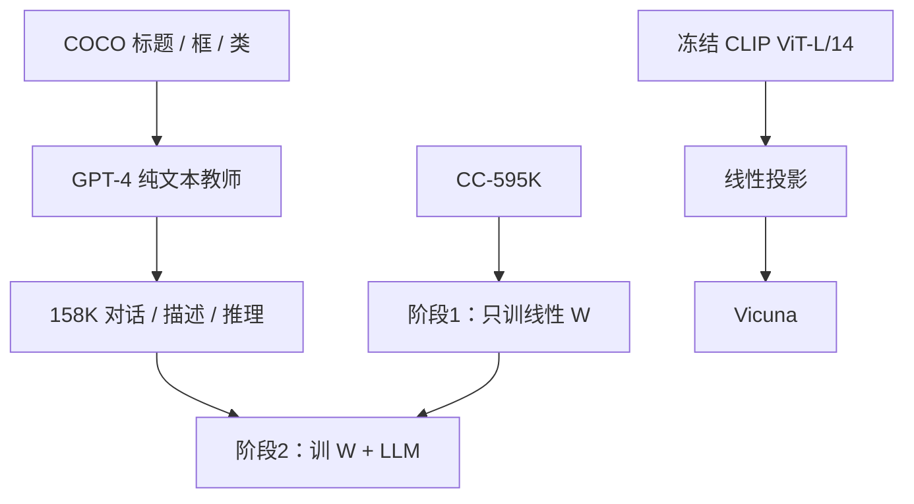

# LLaVA 原文

用 GPT-4 把图的标题、框和类别转成多轮对话、细描述与复杂推理；再拿一层线性层把 CLIP patch 送进 Vicuna，冻结的语言模型就能开始谈图。

<footer>—— Liu 等，Visual Instruction Tuning，NeurIPS 2023</footer>

Liu、Li、Wu、Lee 的 LLaVA（Large Language-and-Vision Assistant）把视觉指令微调写成一条极简流水线：冻结的 [CLIP](/llm/radford-clip) ViT-L/14 出 patch 特征，**一层线性投影**映到 Vicuna 词嵌入空间，与人类指令拼接后做因果语言建模。视觉指令数据不是手工标 15 万问答，而是把 COCO 图的标题、边界框、类别交给 **GPT-4（纯文本）**，生成三种监督：多轮对话、详细描述、复杂推理，合计约 **158K**。对齐阶段另用过滤后的 CC-595K 图文对只训投影。本篇按 arXiv:2304.08485 写初代；投影器的线性代数见 [LLaVA 投影器](/llm/llava-projector)，1.5/1.6 的 MLP 与 AnyRes 见 [LLaVA-1.5 / 1.6](/llm/llava-15)。

## 问题

2023 年春，开源侧缺一种「像 ChatGPT 那样按用户指令谈图」的数据与架构。学术 VQA 是单轮短答案；[Flamingo](/llm/flamingo) 是少样本开放生成但权重封闭、桥很重；[BLIP-2](/llm/blip2) / [InstructBLIP](/llm/instructblip) 走 Q-Former 瓶颈。若 CLIP 已经把视觉放到与语言可比较的空间，还要不要为了对齐再训一个 188M 的查询 Transformer？

数据问题同样硬。没有图的 GPT-4 不能看像素，但 COCO 已经提供了标题与框——足够让教师模型**想象**场景并写出「用户会问什么、助手该怎么答」。LLaVA 赌的是：这种合成指令 + 浅桥，就能把 Vicuna 的对话能力迁到视觉上，而不必十亿级图文对重训桥。

### 教师是 GPT-4，学生是 Vicuna，视觉是冻结 CLIP

图像 $X_v$ 经 CLIP 得 $Z_v=g(X_v)$，投影 $H_v=W\cdot Z_v$，与 token 化指令拼进 Vicuna。训练两段：特征对齐只更新 $W$，数据为 CC-595K（从 CC3M 过滤到与 COCO 概念更近的子集）；视觉指令微调更新 $W$ 与 LLM，数据为 158K 合成指令。ViT 全程冻结。输入分辨率 224，$P=14$ 时 patch 数 256 量级（加 CLS 则 257），全部保留，不做 Q-Former 压缩。

GPT-4 当时的接口是纯文本：提示里写入 captions 与 box 列表，不写入像素。合成对话的空间关系来自框坐标，颜色与纹理若标题没写就会缺。这解释了初代 LLaVA 在细 OCR 与「标题未提及的物体」上的失败模式。

## 方法

### 三种指令，对应三种对话技能

对每张 COCO 图，提示 GPT-4 产出：（1）**对话**：短轮问答，覆盖物体、计数、相对位置；（2）**详细描述**：一段完整场景叙述；（3）**复杂推理**：超出图中直接可见、需要常识或多步的问题。三者比例组成 158K。模板把图像 token 放在约定占位符，角色分隔与 Vicuna 一致。没有这一步，模型只会接 CC 标题电缆，不会列清单、不会拒绝、不会跟「请用一句话」。

ScienceQA 作为例外：该基准自带讲义式问答，LLaVA 在其上做针对性微调，报告当时达到约 90.92% 的准确率，用来说明「浅桥 + 指令数据」也能打结构化多模态考试，而不是只能闲聊。主模型仍是通用视觉助手叙事；不要把 ScienceQA 专调检查点与通用 158K 检查点混成一个权重。

## 机制

浅投影能工作，前提是 CLIP 对比学习已经让 $Z_v$ 对语言可检索；$W$ 只需把坐标系转到 Vicuna 的嵌入尺度。第一阶段的标题生成把 $H_v$ 拉进「可以续写英文句子」的区域；第二阶段才把 Vicuna 的指令跟随条件在这些槽位上。因为没有 query 瓶颈，空间布局以 raster 顺序留在序列里，计数与左右关系有机会被自注意力读出来——机会不等于监督：158K 里这类问题的密度决定了能读多准。

相对 InstructBLIP，视觉特征**不**随问题改变：同一张图的前缀可缓存，多轮对话只追加文本。相对 Flamingo，不插入门控交叉注意力，部署就是一次标准 Decoder 前向。代价是窗口被 $N_{\mathrm{vis}}$ 永久占用，高分辨率在初代无解。

LLaVA-Bench（In-the-Wild）用非常规图与 GPT-4 打分，是论文推动的对话评测，不是 VQAv2 准确率。引用「接近 GPT-4」必须写 LLaVA-Bench 设定，且教师与裁判都是 GPT-4 时存在自偏好风险。

### 和「再训一个视觉桥」的算力对比

Q-Former 第一阶段要在图文对上跑三个损失；Flamingo 要在交错网页上训插入层。LLaVA 对齐阶段只训一个矩阵，指令阶段在 8×A100 量级即可做完 13B。论文的方法论主张因此是**数据中心**：架构减到不能再减，把预算留给 GPT-4 合成与公开图文过滤。这为 1.5 节「学术 VQA + 格式提示也能涨分」埋下伏笔——一旦浅桥成立，涨点优先来自数据，而不是来自更深的连接器。

## 边界与工程取舍

224 分辨率、冻 ViT、线性层、158K 合成，四条边界一起限制了 OCR、图表与非 COCO 域。GPT-4 教师会把语言模型的偏见写进对话（性别、地域、过度自信）。CC-595K 过滤偏向自然照片，截图与扫描件是域外。Vicuna 基于 LLaMA，权重许可不是 Apache。不要把初代写成已经支持 AnyRes 或多图：那是 NeXT / OneVision。

部署时图像占位符、起止 token、与训练不一致会导致投影槽错位，表现为「能聊天但像没看见图」。量化应保护视觉前缀：每个 patch 上的误差会累积成认错物体，而不是 LLM 突然不会说话。ScienceQA 数字不可当作通用 VQA SOTA。初代没有系统对比「线性 vs MLP」——那是 1.5 的消融。若要用初代权重做文档问答，应预期失败并升级到 1.5 的 336 或 NeXT 的切格，而不是把线性层加宽当成补分辨率。

论文全称 *Visual Instruction Tuning*。口头说 LLaVA 时请钉 2304.08485，以免与 LLaVA-1.5（2310.03744）、NeXT 博客、OneVision（2408.03326）抢同一句「LLaVA 证明了浅桥」。

## 小结

- 初代 LLaVA：CLIP ViT-L/14 + 线性投影 + Vicuna；两阶段先对齐再视觉指令微调。
- 指令数据约 158K，由 GPT-4 根据 COCO 符号标注合成对话、描述与推理。
- 不压缩视觉长度、不改 LLM 注意力形状；能力上限受 224 分辨率与合成教师约束。
- ScienceQA 专调与 LLaVA-Bench 是两条不同评测，不要混用。
- 出处：Liu 等，*Visual Instruction Tuning*（LLaVA），NeurIPS 2023，arXiv:2304.08485。
