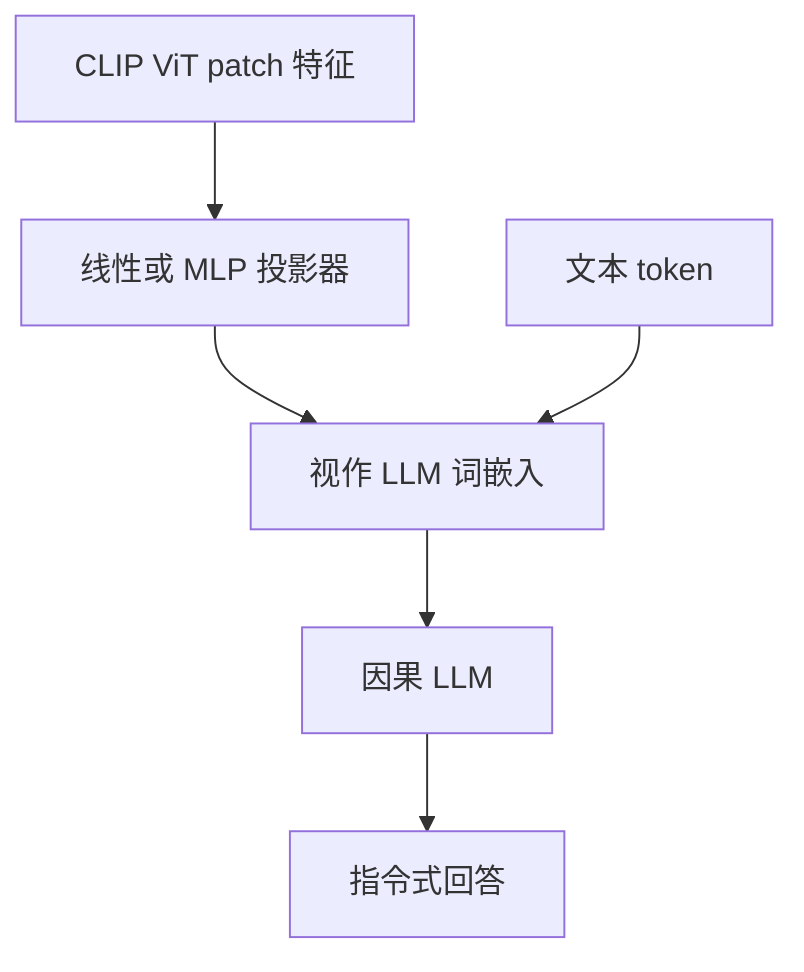

# LLaVA 投影器

视觉特征已经活在与语言相近的空间里；一层可训练的投影把它们送进词嵌入槽位，再用视觉指令微调，就能让冻结的 LLM 开始谈图。

<footer>—— Haotian Liu 等, LLaVA, 2023</footer>

Flamingo 式交叉注意力、BLIP-2 的 Q-Former，都在视觉与语言之间加了一段可问询的模块。[CLIP](/llm/clip) 的 ViT 已经把图编成与句子可比较的特征之后，Liu 等人 2023 年的 LLaVA（Large Language-and-Vision Assistant）把连接器减到最小：一个投影器把视觉 token 线性（后来是两层 MLP）映到 LLM 的词嵌入空间，再当作前缀 token 与文本一起做因果注意力。没有额外查询集，也不改 LLM 的注意力形状。本篇只讲这条投影路径；Q-Former、像素 shuffle 等对照见 [连接器](/llm/vl-connector)。

## 问题

要把 [ViT](/llm/vit-as-encoder) 接到已经训好的对话 LLM，必须回答三个对齐问题。空间：视觉向量的维数、尺度与词嵌入不同。语义：CLIP 空间里的「像这句话」不等于 Vicuna 空间里的「这个词接下来该怎么续写」。监督：只有图文对时，只能做粗对齐；要听懂「描述这张图里的表格第二行」，还需要指令数据。

若为此训练一个重的视觉–语言桥（多层交叉注意力、可学习查询），数据与算力都会涨，也更难借用纯文本 LLM 的权重。LLaVA 的问题设定是：桥越浅越好，把表达力留在已经很强的两侧骨干上，用两阶段训练把浅桥对齐到能做视觉指令跟随。

## 方法

### 把 patch 映进词嵌入槽

冻结的 CLIP ViT 输出长度为 $N_{\mathrm{vis}}$ 的特征 $v_i\in\mathbb{R}^{d_v}$（336 输入、$P=14$ 时，$N_{\mathrm{vis}}=576$ 量级）。投影器 $W$ 给出

$$
h_i=W v_i\in\mathbb{R}^{d_{\mathrm{llm}}}
$$

$h_i$ 与文本 token 嵌入拼接，按「图在前、问题在后」的模板送进 LLM。LLaVA-1.0 用单层线性；后续 LLaVA-1.5 改为两层 MLP 加 GELU，让映射能做一点非线性，而不引入 Q-Former 那种新的注意力模块。视觉 token 全部保留，空间布局仍在序列顺序里，语言模型用自己的注意力去读图。

投影器不是视觉编码器。它不看像素，只看 ViT 已经算好的特征。ViT 冻住时，投影器再宽也变不出更高分辨率的字；那是输入边长和切块的事。把 MLP 加深当成补分辨率，是范畴错误。

### 两阶段训练

第一阶段只训投影器：数据是图–标题对，LLM 与 ViT 冻结。目标是让 $h_i$ 落在词嵌入能续写标题的区域，完成特征对齐。第二阶段做视觉指令微调：投影器与 LLM 一起更新（ViT 仍常冻结），数据是「图 + 用户指令 + 助手回答」。没有第二阶段，模型只会像接了一根标题电缆；有了第二阶段，才会回答问题、列清单、听约束。

对齐阶段的损失就是标准语言建模，但可更新参数极少，相当于学一个跨空间的线性字典。指令阶段才把「如何谈图」写进 LLM 权重。模板必须稳定：图 token 的占位、换行、角色标记一旦与部署不一致，投影器学到的槽位会错位。

### 和重连接器的差别

Q-Former 用几十到几百个可学习查询去交叉注意视觉特征，输出长度与图分辨率解耦，信息已经过一次瓶颈。LLaVA 投影器不减少 $N_{\mathrm{vis}}$，LLM 直接看见每个 patch。好处是空间细节少一次有损池化，OCR 与计数更有机会；代价是上下文被视觉前缀占满，高分辨率必须另想切格或压缩。LLaVA 把「压不压视觉长度」留给后续工作，本篇的方法核心就是：对齐用浅映射，不在连接器里做检索。

## 机制

浅投影能工作，前提是 CLIP 空间与词空间足够近：对比学习已经让视觉特征对语言可检索，投影器只需把坐标系转正、缩放对齐。若视觉骨干从未被语言拉过，同一线性层往往欠拟合。MLP 相对线性，多了一层非线性去拟合两空间之间的弯曲，对指令微调后的对话更稳，但仍不是新的视觉计算。

LLM 侧的机制是前缀条件生成：视觉 token 作为可被后续文本查询的键值。定位、「图里第几个」依赖的是 patch 序列仍按空间排列，以及指令数据里出现过类似问法。没有区域监督时，定位是涌现的、不保证框准；那不是投影器的精度问题，是训练信号问题。

第一阶段若用太短的标题、第二阶段指令又很复杂，投影器会对「能写一句描述」过拟合，对「读表、跟指代」欠拟合。两阶段的数据分布应覆盖下游，而不是只覆盖 COCO 式短句。

## 边界与工程取舍

固定 $N_{\mathrm{vis}}$ 在高清文档上不够细，在大图上又太贵。投影器本身几乎不压缩，长度问题被原样转交给 LLM，这正是 [AnyRes](/llm/anyres) 与 [视觉 token 压缩](/llm/vision-token-compression) 要接着做的。冻 ViT 时，领域偏移（截图、扫描件、医学图）无法靠 MLP 补；应解冻或换骨干。

不要把 LLaVA 理解成「唯一正确的连接器」。它证明浅桥 + 指令数据足够做出强的对话 VLM，并不证明 Q-Former 无用——在必须把视觉长度打到几十 token 的设备上，查询瓶颈仍然合理。也不要把 LLaVA-1.5 的 MLP 写成论文里的新注意力；它只是投影器深度加一。

部署时若把投影器精度打得很低、视觉前缀很长，误差会在每一个 patch 上累积，表现为物体幻觉或读错字，而不是 LLM 突然不会说话。量化预算应优先保护视觉前缀与投影权重。

取舍：以对话、开放视觉指令为主，浅 MLP 投影是默认；以固定长度、端侧延迟为主，再考虑查询式压缩。无论哪种，第二阶段的指令数据质量通常比再加一层投影更敏感。

## 小结

- LLaVA 用线性或两层 MLP 把 CLIP patch 特征映到 LLM 词嵌入空间，视觉 token 作为前缀参与因果注意力。
- 两阶段：先冻骨干只训投影做特征对齐，再视觉指令微调更新投影与 LLM。
- 不减少视觉长度，细节少一次瓶颈，上下文占用原样转交 LLM。
- 能浅，是因为 CLIP 已做过图文对齐；换无语言监督的 ViT，浅桥会不够。
- 高分辨率、文档 OCR、端侧长度预算，要靠切格或别的连接器，不是加宽 MLP。
- 与 Q-Former / 交叉注意力桥不是同一设计，对照见下一篇连接器。
- 出处：Liu et al., *Visual Instruction Tuning*（LLaVA）, 2023；LLaVA-1.5 将投影器改为 MLP。视觉骨干见 Radford et al., CLIP, 2021。
