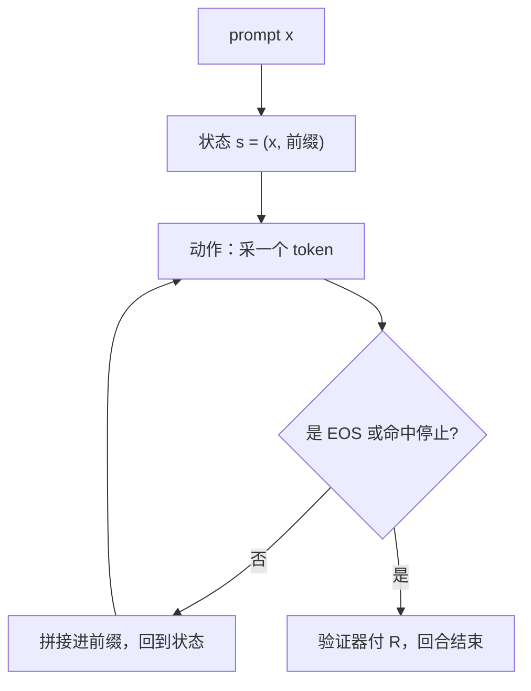

# 语言生成作为 MDP

自回归模型每选一个 token 就做了一次决策；整段生成是一个回合，环境从不掷骰子，唯一的随机源是策略自己。

<footer>—— 据 MDP 框架（Bellman, Dynamic Programming, 1957；Sutton &amp; Barto 2018）对自回归生成的套用整理</footer>

[上一课](/llm/value-policy-iteration)把「模型已知」的动态规划推到停止判据，也暴露了它的两个前提：状态可枚举、$P$ 与 $r$ 可逐状态查询。本课开新课序「语言模型的决策视角」，把语言生成逐项写成 MDP——状态、动作、回合、轨迹分布落位之后立刻看见：表格 DP 的两个前提全塌，课程由此推向无模型。

## 问题

前面各课——[RLHF 流水线](/llm/rlhf-pipeline)、[RLVR](/llm/rlvr)、[过程奖励进环](/llm/prm-in-rl-loop)——一直在用「策略」「轨迹」「回合」，但没有一处把生成过程作为决策问题钉死：马尔可夫性从哪来、回合何时结束、第一课那个轨迹连乘在语言里剩几项。不写清楚这些，就分不清哪些 RL 结论原样适用、哪些因为生成问题的特殊结构而改变。

## 方法

逐项落位。**状态**：$s_t=(x, y_{\lt t})$，prompt 加已生成前缀。**动作**：$a_t=y_t$，词表里的一个 token。**转移**：$s_{t+1}=s_t\oplus y_t$，确定性拼接——教科书里环境掷骰子的那部分，在语言生成里是恒等映射。**回合**：采样到 EOS 或触发停止条件时结束（解码侧的终止机制见 [stop sequences](/llm/stop-sequences)）；回合长 $T$ 随机，可达数百上千 token。**奖励**：RLVR 里只在回合末由验证器给出 $R$，中间全零；过程奖励是把这笔账摊到中间步的尝试。

代回第一课的连乘，转移因子 $P(s_{t+1}\mid s_t,a_t)$ 恒为 $1$，轨迹分布只剩策略：

$$p^\pi(\tau)=\rho(x)\prod_{t=0}^{T-1}\pi(y_t\mid x,\ y_{\lt t})$$

$\rho(x)$ 是 prompt 分布。第一课「策略只通过动作分布进入」在这里走到极端：**连乘里只剩策略项**。优化目标 $J(\pi)=\mathbb{E}_{x\sim\rho,\,y\sim\pi}[G_0]$，就是后训练实际在最大化的那个期望。

## 机制

马尔可夫性免费成立：自回归的条件分布天然只看前缀，而状态**定义**就是「prompt + 全部历史」——第一课说状态压缩历史是建模负担，这里语言模型替你付了。也正因为如此，这颗 MDP 与教科书的最大差别是：**全部随机性来自策略**。没有环境的转移噪声，意味着离策略修正只需修正动作项（后面重要性采样课的主题），也意味着「环境模型」在语言里只剩验证器那一环。

但视角同时暴露维度灾难。词表 $10^5$ 量级、生成上千步，前缀状态数上限约 $|V|^{T}\approx 10^{5000}$——上一课表格 DP 的第一步「逐状态 backup」连一行都放不下；第二步「$r$ 已知」也塌：$R$ 由验证器在回合末给出，是黑箱函数不是可查询表。两个前提齐塌不是工程困难，是数学障碍，所以动态规划单元的算法在此让位。无模型方法——只从采样出的轨迹学习——成为唯一出路；但「从自己采的轨迹学」还藏着一个更早的前提：轨迹覆盖了哪些状态，价值就只能学到哪里。这是下一课的主题。

转移为恒等也改变了 $\gamma$ 的含义：语言生成里 $\gamma$ 不再度量「环境延迟」，纯粹度量「多久之前的 token 还值得追究」——第一单元的有效视界读法在生成问题上是唯一活着的读法。

## 边界

本课的落位只覆盖单轮、无工具的生成：多轮对话与 agent 场景里，工具返回、检索结果、外部环境状态都得进状态定义，否则马尔可夫性被破坏——那是 agent 各课的事。不讲部分可观测；也不把「奖励只在回合末」当成问题结构的改变：奖励是观测不是状态，稀疏只让学习变难（第一课的结论原样适用）。

后课默认：生成 MDP 的状态是前缀、动作是 token、转移为恒等、轨迹分布只剩策略项。

## 小结

- 状态 = prompt + 前缀，动作 = token，回合 = EOS，转移是确定性拼接。
- 环境因子消失，轨迹分布 $p^\pi(\tau)=\rho\prod_t\pi$：随机性全部来自策略。
- 马尔可夫性由自回归条件分布免费给出；奖励稀疏不影响它。
- 维度灾难 $|V|^T$ 与验证器黑箱使表格 DP 两个前提齐塌，转向无模型。
- 无模型的前提是数据由策略采样产生，覆盖问题留给下一课。
- 出处：Bellman 1957；Sutton &amp; Barto 2018 第 3–4 章框架对自回归生成的套用。
