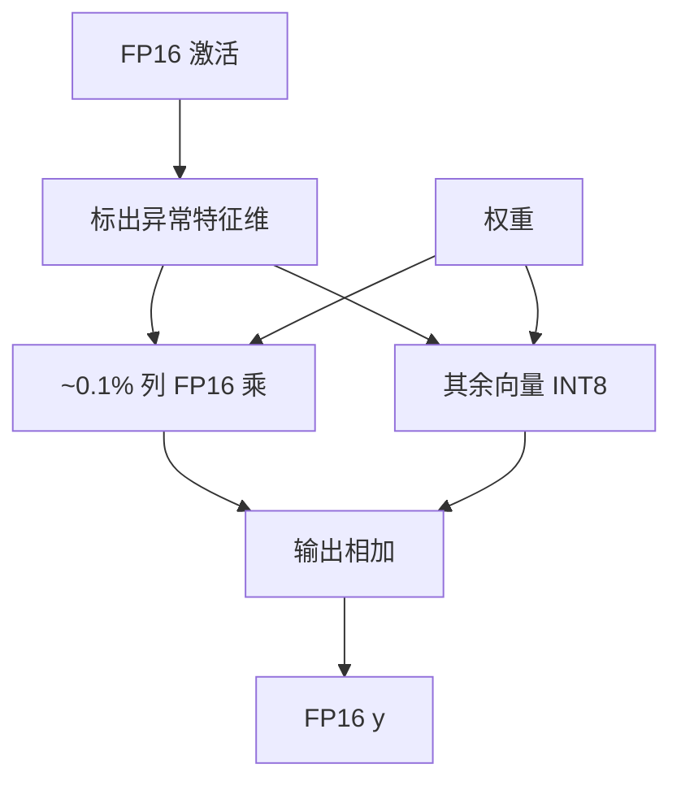

# LLM.int8()

    
大约从 6.7B 起，少数特征维的幅度突然主导矩阵乘；把这些维留在 16-bit，其余走向量尺度的 INT8，175B 的乘法才能在 8-bit 里算完又不掉点。

    <footer>—— Dettmers、Lewis、Belkada、Zettlemoyer，LLM.int8(): 8-bit Matrix Multiplication for Transformers at Scale，NeurIPS 2022</footer>

Tim Dettmers、Mike Lewis、Younes Belkada 与 Luke Zettlemoyer 的 NeurIPS 2022 论文（arXiv:2208.07339）给大模型 INT8 推理提供了两样至今仍被引用的东西：一是 **异常特征在尺度上涌现** 的经验事实，二是 **混合精度矩阵乘分解** 的可运行算法。实现进入 `bitsandbytes`，成为 Hugging Face 生态里默认的「8-bit 加载」之一。算法专文的屋顶线见 [W8A8](/llm/w8a8)。本篇按原文写：6.7B 阈值、约 0.1% 的维、向量尺度、175B 无掉点的合同，以及为何它证明了精度障碍却没有成为后来服务端稠密 INT8 的默认核。同年 [ZeroQuant](/llm/zeroquant) 走分组 + 蒸馏；次年 SmoothQuant 走对角迁移。三条路对「异常值」的处置不同。

## 问题

Transformer 线性层 $y=xW$。要做 INT8 乘，需把 $x$ 与 $W$ 都量化。逐张量一个尺度会被单个大值绑死。作者发现：在 OPT、BLOOM、GPT-3 类模型里，当参数量跨过大约 **6.7B**，隐状态里出现少数维度，幅度比其余高一个数量级以上，且这些维度对很多 token 反复出现——不是偶发的 token 尖峰，而是**特征维上的涌现结构**。小于该尺度的模型，INT8 往往还能凑合；大于该尺度，朴素 INT8 的零样本与困惑度明显掉，看起来像「8-bit 不能表示大模型」，实则是格子被少数维吃掉。

第二条约束是工程：175B 的 FP16 装不进常见单卡，需要大约减半的权重内存，同时生成质量与 FP16 对齐。混合精度若把整层留在 FP16，内存目标失败；若把异常维拆出去，核变成稠密 INT8 加稀疏 FP16，复杂度上升，但精度有希望保住。论文要同时给出现象、分解算法、以及 BLOOM-176B / OPT-175B 上的端到端证据。

### 异常特征在尺度上涌现

涌现一词在文中有具体指称：不是能力榜突然上升，而是量化难度在 6.7B 附近变陡，与可测量的异常维比例、幅度比同步出现。异常维约占特征的 **0.1%** 量级，却贡献可观的 $\ell_2$ 质量。它们在 decoder 的多层重复出现，位置相对稳定，因此可以按列（特征维）而不是按单个元素来拆。小于阈值的模型没有这套结构，所以早期 BERT INT8 的成功不能外推到 GPT-3。这是对 [Outlier Suppression](/llm/outlier-suppression) 通道诊断在「大尺度生成模型」上的独立再发现，数据集与模型家族不同，结论同族。

0.1% 与 6.7B 是 OPT/BLOOM 上的观察，不是物理常数。换家族、换 RMSNorm、换训练配方，阈值会移动。把「所有 7B 都必须 mixed-precision」写成定理，过读。

## 方法

向量尺度（vector-wise）量化：激活按行（每个 token）一个尺度，权重按列（每个输出通道）一个尺度，使 $xW$ 的每个内积对应一对尺度，反量化时相乘。比逐张量细，比逐元素元数据少。对**不含异常维**的子矩阵，这样的 INT8 内积足够准。

混合精度分解：用阈值标出异常特征维（校准或在线统计 $|x|$ 的列），设指标集 $\mathcal{O}$，

$$
y = x_{\mathcal{O}} W_{\mathcal{O}} + \mathrm{Int8}(x_{\setminus\mathcal{O}})\,\mathrm{Int8}(W_{\setminus\mathcal{O}}),
$$

第一项 FP16 稠密短宽乘，第二项 INT8。输出在 16-bit 相加。异常列对应的权重切片也走 FP16，避免「激活 FP16、权重仍 INT8」的尺度错配。阈值使 $|\mathcal{O}|/d\sim 10^{-3}$，FP16 尾巴的 FLOPs 可忽略，只要实现不把尾巴写成无结构 gather 的灾难。

主实验：OPT 125M–175B、BLOOM 176B、T5 等。6.7B 以下，纯 INT8 与 mixed-precision 都接近 FP16；6.7B 以上，纯 INT8 掉点，LLM.int8() 与 FP16 的零样本 / PPL 对齐。内存约减半（权重 INT8 + 少量 FP16 列 + 尺度）。墙钟在小模型上常**慢于** FP16——分解与量化核开销大于 INT8 Tensor Core 的收益；在 175B 上才进入「可比较或略快」的区间。论文把这一点写明：8-bit 的卖点首先是**装得下**，不是小模型加速。

### 175B 无掉点的合同

「无掉点」绑定：语言建模困惑度、若干零样本常识任务、作者当时的生成样例。不是 MT-Bench，不是长上下文针测，不是指令微调后的对话模型。BLOOM / OPT 的预训练分布与后来的 LLaMA-Instruct 不同。引用「175B INT8 无损」必须带模型名与任务。bitsandbytes 后来的默认阈值、block-wise 变体、NF4（QLoRA）是另一合同，不要写进 2022 年 NeurIPS 表。

## 机制

矩阵乘对异常维线性敏感：该维的 $x_j w_j$ 可以大过其余维之和。INT8 的 256 个 bin 若按该维的 max 分配，其余维的有效分辨率掉到几个 bin，累积误差在残差流里放大。拆出 $\mathcal{O}$ 等于承认：同质假设只在补集上成立。向量尺度处理的是「行与列的平均幅度不同」，处理不了「行内部两极分化」；所以两者要一起上。

涌现为何在 6.7B：论文给的是经验曲线，不是证明。一种读法是宽度与深度到某点后，LayerNorm / 残差让少数维承担快捷通路（注意力汇、大 $\gamma$、未归一化的特征）。OS 从 $\gamma$ 进入；LLM.int8() 从矩阵乘误差进入。机制上相容：$\gamma$ 大的通道更容易成为 $\mathcal{O}$ 里的成员。

混合精度分解不是稀疏训练，也不是 MoE。$\mathcal{O}$ 是特征维集合，对 batch 内所有 token 共享（或按统计冻结）。不要把它画成 token 级专家路由。

### 为何后来服务端改走稠密 INT8

拆列让 CUDA 核变成两支，异常比例一高或 gather 不连续，吞吐掉回 FP16。SmoothQuant 用离线 $s$ 把 $\mathcal{O}$ 的难度迁到权重，恢复稠密 INT8 Tensor Core，prefill 更爱这条路。LLM.int8() 的历史贡献是**证明精度障碍是通道结构**，并把 175B 第一次装进 8-bit 推理软件栈。产品上，数据中心 prefill 后来多选平滑后的 W8A8；消费级「8-bit 加载」仍大量使用 bitsandbytes 分解，因为实现现成、质量可预期、对核峰值不敏感。两种终点都合法，不要用其中一种否定原文。

## 边界与工程取舍

### bitsandbytes 与论文核不是逐行对应

库版本改过阈值、块大小、是否 CPU 卸载、与 LLM.int8() 并列的 8-bit 优化器。训练用 8-bit Adam 与推理用 LLM.int8() 是 Dettmers 相邻工作，不要混成一篇。没有 INT8 Tensor Core 的设备上，分解路径可能全程慢。异常维检测若每步在线做，decode 增加分支；若冻结校准集上的 $\mathcal{O}$，换域可能漏检新尖峰。GQA / RMSNorm 模型要重测 6.7B 阈值。LLM.int8() 不量化 KV，长上下文显存墙仍在。它也不提供 4-bit；4-bit 加载是 QLoRA 的 NF4 故事。

阈值过低，FP16 尾巴变宽，内存与速度条款失效；阈值过高，漏网异常维，精度条款失效。论文默认大约按幅度分位数切。多 GPU 张量并行时，异常维可能集中在部分分片，负载不均——原文未当主问题写，部署时要自己量。

出处：Dettmers, Lewis, Belkada, Zettlemoyer，*LLM.int8(): 8-bit Matrix Multiplication for Transformers at Scale*，NeurIPS 2022（arXiv:2208.07339）。作者单位含华盛顿大学与 Meta。QLoRA 是 2023 年另一篇。

## 小结

- LLM.int8() 发现约 6.7B 起出现占约 0.1% 的异常特征维，朴素 INT8 从此掉点。
- 向量尺度量化加混合精度分解，使 OPT/BLOOM 175B 级 8-bit 推理与 FP16 质量对齐。
- 卖点首先是内存（约减半），小模型墙钟往往更慢。
- 它证明障碍在通道结构；稠密 INT8 的后作（SmoothQuant）改分布而不拆核。
- 出处：Dettmers et al.，NeurIPS 2022。
