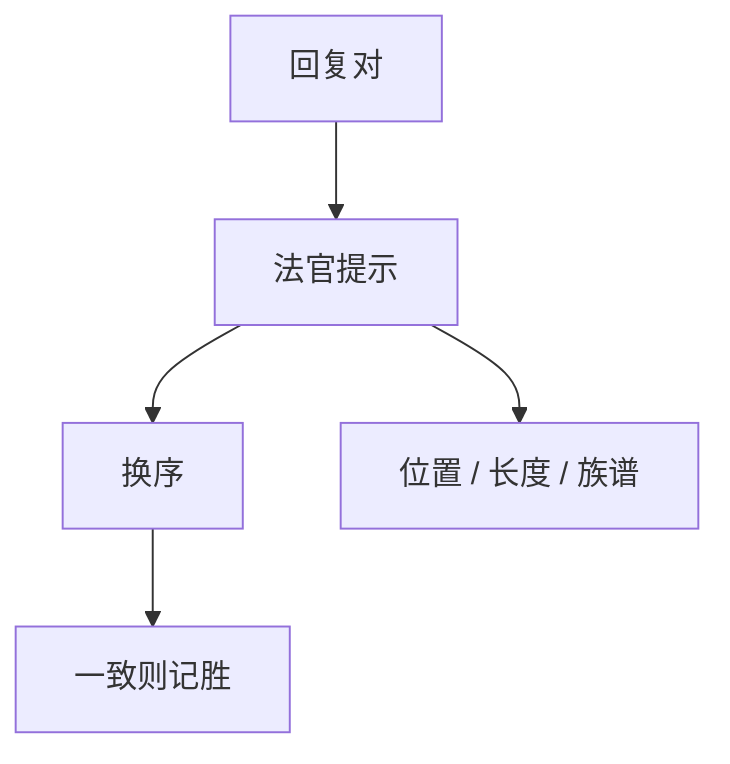

# LLM 裁判偏差

用强模型给弱模型打分，便宜、可复现，也继承位置、长度与自我偏好。未经人校准的法官不是金标。

<footer>—— Zheng 等, Judging LLM-as-a-Judge with MT-Bench and Chatbot Arena</footer>

[上一课](/llm/model-cards)把开放生成的分数留给「谁来判」。本单元从 LLM 裁判开始。主干已有[裁判作奖励](/llm/llm-judge-reward)与[人机评测分工](/llm/human-vs-auto-eval)；本课补评测进阶里的偏差清单，不把法官再介绍一遍。缺口是：榜上的胜率常常是偏差的函数。后课成对对逐点默认偏差先被当成系统误差。

## 问题

Zheng 等人在 MT-Bench 上量过：同一对回复，先呈现的更容易赢（位置偏差）；更长的更容易赢；法官偏爱同族模型的文风（自我增强）。这些偏差在 AlpacaEval、自动 Arena 里同样出现。开发期用法官当烟雾合法；论文主表用未交换顺序、未控制长度的法官分，则是测量失效。

法官还有任务失效：有标准答案的数学与代码，应用程序判，不应用法官「看起来对」。难题上法官自己会幻觉，方差大于被评模型的差。

裁判提示里写「忽略长度」几乎无效。要用交换位置、长度归一或风格控制（后课），不能靠自然语言禁令。

## 方法

成对评测：每个样本交换 $y_a,y_b$ 跑两次，不一致则平局。报告与人评的一致率、Cohen $\kappa$ 或胜负相关，而不是只报法官 Elo。点分 Likert 更便宜、校准更差，只适合粗过滤。法官模型版本与温度写入协议，与 harness 哈希同等重要。

## 机制

法官是另一个语言模型，先验来自「什么样的回答像好助手」：列表、礼貌、自信、英语流利。位置偏差来自条件顺序改变注意力与「先完整后挑剔」的叙事习惯。自我偏好来自风格重叠：同族解码器的 n-gram 与结构更像法官的预训练。偏差进入名次后，策略会向法官审美拟合，看起来像产品进步。

## 边界

本课不给「如何骗过法官」的提示。下一课把成对与逐点当作两种仪器，而不是两种文风。

## 小结

- LLM 法官必须换序、对人校准；未校准者不能当主表。
- 位置、长度、同族偏好是一等系统误差。
- 可程序判定的任务不要用法官。
- 出处：Zheng 等 MT-Bench / LLM-as-a-Judge。
