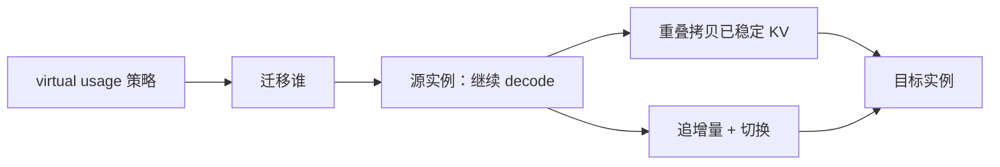

# Llumnix

    
请求的资源与延迟在运行中才会长出来；跨实例热迁移就像操作系统把进程换到另一颗核，才能在负载均衡、碎片和优先级之间改主意。

    <footer>—— Sun et al., Llumnix: Dynamic Scheduling for Large Language Model Serving, OSDI 2024</footer>

单实例引擎把吞吐做到很高之后，集群侧仍常沿用传统 DNN 服务的一次性分发：请求进哪张卡，就在哪张卡上跑到结束。LLM 的请求却是异构且不可预测的——提示长度、输出长度、期望延迟、KV 占用量都在运行中变化。Sun、Huang、Zhao、Xiao、Zhang、Li、Lin（阿里巴巴）的 Llumnix 把多实例调度写成操作系统类比：运行时在实例之间**再调度**，用近乎零停机的热迁移搬走请求及其 GPU 上的 KV。评测在 16 卡集群上相对当时的 INFaaS 一类调度器，P99 首 token 延迟最高约 15× 改善，P99 生成延迟约 2×，高优先级请求加速约 1.5×，在相近尾延迟下成本约降 36%。代码当时在 `AlibabaPAI/llumnix`，引擎接 vLLM。本篇写这篇 OSDI 论文，不把单机抢占（FastServe）说成同一层。

## 问题

同一套权重要伺候聊天、摘要、评分、离线评测。交互请求要短 TTFT 与平滑 TBT；离线请求要便宜、可以等。输出多长事先不知道，KV 随 token 涨，实例内连续批会因显存争用触发抢占或互相干扰，延迟抖动。跨实例则出现碎片：为了负载均衡把空闲显存摊到许多卡上，新来的长提示反而找不到一张「整段放得下」的卡，排队爆炸。一次性分发必须在到达时刻同时猜准负载、碎片和优先级——这三件事在运行中还会变。

现有推理引擎（Orca、vLLM）优化的是单实例吞吐。跨实例调度多半继承传统模型服务：按请求数或粗粒度负载做 round-robin。LLM 更像多核操作系统上的进程：工作集动态涨、优先级不同、核之间可以迁。缺的是「迁」这一原语——把正在生成的请求连同 KV 搬到另一实例，且停机时间不能随序列长度线性涨。

### 一次性分发解不开的三项目标

隔离：某条请求的 KV 突然涨，会挤占同实例邻居，甚至触发引擎内部抢占。碎片：均衡降低了单卡峰值，却提高了「找一块连续空位给长前填」的失败率。优先级：付费档与离线档若永远同批，SLO 只能按最严的那档超配。这三项目标在到达时刻互相冲突，需要在运行中改放置。

Llumnix 的迁移对象是**在飞请求 + 其 KV**，不是把整个实例做 live migration，也不是 PD 分离里「前填算完把 KV 交给解码池」的阶段交接。阶段交接发生一次；再调度可以发生许多次。

## 方法

热迁移把计算与内存拷贝重叠：利用 KV 只追加、已生成前缀不再被改写这一事实，先把已经稳定的 KV 拷到目标实例，源实例继续 decode；追上之后再迁剩余增量与控制状态，切换流量。停机时间被设计成与序列长度近似无关——长序列多的是可重叠的拷贝，而不是更长的冻结窗口。朴素「停下来整段拷」会让长请求的 TBT 出现一次与长度成正比的空洞，热迁移就是为了堵住这个空洞。

调度架构是分布式的，避免全局锁成为实例数的瓶颈。策略用 **virtual usage** 把多种目标收成同一种负载均衡：为隔离中的高优先级请求虚报更高的显存占用，为待抽空的缩容实例虚报已满，为碎片整理把长请求吸引到空闲更整的卡上。真实占用与虚报占用分开，迁移决策只看虚报，执行时再搬真实 KV。这样不必为负载均衡、碎片、优先级、扩缩各写一套启发式。

### 统一再调度场景

论文列举的场景包括：把请求从过热实例迁走以降抢占；把短请求从碎片化集群里挤出整段空间给长前填；把高优先级请求迁到更空的实例甚至独占；扩容时尽快灌满新实例、缩容时尽快抽空旧实例。它们都是「改 virtual usage → 负载均衡想迁谁 → 热迁移执行」。评测负载用真实痕迹，对照 INFaaS 等面向传统模型的调度。

「近零停机」是相对整段冻结拷贝而言，不是绝对零开销。拷贝仍占互连；目标实例要有放得下的 KV 槽。互连很慢或目标已经显存紧张时，迁移本身会制造新的尾延迟。

## 机制

KV 的追加语义让迁移可以做成预拷贝：旧前缀是只读的，和新 decode 步不冲突。这与虚拟机预拷贝类似，但工作集的增长模式更简单——几乎只有尾部在变。停机窗口只需覆盖最后一轮增量与连接切换，所以能做到对长度近似常数。没有分页 KV，迁移粒度会退回整段连续缓冲，碎片与拷贝量都更差；Llumnix 选 vLLM 当引擎不是偶然。

Virtual usage 是策略层的技巧：把「我想让调度器以为的负载」从「卡上真实字节」解耦。高优先级隔离 = 虚报占用变大 = 均衡算法自动把邻居迁走。缩容 = 虚报已满 = 新请求不再进来、旧请求被迁出。不必发明第四种优先级队列。它不保证最优，但把多目标收成可实现的一个旋钮。

### 和 FastServe、PD 分离的分层

FastServe 在**单实例内**按迭代抢占，优化 JCT。Llumnix 在**实例之间**迁请求，优化集群级隔离与碎片。两者正交：实例内仍可以 FCFS 或 MLFQ，实例间用迁移做二次放置。PD 分离迁的是阶段边界的 KV，目的是屋顶线匹配；Llumnix 迁的是同阶段的在飞请求，目的是多租户。生产上可以先 PD 再在 decode 池内做 Llumnix 式再平衡，原文把与实例内抢占的联合列为未来工作。

P99 改善「一个数量级」来自排队与碎片被迁移解开，不是单步 GEMM 快了十倍。对照是当时的跨实例调度器，不是把 vLLM 单机核换掉。读 15× 必须带着 P99 TTFT 与基线名字。

## 边界与工程取舍

迁移需要实例间高速拷贝路径；跨机且无 RDMA 时，长 KV 的重叠窗口可能盖不住增量产生的速度，预拷贝追不上。投机解码、LoRA 多适配器、前缀缓存会使「什么算稳定前缀」变复杂：共享前缀页不能随便随一条请求迁走，引用计数与 radix 节点要一起走。引擎若不能导出块表，调度层无法做热迁移，只能停机重放——那就不是这篇的机制。

Virtual usage 调得过激会抖动：请求在实例间来回跳，拷贝税超过隔离收益。策略需要冷却时间与迁移预算。评测规模是 16 GPU，推到数百实例时，分布式调度的一致视图与风暴要另证。不要把 36% 成本节约当成云账单常数：它依赖于能靠更好的打包少开实例，流量形状一变就变。

Llumnix 不解决前填/解码屋顶线差异，也不解决单步带宽墙。它是调度层。底层仍要连续批、分页、合适的核。

出处钉 Sun 等 *Llumnix: Dynamic Scheduling for Large Language Model Serving*，OSDI 2024，arXiv:2406.03243。开源仓库与论文是同一条线；后来引擎版本的块表接口变了，迁移实现要以当时代码为准。

## 小结

- Llumnix 用跨实例热迁移做运行时再调度，类比 OS 把进程换核。
- KV 追加语义使预拷贝与计算重叠，停机时间对序列长度近似常数。
- virtual usage 把隔离、碎片、优先级、扩缩收成同一种负载均衡。
- 报告 P99 TTFT 最高约 15× 改善、高优先级约 1.5×、相近尾延迟下约 36% 成本下降。
- 与单机抢占、PD 分离正交；互连慢或共享前缀复杂时迁移变贵。
- 出处：Sun et al., *Llumnix*，OSDI 2024，arXiv:2406.03243。
