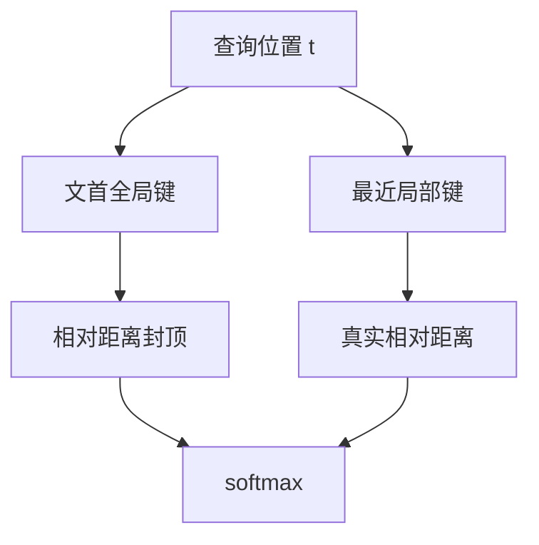

# LM-Infinite

把注意力收成 Λ 形——盯住文首、盯住近邻——再给相对距离加上封顶，短训模型也可以零样本在极端长度上继续写。

<footer>—— Han 等，LM-Infinite，2023 / 2024</footer>

RoPE 模型一超过训练长度 $L$，相对相位走出支撑集，生成崩溃。与此同时，全历史 softmax 的二次代价也禁止把 $t$ 真的放到几十万。[StreamingLLM](/llm/streaming-llm) 用汇点加窗口稳住流式 KV；Han 等人的 LM-Infinite 走平行但更偏「零样本长度泛化」的路：注意力图案做成 Λ（lambda）形，并且把过大的相对距离截断（ceiling / floor）回训练见过的范围。目标是不微调、不改权重，让 Llama 一类模型在远超 $L$ 的序列上仍有可用的困惑度与续写。本篇只写这套推理期几何，不把 YaRN 续训算进方法本身。

## 问题

失败有两只手同时抓。第一只是位置 OOD：$\Delta=p_q-p_k>L$ 时，$\cos(\theta_i\Delta)$ 不再对应训练时的相对距离。第二只是可见集：即便相位能算，让每个查询看全部 $t$ 个键，服务端也扛不住。只修一只不够。纯滑窗修了复杂度，却把文首切掉，汇点与篇章锚一起消失；纯位置插值修了相位，仍是 $O(t^2)$ 的一次前向，而且通常要微调。

LM-Infinite 面对的设定是：权重冻结，推理长度可以到 128k 甚至论文展示的更大尺度，既要相对距离落在训练弧长内，又要把注意力边数压到与窗口同阶。它因此必须同时规定「看谁」和「看成多远」。零样本是这篇文章的方法约束，不是评测偷懒。一旦允许在目标长度上续训，YaRN 与 PI 往往更稳；LM-Infinite 要回答的是「今天就必须在已有检查点上拉长」。

## 方法

### Λ 形可见集

对位置 $t$ 的查询，允许参加 softmax 的键分成两段：开头一小段全局锚（长度 $n_{\mathrm{global}}$，量级与汇点类似），以及最近的局部窗（长度 $n_{\mathrm{local}}$）。中间历史不参加点积。图案在示意图上像字母 Λ：左竖是文首，右撇是近邻。文首承担锚与少量篇章级提示，近邻承担局部流畅。计算量为 $O(n_{\mathrm{global}}+n_{\mathrm{local}})$。

这与 StreamingLLM 的 sink ∪ window 在集合上几乎同构。LM-Infinite 的差别主要在下一节的距离处理，以及它把「极端长度泛化」当作主指标，而不只是流式 KV。

### 相对距离封顶

即使可见集里同时有 $p=0$ 和 $p=t$，若 RoPE 仍用真实 $\Delta=t$，高频维照样 OOD。LM-Infinite 对相对距离做封顶：超过阈值 $\Delta_{\max}$（通常取训练长度量级）的 $\Delta$ 被写成 $\Delta_{\max}$ 或经 floor 压回训练网格。于是文首键在旋转几何里看起来「很远，但远得仍然在训练集里见过的那种远」，而不是「远到相位随机」。

$$
\tilde\Delta=\min\bigl(\,|p_q-p_k|,\,\Delta_{\max}\bigr)
$$

局部窗内部 $\Delta$ 本来就小于 $\Delta_{\max}$，封顶不改变近邻分辨率。被改变的是「查询与文首」这一类边：它们共享同一个饱和距离，不再编码精确的绝对章节位置。

### 零样本接入

实现落在注意力掩码与 RoPE 的 $\Delta$ 计算两处，不改 $W_q,W_k$。Han 等人在语言建模困惑度、生成连贯性上展示：相对朴素外推，Λ + 封顶能把崩溃点往后推几个数量级。它不是检索增强，也不学习压缩函数。

## 机制

Λ 解决分配与复杂度：中间键既贵又容易在超长 softmax 里变成噪声，直接不看。封顶解决几何：所有还被看见的键，其旋转弧长不超过训练最大值，点积统计回到支撑集。两者缺一就会分别再现「滑窗丢锚」或「RoPE 外推噪声」。

饱和距离的代价是可分辨性。所有 $|\Delta|\ge\Delta_{\max}$ 的键在位置通道上不可区分，只能靠内容通道竞争。这对「找文首 BOS」这类锚任务无妨，对「区分第 2 章与第 20 章」则故意放弃。所以 LM-Infinite 的长程能力上界是：记得有一个文首锚，加上窗口内的精确相对位置；不是无损的长距离寻址。若任务是针在中间某处的 NIAH，Λ 形根本看不见那根针，封顶再正确也是零。LM-Infinite 与大海捞针类评测的匹配，取决于针是否落在全局段或局部窗里。中间针应交给分组注意力、分块或检索。

与 Self-Extend 的几何不同：后者把远距离**分组压缩**成许多个仍小于 $L$ 的阶梯，中间历史以低分辨率仍可被看见；LM-Infinite 选择**不看**中间，只对还看的边做饱和。一个省计算、一个保低分辨率长程。工程上不要把封顶误实现成对绝对位置取模——取模会制造周期错位，是另一种 OOD。

## 边界与工程取舍

零样本意味着上限取决于原模型在 $L$ 内学到的东西。原模型若从未用过长程依赖，封顶不会凭空教它。需要读中间段落时，应换 Self-Extend、Dual Chunk Attention 或真正的长窗口续训。$n_{\mathrm{global}}$ 与 $n_{\mathrm{local}}$ 是显式超参：全局段太大，局部流畅被挤；太小，则锚不够、汇点不稳。应在校准困惑度曲线上扫，而不是复制论文表格里的一个整数。

和 StreamingLLM 叠用时，缓存形状已经是 Λ，再加一遍汇点通常冗余；仍建议保留逻辑下标与封顶，避免 RoPE 用物理下标。若准备在目标长度上微调，LM-Infinite 不是首选——微调预算更适合 YaRN 那种保留全可见集、只改频率的方法，否则模型会学着忽略中间，微调白做。

论文年份跨 2023 预印本到 2024 会议版本，方法骨架一致：Λ 形加距离限制。引用时写 Han et al.、LM-Infinite 即可，不要发明新的 arXiv 编号来区分版本。

## 小结

- LM-Infinite 用 Λ 形注意力（文首 + 近邻）把可见集压到常数，用于零样本极端长度生成。
- 相对距离封顶让仍被看见的边落在 RoPE 训练弧长内，避免朴素外推的相位噪声。
- 中间历史被丢掉，不是被压缩；中间针、中间章节对它不可见。
- 与 StreamingLLM 在缓存集合上相近，多出来的关键步骤是对 $\Delta$ 做饱和而不是只用真实下标。
- 与 Self-Extend 的差别是「不看中间」对「低分辨率看中间」。
- 允许续训时，优先考虑改频率的延窗，而不是把 Λ 写进训练掩码。
- 出处：Han 等，*LM-Infinite: Zero-Shot Extreme Length Generalization for Large Language Models*，2023/2024；对照 Xiao 等 StreamingLLM（2023）与 Jin 等 Self-Extend（2024）。
