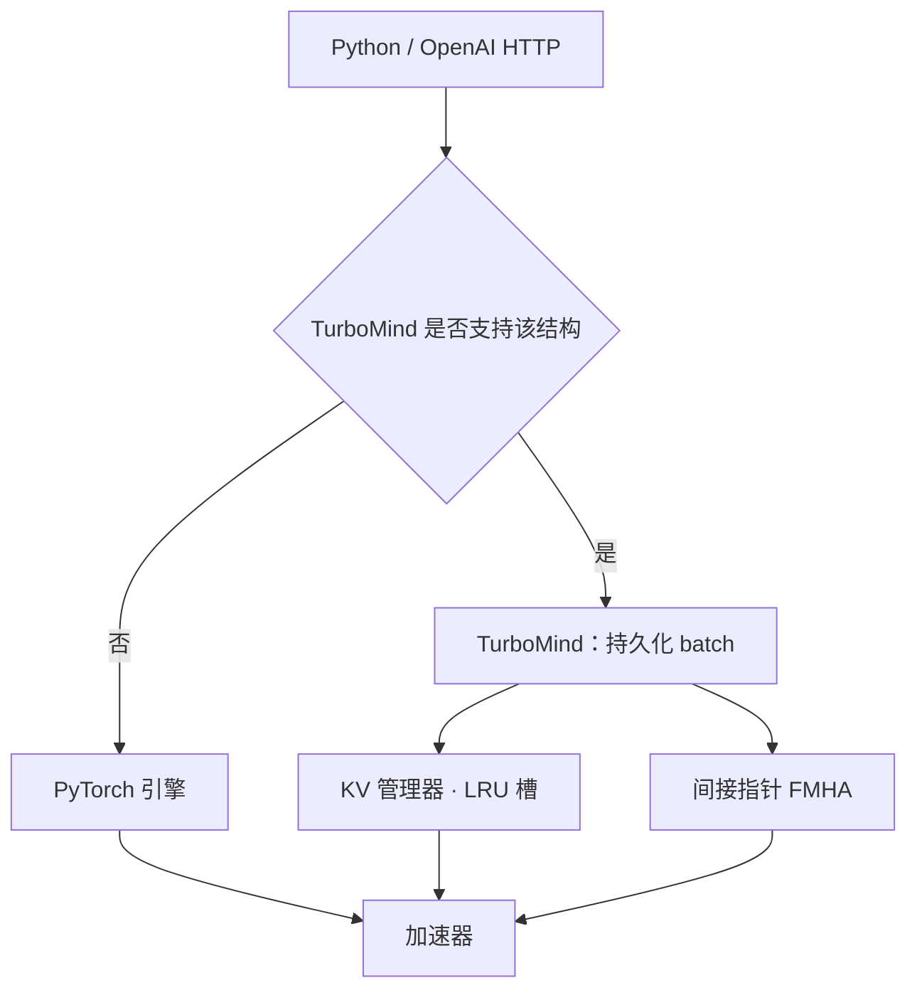

# lmdeploy

TurboMind 面向对话式 LLM 的高吞吐推理：持久化 batch、可扩展的 KV 管理，以及一条为 LLaMA 族改过的 FasterTransformer 内核路径。

<footer>—— LMDeploy / InternLM 团队，TurboMind 架构文档</footer>

LMDeploy 是上海人工智能实验室 InternLM 团队开源的大模型推理与服务工具。它不是「又一个 Python `generate` 封装」，而是双后端：热路径上的 TurboMind（C++/CUDA，从 NVIDIA FasterTransformer 长出来），以及为快速适配、覆盖 TurboMind 内核目录之外模型而准备的 PyTorch 引擎。服务入口可以是 Python API，也可以是与 [OpenAI 兼容协议](/llm/openai-compat-api) 对齐的 HTTP。本篇按官方 TurboMind 文档写三件东西：持久化 batch、把 KV 当「缓存的缓存」来管的内存池、以及对话场景下对 LLaMA 族注意力的改动。量化核与具体版本的吞吐表随发布变，不在这里写成永恒排名。

## 问题

对话服务的请求长度极不均匀：系统提示很长、用户后继轮很短，多路并发时序列进进出出。若每一轮都把整个历史重新 prefill，TTFT 被重复计算吃掉；若按最大长度为每条序列预留一整块连续 KV，显存碎片会在并发上去之前先把 batch 卡住。FasterTransformer 一类静态 batch 引擎，假设一个 batch 从开始到结束成员不变，对「有人先说完、有人中途插入」不友好。

InternLM 要把自己的对话模型服出去，需要一条能在推理进程寿命内一直转的 batch：新序列加入、旧序列退出，GPU 上始终有可算的 decode 步。同时还要让 KV 块可回收、可按 LRU 丢掉不活跃会话，而不是把「会话缓存」和「当前 batch 的 KV」当成两套互不理睬的分配器。问题是同一句话：如何在不停进程的前提下，让 batch 成员与 KV 布局都变成动态的。

### 为什么对话比单轮补全更需要「KV 的缓存」

单轮补全的 KV 随请求生灭。多轮对话里，同一会话的前缀在下一轮还会再读。若引擎只实现请求级 KV，每一轮都要重新写入系统提示与历史。TurboMind 把 KV 管理器写成带 LRU 的内存池，文档称之为 cache of KV caches：槽位按设备内存固定下来，槽里的内容可以在会话之间复用或淘汰。这与后来 vLLM 的前缀分页、SGLang 的 radix 树是同一类压力，实现年代与接口不同，不要互相冒名。

LMDeploy 的模型覆盖以官方 `supported_models` 为准。TurboMind 认的结构和 PyTorch 回退认的结构不是同一张表；窗口注意力、特殊 `head_dim` 会迫使走 PyTorch 路径。选后端是正确性决策，不是「C++ 一定更快」的信仰。

## 方法

TurboMind 进程里常驻一个 persistent batch：工作线程在张量并行模式下持续跑 decode 循环，新请求进入、完成的请求离开，不必为每个 HTTP 调用重建执行图。为编排这些线程，文档写明他们为 TP 下的并发推理设计了新的同步机制，并处理「单进程里多个 TP 实例时 NCCL 挂起」——NCCL API 被主机侧屏障保护。这是服务进程而不是训练进程里才会撞上的坑：训练通常一进程一组 NCCL，服务可能在同一 OS 进程里塞多份模型。

KV 管理器（实现上对应序列管理一类对象）预先按系统内存容量准备固定数量的槽，每个槽对应一条序列的 KV。分配可以是整槽、按块，或介于两者之间。注意力核不假设 batch 内 KV 在地址上连续：上下文 FMHA 与生成 FMHA 都引入间接缓冲区指针，以支持 batch 内 KV 的不连续。上下文解码还把注意力换成基于 CUTLASS 的 FMHA，以支持 Q/K 长度不一致——多轮里「新用户句短、历史键长」是常态，而不是 bug。

### LLaMA 族内核与权重量排布

官方写：LLaMA 族实现从 FasterTransformer 的 GPT-NeoX 改来。除结构差异外，对话向的改动主要是：上下文解码的变长 FMHA、间接指针、TP 工作线程同步、以及 INT8 KV 以加大可服务 batch。INT8 KV 的动机写得很明确——真实服务里 KV 往往比权重要吃带宽、更占显存。权重布局因历史原因接近原始 LLaMA（与 Hugging Face `transformers` 对 $W_q,W_k$ 的排布不同），转换在部署脚本里做，而不是在每步 GEMM 里偷偷转置。

服务侧通常还提供权重量化路径（文档与版本说明里的 AWQ / GPTQ 等）。量化属于权重格式，INT8 KV 属于缓存格式，两套旋钮不要混成「INT4 模型所以 KV 也是 4 bit」。后端选择逻辑是：先看 TurboMind 是否声明支持该架构，再看本地是否装好对应二进制；都不满足则落到 PyTorch，正确性优先于峰值吞吐。

## 机制

持久化 batch 能涨吞吐，是因为 decode 的屋顶线在内存带宽：batch 里序列越多，一次读权重摊到越多 token 上。它要求调度器在步与步之间做成员变更，而不能像静态图那样把 `batch_size` 写死。间接指针让 KV 物理上分页或分槽之后，注意力仍能在一个 kernel 里gather 到正确的历史。LRU 则决定「哪些已经算过的前缀值得留」：命中时下一轮少做 prefill，未命中时付一次冷启动。命中率由会话粘滞与路由决定，单机 LRU 救不了「每次打到不同副本」的集群，那是 [KV 感知路由](/llm/kv-aware-routing) 的问题。

PyTorch 后端的存在，是承认内核目录跟不上模型发布速度。InternLM、部分 LLaMA / Qwen / 视觉语言模型会优先走 TurboMind；对核不支持的结构，与其静默算错，不如降到可维护的 Python 路径。视觉-语言若把图像 token 拼进同一条因果序列，KV 槽的语义从「文本 token」变成「多模态元素」，块大小与驱逐策略都要重测，不能把纯文本对话的 LRU 命中率直接写进容量规划。

TurboMind 文档把 persistent batch 与 continuous batching 当成同一方向的工程实现，但没有把它等价于 vLLM 的 PagedAttention 论文。引用时写 InternLM 团队的架构说明，不要给 LMDeploy 编一个不存在的 arXiv 号。

### 流式与张量并行 API

官方 Python API 支持流式输出与张量并行。流式把 decode 步推到迭代器上，取消与断开必须能从持久化 batch 里把该序列摘掉，否则 LRU 槽会被「客户端已走、引擎仍在写」的幽灵请求占满，见 [sse-cancel](/llm/sse-cancel)。TP 度仍应落在节点内高带宽域；对话 decode 的小 batch 会放大 All-Reduce 延迟，服务期盲目复制训练期的 TP 度，往往不如复制整模。

## 边界与工程取舍

LMDeploy 强在 InternLM 族与已开通的量化 / KV 量化路径，弱在「任意新结构第二天就有手写 CUDA」。与 TGI 相比，它把更多调度放进 C++ 引擎，而不是 Rust HTTP 层；与「纯 PyTorch 服务」相比，它用持久化 batch 换掉了逐步 Python 调度的税。选型应钉版本、钉模型、钉是否走 TurboMind，而不是钉项目名。NCCL 屏障、权重转置、INT8 KV 的精度，都是上线清单里的独立项：关掉 INT8 KV 再比延迟，才能知道瓶颈在注意力核还是在量化误差引起的更长生成。

不要把社区某一版 AWQ 吞吐截图当成 InternLM 技术报告的一部分。LMDeploy 是推理栈，InternLM 是模型族，论文数字与引擎数字必须分开引用。多 LoRA、工具调用、多模态切图，各自有没有进入当前后端，以当时文档的特性表为准。

对照阅读 Hugging Face TGI 的 router/server 拆分，可以看到同一问题的两种切法：TGI 把组批放在 HTTP 进程，LMDeploy 把持久化 batch 放在引擎内部。协议皮可以都做成 OpenAI 兼容，内核调度不是同一份代码。

## 小结

- LMDeploy 由 InternLM 团队维护，推理核是 TurboMind，不支持的结构回退 PyTorch。
- TurboMind 的核心是持久化 batch、带 LRU 的 KV 槽位池，以及支持不连续 KV 的间接指针 FMHA。
- 对话场景下 Q/K 长度不匹配是一等需求；INT8 KV 用来换并发，不是用来当权重量化。
- 权重布局与 Hugging Face 默认排布可能不同，转换发生在部署时。
- 流式退出必须从持久化 batch 删序列；集群命中率还要靠 KV 感知路由。
- 出处：LMDeploy 官方 TurboMind 架构文档与 InternLM / LMDeploy 项目说明。
