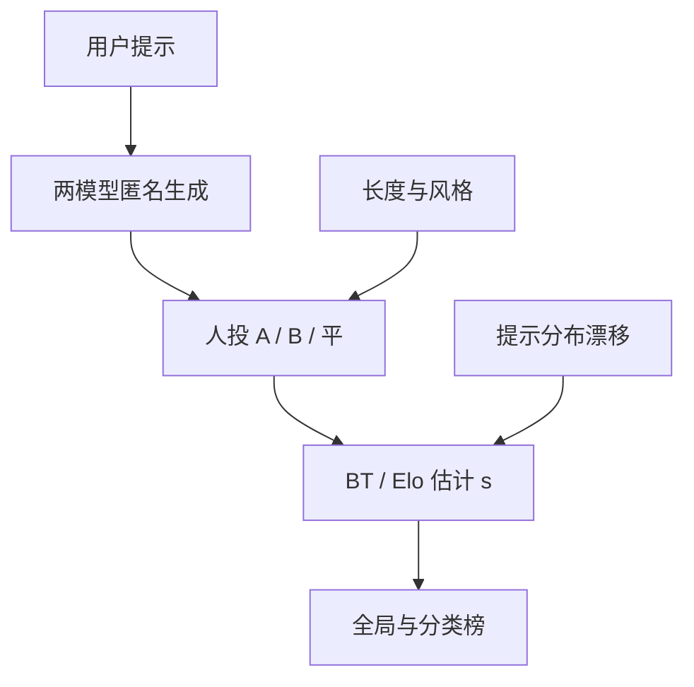

# LMSYS Arena 与人工偏好

静态榜把模型按同一套题排序；Arena 让人在同一提示下看两条匿名回答、只投一票，再用成对胜负估计一个会动的 Elo。

<footer>—— LMSYS Chatbot Arena；成对比较的统计骨架见 Bradley-Terry</footer>

LMSYS Chatbot Arena（今常称 Chatbot Arena）把助手评测从「固定题面 + 自动分」换成「真实用户提示 + 盲成对投票」。用户提交一句自己的话，系统抽出两个匿名模型的回答，人只选 A 更好、B 更好或平局。累积的胜负用 [Bradley-Terry](/llm/bradley-terry) 一类模型估每个模型的潜在强度，再排成公开榜。它直接对准产品问题——人更想用哪一个——因此对对齐和风格极度敏感，对 [MMLU](/llm/mmlu) 那种闭卷知识却几乎不保证相关。本篇写 Arena 作为偏好测量器：它的抽样、成对估计、以及为什么「榜上高」不能翻译成「各能力都高」。

## 问题

静态基准的题面在发布日就冻结，训练数据随后可以贴近，风格也可以针对评分器优化。用户真正在意的提示分布每天在变：写邮件、改代码、劝架、出点子，长尾极长。自动指标覆盖不了这条长尾，雇标注员按固定 rubric 打分又贵、又容易和真实使用错位。Arena 的赌注是：用足够多的自愿者投票，让提示分布近似真实使用，用成对比较降低绝对打分的校准噪声，得到一个随时间滑动的偏好序。

代价立刻出现。投票人不是随机抽样的人类：他们是愿意打开该网站、愿意比较长回答的人，提示偏向技术与英语的程度随社区变化。匿名可以减少品牌光环，减不掉「喜欢长、喜欢有列表、喜欢客气」这类审美。模型若针对这些审美加长、加 emoji，Elo 会涨，[IFEval](/llm/ifeval) 的长度上限和事实性却可能掉。偏好序不是能力的充分统计量。

### 成对比较测的是相对顺序

一次投票只说在这个提示、这对回答上谁赢，不说赢多少，也不说绝对好不好。两个都差，仍会决出胜者。BT / Elo 把许多对的输赢融合成分数差，差只在参加过比较的模型集合里可解释。新模型加入、旧模型退役、提示分布漂移，都会让同一「分数」不可跨周直接减。报告 Arena 必须带时间戳、对战矩阵是否充分连通、以及是否含风格控制（如强制短答）。

盲测减少的是「GPT 四个字」带来的先验，不是内容里的水印。熟悉某模型口头禅、代码块格式、拒答腔的用户仍可能认出来。认出来之后的投票，测的是品牌忠诚，不是回答质量。

## 方法

对模型 $i,j$ 在提示 $x$ 上的回答 $y_i,y_j$，观测 $y_i\succ y_j$ 或平局。BT 写

$$
P(i\succ j\mid x)=\sigma\bigl(s_i-s_j\bigr),
$$

实践中 $s$ 常当成与 $x$ 无关的全局强度——这是强假设：模型 A 可能在代码上稳赢、在创意写作上稳输，全局 $s$ 只是提示分布下的加权平均。Arena 后来的分类榜（编程、数学、指令等）就是在承认这一点：不同 $x$ 族应有不同 $s$。Elo 的顺序更新是 BT 的在线近似；大规模重估时更常见的是在全部对上拟合 BT / 统计模型，并给出不确定度。对战次数少的模型，区间宽，点估计的名次没有意义。

采样协议影响分数。温度、`max_tokens`、是否联网、是否工具，必须按模型配置冻结并公开，否则比较的是两套产品而不是两个权重。系统提示是否允许「我是某某模型」会破坏匿名。长度控制实验（把回答截到相近词数再投）用来检验风格混淆：若截断后名次大洗牌，原榜更多是在奖长度。

### 提示分布与污染式刷榜

用户提示会被公开或半公开日志吸收，后续模型可以针对高频题微调。这与静态集污染同类，但更难审计。Arena 侧用抽样、去重、过滤机器投票来缓解，不能消除。自己的模型上榜时，应同时看：私有提示集上的盲测、静态能力榜、以及分类 Arena。只优化公开投票入口的流量结构，可以得到虚高 Elo。

## 机制

人在成对阅读时，使用的线索远多于「事实对不对」：先看到的列表是否整齐、有没有承认局限、代码能不能直接粘、有没有说教。这些线索进入 BT 的 $s$，于是对齐阶段优化 RM / DPO 时，若 RM 数据来自相似人群，Arena 会跟着涨——这是一致，不是作弊。若 RM 数据来自雇来的标注员、严格的安全 rubric，Arena 人群又偏娱乐，两者会分叉。分叉应被报告，而不是选高的那张榜。

### 不可传递时 Elo 只是投影

平局与不可传递是 BT 的已知伤口。风格极端不同的三个模型可能出现石头剪刀布：A 赢 B、B 赢 C、C 赢 A。全局 $s$ 仍会给出一个序，但序是投影，不是真实的全序。对战矩阵的环越多，Elo 越像勉强的一维化。这在「创意 vs 严谨」混在同一全局榜时尤其严重。

Arena 分数对延迟、拒答率和工具不可见。投票人看到的是已经生成好的文本。服务上 TTFT 很差、动不动拒答的模型，只要被抽中且产出了看起来好的回答，仍可获高 Elo。产品体验不能只抄 Arena。

## 边界与工程取舍

Arena 不替代自动基准。知识、数学、代码的可执行对错仍要 [MMLU](/llm/mmlu)、[GSM8K](/llm/math-bench)、[HumanEval](/llm/code-bench)；格式要 [IFEval](/llm/ifeval)；长文检索要 [NIAH](/llm/niah)。Arena 回答的是「在当前用户分布上，盲测偏好序如何」。发布应把自动集当回归、把 Arena 与内部盲测当产品对齐，而不是互相取消。

统计上，名次的最小可报告差取决于对战数与对手集合。宣布「超过对手 5 个 Elo」而不给区间，等于没宣布。下架旧模型会改变连通图，历史分数不宜当成不变的资产。多语言与中文用户比例不足时，中文产品应以中文盲测为准，英文 Arena 只是参考。

不要把 Arena 当强化学习的直接奖励去刷：投票入口可被自己人、机器人、诱导提示操纵。公开榜的治理假设对手都有限作恶；把它接到自动训练循环里，激励立刻变味。

成对偏好也不是用户留存。有人投「写得漂亮」的赢，日常却用那个答得更快、更短的。内部指标应把盲测 Elo 与留存、重试率、点踩分开看。

## 小结

- Arena 用真实提示上的盲成对投票，经 BT / Elo 得到随时间滑动的偏好序，测的是相对受欢迎程度。
- 全局分数是提示分布下的加权平均；分类榜与长度控制用来拆开能力与风格。
- 投票人、匿名失败、长度审美、工具与延迟不可见，都是系统偏差。
- 对战少则区间宽；环状不可传递时一维 Elo 是投影。
- 它不替代可执行的知识、数学、代码、格式与长上下文评测。
- 不宜当作可自动优化的奖励入口。
- 出处：LMSYS Chatbot Arena；成对模型见 Bradley & Terry（1952），现代助手评测中的用法见 Arena 技术报告与公开排行榜说明。
