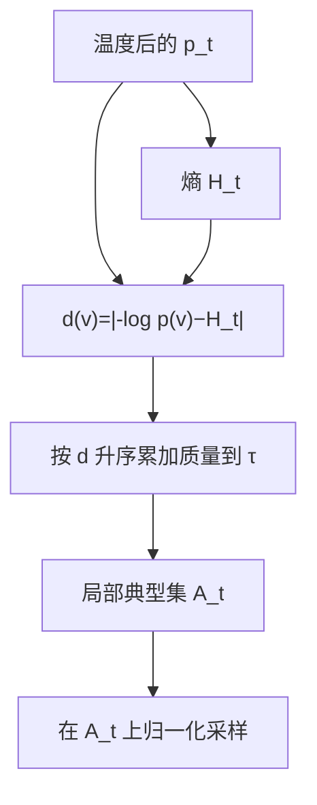

# Locally Typical Sampling

    
信息论里的典型集由接近期望信息量的事件组成，而不是由最大概率事件组成；逐步采样应对准当前条件分布的熵，而不是反复摘下峰值。

    <footer>—— Meister, Pimentel, Wiher & Cotterell, Locally Typical Sampling, ICLR 2023</footer>

Shannon 的典型集说：长序列的样本以高概率落在「平均每符号信息量接近熵」的集合里，最大似然串往往 *不* 典型——它们的信息量偏低。Meister 等人把这句话接到自回归的每一步：给定前缀，下一步的局部典型集是那些 $-\log p(v)$ 靠近条件熵 $H_t$ 的 token，而不是 $p(v)$ 最大的那些。算法按与 $H_t$ 的距离排序再累加质量，外形像 nucleus，排序键完全不同。Holtzman 的核采样切的是长尾噪声；局部典型还会丢掉 *过可预测* 的头部。这是它与 [min-$p$ / $\eta$](/llm/minp-typical) 分家的地方。

## 问题

贪心与束优化联合对数概率，倾向信息量偏低的续写，开放生成里就是重复与套话。Nucleus 保留高概率质量，头部套话仍在核里，随机性只是有时抽到次优。若人写文本的逐步信息量围绕条件熵波动，解码器却系统性地抽信息量过低的 token，样本会落在典型集之外。需要一种逐步规则，使被抽中的符号的自信息靠近 $H(p(\cdot\mid x_{<t}))$。

「靠近熵」与「高概率」只在分布极尖时重合：那时 $H$ 小，最大项的 $-\log p$ 也小。分布平坦或双峰时，最大项可能仍比 $H$ 低一截（过于可预测），而若干中等概率项的信息量更贴 $H$。Typical 会把后者排在前面。这解释了主观上的「少套话、仍通顺」：通顺来自仍在高概率质量附近，少套话来自不把峰值当唯一目标。

### 全局典型与局部典型

经典典型集是对整段序列定义的，依赖弱定律，长度要足够。生成时长度不固定，且每步条件分布在变，不能等写完再判断是否典型。局部化是必要近似：每步在当前 $p_t$ 上取典型符号，链式拼接。这不自动保证整段落在序列级典型集里——误差会累积——但比 MAP 更接近信息论给出的样本形貌。Mirostat 从另一头钉序列平均惊奇；局部典型不设全局 $s_*$，只问本步是否贴 $H_t$。两者都反对 Holtzman 描述的过低信息量模式，执行器不同。

Hugging Face 的 `typical_p` 实现的是本文算法，不是 Hewitt 的 $\eta$。参数 $p$ 是累加质量，类似 nucleus 的 $p$，不是 min-$p$ 的相对地板。

## 方法

设 $p_t(v)=p(v\mid x_{<t})$，$H_t=-\sum_v p_t(v)\log p_t(v)$。对每个 $v$ 定义与期望信息量的距离

$$
d_t(v)=\bigl|-\log p_t(v)-H_t\bigr|.
$$

将词表按 $d_t$ 升序排列，取最小前缀集合 $A_t$ 使得 $\sum_{v\in A_t}p_t(v)\ge\tau$，再在 $A_t$ 上把 $p_t$ 归一化并采样。$\tau$ 即实现里的 `typical_p`，常用 $0.9$ 量级。$\tau=1$ 等于不截断；$\tau$ 过小会在「恰巧贴熵」的一两个 token 上打转，多样性假象消失。

也可以不用质量预算，而用绝对阈值 $|-\log p-H|\le\epsilon$。质量预算的好处是与 nucleus 一样保证核上有足够的概率质量，避免空集；绝对阈值在极尖分布上可能只留下空集或全词表，需要回退规则。实践中质量预算更常见。

### 与 nucleus 只差排序键

Nucleus：按 $p$ 降序累加到 $\tau$。Typical：按 $d$ 升序累加到 $\tau$。其余工程相同——掩码、归一化、温度次序、空核回退。温度应在算 $H_t$ 与 $d_t$ 之前施加，因为熵是温度后分布的性质。先 typical 再温度会破坏「靠近熵」的定义。与 min-$p$ 交集时，最终支撑可能既不贴熵也不含峰值，应避免无声明叠层。

## 机制

信息量 $-\log p(v)$ 低于 $H$ 的 token 是「过于可预测」的，高于 $H$ 的是「过于意外」的。Nucleus 只砍后者的极端（长尾），保留前者。局部典型两边都砍，直到剩下的质量够 $\tau$。高峰套话的 $-\log p$ 往往明显低于 $H$，会被排到序列后部，可能进不了 $A_t$。这是相对 Holtzman 退化的几何修复：退化项恰恰是过可预测符号。它仍然保留一部分高概率质量，因为累加的是 $p$ 而不是均匀，完全离谱的 token 即信息量极高，也会排在后面被切掉。

### 熵估计与数值

$H_t$ 要对整个词表求和，或至少对概率不可忽略的支撑求和。半精度 softmax 后的小概率 $\log$ 需要夹紧。BPE 词表很大，真正贡献熵的往往是前几百个 token；实现可在排序前丢掉 $p$ 低于某数值地板的项以省排序，这会略微改变 $H$ 与 $d$，应视为近似。极尖分布 $H\approx 0$，所有合理 $d$ 都很小，typical 核与贪心几乎重合——算法自动承认「这一步没有典型的多样性」。极平坦分布 $H$ 大，许多 token 的信息量都靠近 $H$，核变宽，行为接近高温采样。这与 min-$p$ 跟 $p_{\max}$ 走的方向类似，但判据是熵距离不是相对峰高；双峰时两者会分叉。

不要把「典型」理解成「像训练集的平均句子」。它只是逐步符号的信息量靠近当前条件熵。话题是否像训练集，仍然完全取决于 $p_\theta$。

## 边界与工程取舍

局部典型不优化任务损失。代码补全里正确的下一个 ident 常常是信息量偏低的那一个（模型很确信），$A_t$ 可能把它排除，改抽一个「更意外」的错误名。确定性强的任务应用贪心或约束，不要开 typical。知识问答同理：实体名往往是峰值。它面向的是开放散文、故事、对话里 Holtzman 式退化。

与 [Mirostat](/llm/mirostat) 同时开没有清晰合成语义：一个按 $d$ 切核，一个按闭环 $\mu$ 切核。与 [Contrastive Search](/llm/contrastive-search) 也不同——后者是确定性表示惩罚。投机无损要求草稿使用同一 $A_t$ 构造规则，包括同一 $\tau$ 与同一温度；草稿模型的 $H_t$ 与目标不同，逐步集合会对不齐，接受率下降，但只要比较的是截断后的 $p,q$，一致性仍可保留。

评测不要只用重复 $n$ 元下降来宣布胜利，typical 本来就会少用峰值套话；还要看是否开始插入无关键接。Meister 等人用信息量直方图与人工评估，复制时应看分布是否真的靠近熵，而不是只看 nucleus 同款的 MAUVE 再报一次。实现细节（log 底数只差一个常数尺度，只要 $H$ 与 $-\log p$ 同底）必须自洽。

出处是 Meister et al., ICLR 2023。Nucleus 对照 Holtzman et al., ICLR 2020。$\eta$-sampling 是熵自适应 *地板*，不是按 $d$ 排序的典型集。

## 小结

- 局部典型集由与条件熵距离最小的 token 组成，再用质量 $\tau$ 截断，而不是按概率从大到小取核。
- 它同时削弱过可预测的头部与过意外的长尾，针对 MAP / 贪心落在典型集之外的问题。
- 与 nucleus 仅排序键不同；与 min-$p$、$\eta$ 同属截断族，但可能丢掉峰值。
- 温度必须先于熵与距离计算；`typical_p` 是质量预算，不是相对地板。
- 高确定性任务上「意外一点」是错误，应关闭该采样器。
- 投机时两边要用同一典型集规则，比较截断后的分布。
- 出处：Meister, Pimentel, Wiher & Cotterell, *Locally Typical Sampling*, ICLR 2023。
