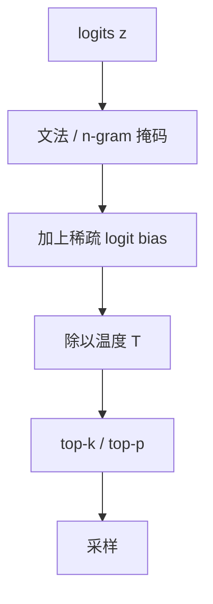

# logit bias

把若干 token 的分数加减一个常数，再送进 softmax：这是 API 能提供的最薄控制面，也是最容易和核采样、文法掩码打成一团的旋钮。

<footer>—— 对照 OpenAI 兼容接口里的 logit_bias 字段，以及逐步约束如何改支撑集</footer>

[上一课](/llm/ngram-blocking)把已出现 n-gram 做成硬零。本课把闸门放松：logit bias 对指定 token 加或减一个有限偏置，再进入温度与核。它出现在[兼容 API](/llm/openai-compat-api) 里，是产品侧最常见的「不要说这个词」开关，也是把白名单做成软偏好的方式。后课才问温度如何改推理路径；本课先把 *逐步仿射变换* 钉死，避免和采样超参混成一个旋钮。

## 问题

硬阻断不能表达「尽量别出现、但语法需要时可以」。频率惩罚按出现次数线性减，对象是 *已经写过的* token；产品还想对 *尚未出现* 的词预置偏好：抬高某个选项字母、压低脏话表、把 EOS 提前。缺口是一套与 $\pi$ 相加的稀疏向量 $b\in\mathbb{R}^{|\mathcal{V}|}$，使

$$
p(x_t)\propto \exp\big((z_t+b)_{x_t}/T\big).
$$

$b$ 的索引在 token id 空间，不在 Unicode 空间。调用方若按字符串想「禁止 apple」，必须枚举所有 BPE 片；漏掉一个片，模型会改走 `Apple` 或 ` apples`。这是 bias 作为 API 的主要陷阱，不是数学。

$b_i=+\infty$ 或实现里的极大值等于硬白名单；$b_i=-\infty$ 等于硬黑名单。有限 bias 与核的相互作用：被压低但仍在核里的 token 仍可能被抽中。文档必须写清是先加 bias 再核，还是先核再加——后者几乎无意义，因为核外已经是零。

## 方法

推荐顺序：文法掩码 → n-gram 阻断 → logit bias → 除以 $T$ → top-$k$ / top-$p$ → 归一化采样。与[核采样课](/llm/sampling-temperature-topp)同一协议，只是多了一层仿射。白名单应优先走文法（合法集精确），不要用很大的正 bias 冒充约束：softmax 仍给名单外非零质量，除非同时 mask。

服务端应把 $b$ 做成稀疏对列表，而不是每次物化 $|\mathcal{V}|$ 向量。词表 10 万时，稠密 $b$ 的搬运会接近一次无用的带宽税。多请求连续批时，每条请求的 $b$ 不同，采样器内核必须按请求施加——这是后课采样器内核要接的形状。

## 机制

对 softmax，加 $b_i$ 等价于把先验乘上 $\exp(b_i/T)$。$T$ 越小，同一 $b$ 越「硬」：低温下 $b=-2$ 已经接近禁令，高温下只是略降。因此 bias 与温度不可独立宣传：「禁止脏话、同时 $T=1.2$」会把黑名单重新变软。EOS bias 常被用来控长度：正 bias 提前结束，负 bias 拖长。这与长度惩罚不同——后者重排已生成假设，前者改下一步停不停。

不要用 bias 实现 JSON schema。嵌套与状态机转移不是一张静态表能表达的。静态表只适合与前缀无关的全局偏好。

## 边界与工程取舍

跨模型词表不同，同一字符串的 id 列表不可移植；兼容层若只转发整数 id，换模型即静默失效。投机解码时 bias 必须进入 $p$ 与 $q$ 两侧，否则[无损接受](/llm/speculative-decoding)对的是未偏置的目标。评测与线上必须同一张 $b$：安全词表若只在网关注入、评测脚本没加，数字会骗人。

出处以 API 契约与约束解码文献为准，没有单独的「logit bias 论文」。不要编造 arXiv。

## 小结

- logit bias 是逐步仿射，硬 $\pm\infty$ 才等于掩码。
- 作用在 token id；字符串到片的枚举必须完整。
- 顺序：掩码 → bias → 温度 → 核；与 $T$ 耦合。
- 静态 bias 替代不了文法；连续批里 $b$ 是每请求状态。
- 投机两侧都要加同一 $b$。
- 后课把 $T$ 从「文风」接到「推理对不对」。
- 出处：OpenAI 兼容 API 的 `logit_bias`；逐步掩码见约束解码文献。
