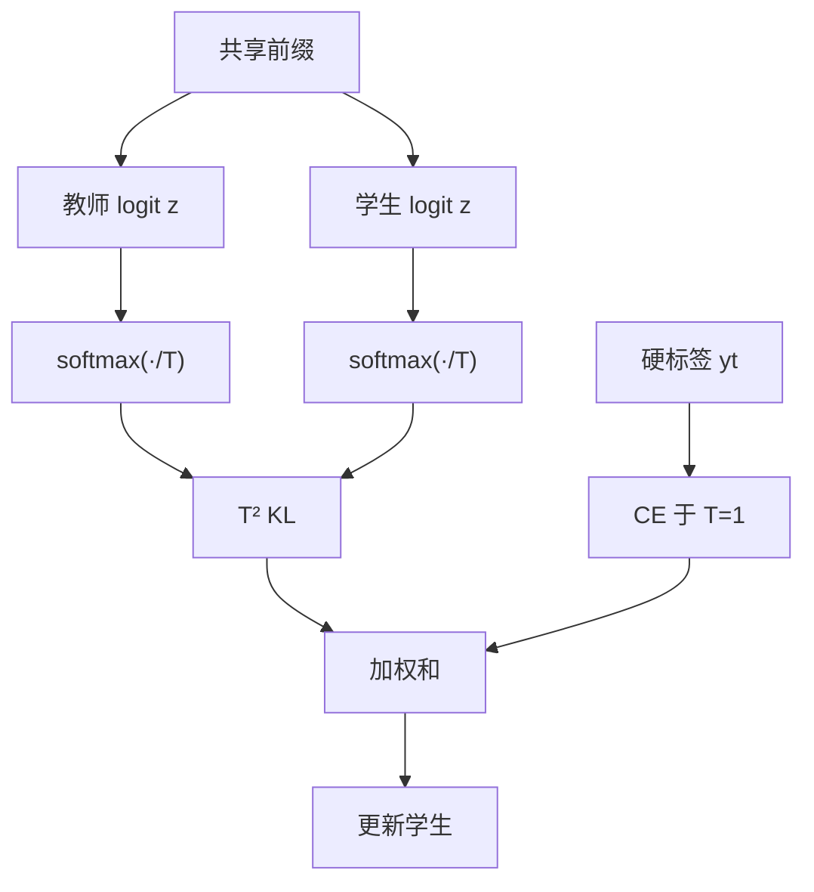

# 对数概率蒸馏

温度把教师的 logit 摊开，学生在整张词表上匹配那份软分布；乘 $T^2$ 是为了让高温下的梯度不跟着变没，暗知识才进得来。

<footer>—— Hinton, Vinyals, Dean，Distilling the Knowledge in a Neural Network，2015</footer>

知识蒸馏最原初的对象不是教师写出来的那串 token，而是每个位置上的对数概率向量。Hinton 等人让学生去拟合教师 softmax 在温度 $T$ 下的分布，使「第二、第三可能」的相对关系成为监督，而不是只拟合 one-hot 正确答案。语言模型里，这变成：在同一前缀上，学生的词表分布对齐教师的词表分布。它与序列级蒸馏（只学教师生成的硬序列）、与推理链蒸馏（学步骤文本）不是同一条损失。端侧场景下的温度与配比见 [蒸馏到端侧](/llm/on-device-distill)；本篇写 logit 级目标本身、数值与词表对齐、以及它何时该让位给硬序列。

## 问题

硬标签交叉熵只在正确 token 的坐标上给梯度。教师若把质量分给近义续写、合理格式变体、同类代码标识符，这些在 one-hot 里都是零。小模型用硬标签会过早变锋利，学不会「哪种错更像对」。Hinton 等人称之为暗知识：非最大 logit 里的相对结构。温度 $T>1$ 把差距压缩，把那些结构抬到足够的概率质量上，KL 才有东西可传。

语言模型把问题放大成三件事。词表极大，存整段教师 logit 昂贵。教师已经指令对齐时分布极尖，$T=1$ 的软标签接近硬标签，蒸馏退化。学生与教师 tokenizer 不同则同一位置根本不是同一事件，KL 无定义。问题是：在能够对齐的位置上，传哪一份分布、用多高的温度、如何不让存储把方法卡死。

### 蒸馏温度不是采样温度

推理时用户调的温度作用在已经训好的学生 logit 上，改的是解码锋利程度。蒸馏温度作用在训练目标里教师（通常也作用在学生）的 softmax 上。二者同形，

$$
p_i^{(T)}=\frac{\exp(z_i/T)}{\sum_j\exp(z_j/T)},
$$

配置必须分开。Hinton 原文的损失含 $T^2\,\mathrm{KL}(p^{\mathrm{tea}}\|p^{\mathrm{stu}})$：高温使 softmax 梯度带 $1/T^2$，乘回去才能在改 $T$ 时保持梯度量级。漏乘 $T^2$，一升高温监督就变没，看起来像「蒸馏没用」。

KL 的方向默认是 $\mathrm{KL}(p^{\mathrm{tea}}\|p^{\mathrm{stu}})$，学生被要求覆盖教师的模式（mode-covering）。反过来 $\mathrm{KL}(p^{\mathrm{stu}}\|p^{\mathrm{tea}})$ 更偏 mode-seeking，学生可以只对准教师的主峰。LLM 上两种都有人用；改方向等于改任务，不要在表格里当同一个「logit 蒸馏」比。

## 方法

在教师与学生共享的因果前缀 $x_{<t}$ 上，取教师 logit $z^{\mathrm{tea}}$、学生 logit $z^{\mathrm{stu}}$，损失为

$$
\mathcal{L}_{\mathrm{KD}}=T^2\,\mathrm{KL}\bigl(p^{\mathrm{tea}}(\cdot;T)\,\|\,p^{\mathrm{stu}}(\cdot;T)\bigr)
+\lambda\,\mathrm{CE}\bigl(y_t,\,p^{\mathrm{stu}}(\cdot;1)\bigr).
$$

$y_t$ 可以是语料真 token，也可以是教师 greedy / 采样出来的 token。$\lambda$ 平衡暗知识与硬标签。前缀必须来自同一文本的同一分词；教师更大、双向或窗口更长，只要学生看不见的键，就不该让教师用那些键去造 $z^{\mathrm{tea}}$，否则学生在部署时无法复现条件。这与 [因果 LM](/llm/causal-lm) 的掩码契约相同。

存储整词表 logit 不现实时，只存 top-$K$ 概率，其余质量扫进一个槽或丢弃。$K$ 太小，暗知识只剩几个近亲词；$K$ 太大，回到整表成本。也可以在线蒸馏：训练步里现场跑教师，不落盘，用算力换磁盘。离线落盘便于复现与配比扫描，教师版本必须钉死。

### 词表映射是前置条件

教师词表与学生词表的交集才可做 KL。做法只能三选一，写进协议：只在共享 token id 上归一化再 KL；把教师分布投影到学生词表（合并被切开的子词质量）；放弃 logit 蒸馏，改用教师解码文本、学生自己的 tokenizer 做序列蒸馏。第三种最脏也最稳，因为不假装 id 对齐。中英混合、代码、数字在不同 BPE 下切开方式不同，强行按位置对齐会把教师的「数字内部结构」教错。

## 机制

### 软标签在传什么几何

$T$ 增大，教师分布的熵升高，KL 的主要梯度从「追最大项」变成「追相对排序」。学生宽度不够复现精确多峰时，仍可学习一个覆盖近邻的平台，生成时表现为同义续写更稳、格式变体不至于零概率。$T$ 过大，分布近均匀，梯度变成对整个词表的微弱拉力，有效信号被稀释，学生变糊。指令模型教师常极尖，需要比分类网原文里更高的 $T$，或承认 logit 蒸馏收益有限、把预算转到序列桶。

$T^2$ 缩放保证：若把所有 logit 同乘一个常数（换温度的另一种看法），损失的相对权重不自动塌缩。它不消除教师校准不良：教师若把质量给错误近邻（自信的幻觉），学生会学这份几何。蒸馏复制教师的校准，不自动纠错。要纠错，硬标签桶或设备域数据必须足够，见端侧配比。

只蒸馏最后一层 logit，不蒸馏中间层，已经足以称为 Hinton 式 KD。中间层回归是另一类损失，需要层对齐与宽度投影，不是本篇的对象。不要把「logit 蒸馏」写成必须对齐每一层 hidden。

### 与序列级目标如何抢梯度

同一 batch 里既有全词表 KL 又有教师序列上的 CE 时，KL 在每个位置对 10^4–10^5 类给梯度，CE 只对一个类。若不按 $\lambda$ 与 token 比例压 KL，学生会把容量耗在模仿教师的长尾词表几何，而序列是否按产品格式结束符停下来反而学不稳。长思维链上这个问题更重：每步都 KL，等于要求小模型在每步复现教师的全部犹豫。端侧实践往往降低 logit 桶比例、提高序列桶，不是因为 logit 蒸馏「过时」，而是容量不够买整表几何。

## 边界与工程取舍

logit 蒸馏贵在教师前向或存储，对小词表、分类头、或已经对齐 tokenizer 的同族模型最划算。跨词表、跨窗口、跨量化图时，序列蒸馏更少暗坑。量化学生应在量化感知图上做 KL，否则学的是 FP16 头、部署 INT4 头，温度等于又被改一次。不要把生成采样温度、注意力温度、蒸馏 $T$ 写成同一个超参。

Hinton 等 2015 年的实验对象是分类网。LLM 上同一公式成立，但词表、尖分布、长序列存储使工程约束成为方法的一部分。没有一份万能 $T$。评测应看学生任务指标，不看教师–学生 KL 是否降到零——KL 为零只说明抄上了，抄上幻觉也算。后续的序列级、推理链、在线离线是不同文章的切分：本篇只保证「位置 $t$ 上的分布」这一层。

top-$K$ 近似会破坏 $T$ 的含义：高温本该抬起长尾，你却把长尾丢掉。若必须 top-$K$，可把剩余质量放到一个显式「其它」槽，或随 $T$ 增大而增大 $K$，避免高温与截断互相抵消。

### 何时不必做 logit 蒸馏

词表对不齐且不想维护映射。教师极尖、扫 $T$ 仍无暗知识，改序列蒸馏。学生容量只够学任务格式，不配整表几何。只能离线存极小 $K$ 又不肯加「其它」槽，KL 已经接近硬标签，不如直接 CE。需要把逐步推理结构传给学生，用推理链文本，而不是指望中间步骤的 logit 自己长出可读证明。

## 小结

- 对数概率蒸馏用温度软化教师分布，学生以 $T^2$ 加权的 KL 匹配，并常与硬标签 CE 混合。
- 蒸馏 $T$ 不是采样温度；漏乘 $T^2$ 会让高温监督消失。
- 词表、因果窗、量化图必须与学生部署对齐，否则 KL 无意义或不可迁移。
- 整表 logit 贵，top-$K$ 要处理剩余质量，以免高温与截断打架。
- KL 方向（教师→学生或反过来）改变覆盖还是寻峰，须写明。
- 小模型上 logit 桶常与序列桶争容量；任务指标优先于教师 KL。
- 出处：Hinton, Vinyals, Dean，*Distilling the Knowledge in a Neural Network*，2015。端侧温度与数据配比见专文。
