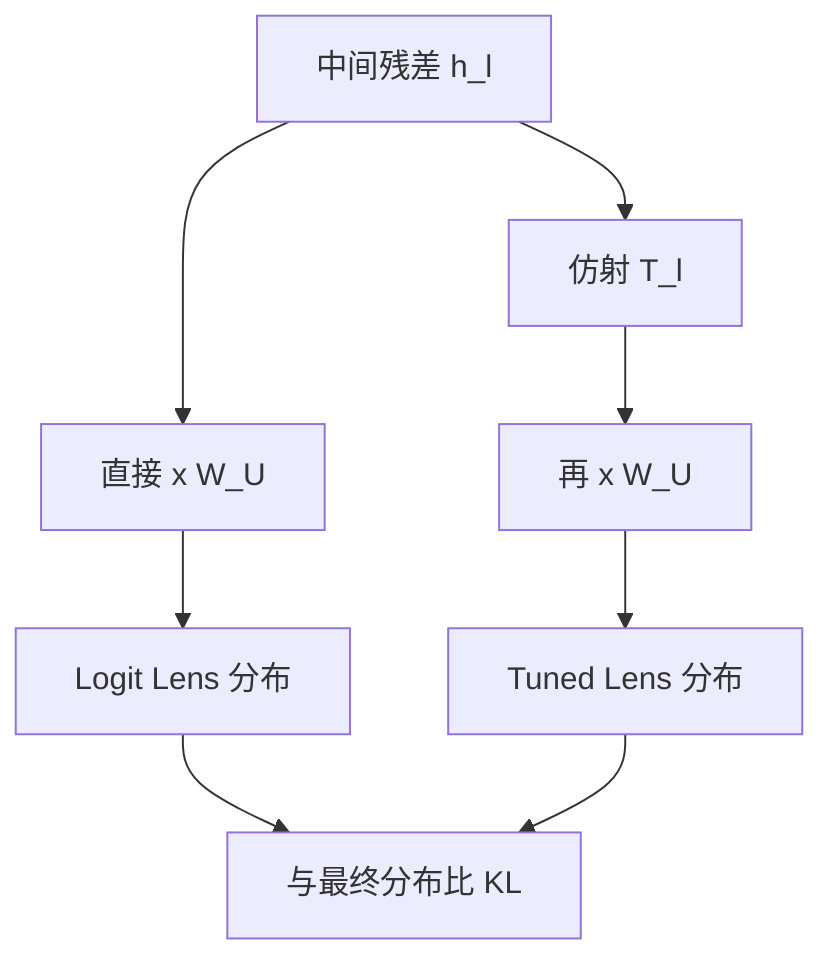

# Logit Lens / Tuned Lens

GPT 的概率预测是末层激活的线性函数。若把同一函数用到中间层激活上，得到的分布往往仍然可被直觉阅读。

<footer>—— nostalgebraist, interpreting GPT: the logit lens, LessWrong, 2020</footer>

语言模型只在最后用解嵌矩阵 $W_U$ 把残差写成词表 logits。中间层的残差与末层同维度，于是可以问：若提前解嵌，模型此刻「会猜哪个词」？nostalgebraist 在 2020 年把这一操作叫做 logit lens。它几乎零成本，却把前向画成一条逐步收敛的预测轨迹。随后 Belrose 等人指出，直接套 $W_U$ 在不少模型上会崩——中间层的基与末层并不相同。他们为每一层学一个仿射变换，再解嵌，称为 tuned lens。两套透镜看的是迭代推断，不是注意力图。

## 问题

残差流在每一层都被注意力与 MLP 更新，但我们通常只监督最后的交叉熵。中间表示里究竟何时出现最终答案、何时还在抄输入、何时已经写成了错误的高置信猜测，默认不可见。若把每一层当独立编码器，又与「层层 refinement」的图景冲突。

Logit lens 的赌注是：解嵌基大致适用于整条残差，于是中间状态可以翻译成词表分布。若赌注成立，就能观察预测如何被逐层修正。若不成，失败本身也有信息——说明表示发生了基漂（representational drift），中间层的「意义」还没被写成末层的坐标。

### 直接解嵌为何在部分模型上失效

GPT-2 上 lens 常看起来单调收敛。BLOOM、GPT-Neo 等模型上，早期层的 lens 会给出乱码或高频词偏置，末几层才突然可读。Belrose 等人将此归因于各层使用不同的仿射基：特征在，但 $W_U$ 不是为那一层准备的。把失效理解成「中间层没有预测」，会低估模型内部已经完成的计算。

Logit lens 读的是「若现在就解嵌会得到什么」，不是「这一层的注意力在看谁」。它与注意力可视化正交。只看 lens 会漏掉仍在通路里、尚未写成词表方向的信息；只看注意力会漏掉残差里已经形成的猜测。

## 方法

记 $h_\ell$ 为第 $\ell$ 层后的残差（通常取最终层归一化之前或之后，需固定约定）。Logit lens 为

$$
z_\ell = W_U h_\ell, \qquad p_\ell = \mathrm{softmax}(z_\ell).
$$

有的实现会先乘与训练时相同的层归一化。比较 $p_\ell$ 与最终 $p_L$ 可用 KL 散度，观察是否大致单调下降。这就是 nostalgebraist 用来论证「中间分布渐渐长成输出」的量。

Tuned lens 为每一层训练仿射 $T_\ell(h)=A_\ell h + b_\ell$，目标是让 $W_U T_\ell(h_\ell)$ 匹配最终分布（或匹配教师 logits），模型权重冻结。Belrose 等人用蒸馏损失，使 $T_\ell$ 把中间基译成末层基。译完再解嵌，早期层的困惑度明显低于裸 lens，校准更好，高频词偏置减弱。

### 作为早期退出与探针的双重身份

Lens 形式上是早期退出：中间层已经输出一个词表分布。但训练目标从未要求这些分布正确，裸 lens 更像探针而不是合法的早停头。Tuned lens 的仿射是后置于冻结模型的探针，容量很小，若仍能预测最终答案，说明信息已线性可译。Belrose 等人还用因果实验表明，tuned lens 依赖的方向与模型自己后续层使用的方向相近，而不是任意可拟合的捷径。

## 机制

Transformer 可被看成对残差里一份「当前猜测」做迭代更新。若 $W_U$ 近似固定了一套词表坐标，那么每层的 $\Delta h$ 就是在这套坐标里加减某些 token 的分数。Geva 等人把 MLP 写成键值记忆，与这一图景相容：MLP 往残差写入可被 $W_U$ 读出的方向。Logit lens 能工作，是因为这条写入足够对齐词表基。

### 基漂与仿射校正

当预归一化、残差尺度、甚至词表绑定策略变化，中间 $h_\ell$ 可能差一个可学习的线性变换才落到 $W_U$ 的行空间。Tuned lens 估计的正是这个变换。它不发明新信息，只纠正坐标系。若某层连仿射都译不出最终分布，才说明该层信息尚未线性写成词表，或写在了 lens 没读的位置（例如尚未拷贝到当前 token）。

在哪个 token 位置读 lens 至关重要。对下一词预测，通常读当前最后一个提示位置。读到主语位置上，看到的是「关于主语的属性」而不是下一词。把位置搞错，会把事实回忆的中间状态误认成解码轨迹。

轨迹本身可当信号。Belrose 等人发现，恶意或异常输入的中间预测轨迹与普通输入不同，可用来做检测。这是透镜的下游应用，不是透镜的定义：先有可信的逐层分布，才谈轨迹异常。

## 边界与工程取舍

裸 lens 零训练、可随时用，适合探索单条提示；跨模型比较、早期层定量、校准敏感的实验应改用 tuned lens。仿射要在与评测集不重叠的语料上拟合，否则探针会偷答案。层归一化前后、是否包含最终 RMSNorm，必须在实验里写死，否则别人无法复现曲线。

Lens 永远只投影到词表。计数、潜在句法、尚未词汇化的计划，可能存在于残差正交于 $W_U$ 行空间的分量里。此时 lens 会显示「还没有猜测」，并不表示什么都没算。与线性探针、激活修补并用，才能区分「没写进词表」和「根本不在表示里」。

不要用 lens 的 argmax 当模型的「真实想法」。中间层的峰值可能是高频功能词，最终被后层改掉。看完整分布、看 KL 到最终分布、看 top-k 集合的演化，比看单一解码词更不容易被故事带走。

## 小结

- Logit lens 用末层解嵌矩阵阅读中间残差，把前向显示为词表分布的逐层收敛。
- 裸 lens 在部分模型上因基漂而失效；失效不等于中间层没有信息。
- Tuned lens 为每层学仿射，把中间基译到末层再解嵌，更准、更校准。
- 读哪个 token、层归一化约定、以及只投影到词表这一上限，决定解释能走多远。
- 轨迹可用于分析 few-shot 与异常输入，但透镜本身是探针，不是因果电路。
- 出处：nostalgebraist, *interpreting GPT: the logit lens*, 2020；Belrose et al., *Eliciting Latent Predictions from Transformers with the Tuned Lens*, arXiv:2303.08112, 2023。
