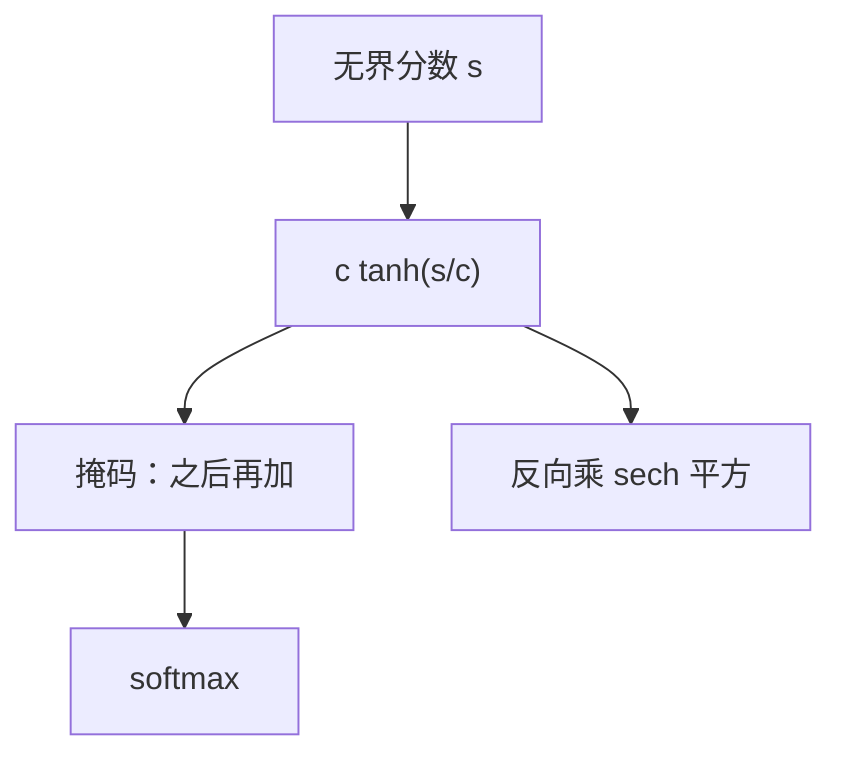

# logit soft-capping

用有界的双曲正切把 logits 按幅度压缩进 $(-c,c)$，饱和被加上硬天花板，梯度在帽沿附近变小但不会突然变成 Inf。

<footer>—— Gemma Team, Gemma 2: Improving Open Language Models at a Practical Size, 2024；tanh 压缩作为有界打分的工程条款</footer>

[上一课](/llm/attention-logit-growth)把注意力分数增长写成熵塌缩。缺口是：归一化 $q,k$ 改的是点积定义，有时不能动检查点结构。Gemma 2 在注意力 logits 与最终词表 logits 上使用 soft-capping：$\mathrm{tanh}(s/c)\cdot c$。本课写这道界怎么进前向与反向，以及它与 [z-loss](/llm/z-loss)、QK-Norm 的分工。后课的输出发散默认你已经知道：cap 可以同时打在注意力与 lm_head 两处，系数通常不同。

## 问题

硬裁剪 $s\leftarrow\mathrm{clip}(s,-c,c)$ 在 $|s|=c$ 处次梯度为 0 或未定义，分数一旦顶满，该位置对 $Q,K$ 不再提供梯度，塌缩被「焊死」。soft-cap 用

$$
\tilde s = c\,\tanh(s/c)
$$

把 $\mathbb{R}$ 光滑映到 $(-c,c)$。$|s|\ll c$ 时 $\tanh(x)\approx x$，几乎是恒等；$|s|$ 大时渐近到 $\pm c$，导数 $\mathrm{sech}^2(s/c)$ 变小但不在有限 $s$ 处跳到 0。Gemma 2 报告对注意力与输出 logits 使用不同的 $c$（注意力一侧更大或更小以报告为准，配方必须分开写），目的是在不改 QK-Norm 的前提下给 BF16 留动态范围。

这不是温度。温度是 $s/\tau$ 再进 softmax，仍无界；cap 是有界。把 cap 误实现成除以 $c$ 而不乘回，等于永久改温度，检查点与推理会错位。

$c$ 太小，模型失去用尖锐路由区分位置的能力，长距离复制变差。$c$ 太大，帽永远碰不到，等于没开。应看训练中 $\tilde s$ 顶满的比例，而不是只抄一个报告里的整数。

## 方法

注意力：在 $S=QK^\top/\sqrt{d_k}$ 之后、掩码与 softmax 之前插入 $\tilde S=c_a\tanh(S/c_a)$。掩码仍是把无效位写成大负数——必须在 cap **之后**加掩码，否则大负数被 tanh 收到 $-c$，softmax 仍会分质量给 padding。输出头：对 $\ell$ 做 $\tilde\ell=c_o\tanh(\ell/c_o)$ 再进 CE。两处 $c$ 禁止共用一个超参名。

反向：对角乘 $\mathrm{sech}^2(s/c)$。顶满区域梯度变小，这是有意的：不再鼓励范数竞赛。与 FlashAttention 融合需要核支持；若核没有 cap，在核外包一层 tanh 会物化 $S$，退回内存墙。没有融合实现时，宁可只对调试层开 cap，不要假装「已对全体注意力 cap」。

推理必须使用**同一** $c$。改变 $c$ 等于改变已训练的路由几何。量化前看 $\tilde s$ 是否已顶满：顶满多，说明 cap 在干活，量化格子要覆盖 $[-c,c]$ 而不是原始无界 $s$。

## 机制

相对 QK-Norm：Norm 约束的是 $q,k$ 的范数，点积变成缩放余弦，仍可因可学习标量而变大；cap 直接卡 softmax 的输入。可以叠用：Norm 管训练动态的漂移，cap 管极端值。相对 z-loss：z-loss 是损失项，拉的是词表 LSE；注意力 cap 不进损失，是前向非线性。输出 cap 与 z-loss 部分重叠——都抑制大 logits——但 cap 改变的是表示函数，z-loss 改变的是目标。只开 cap 关 z-loss，LSE 仍可在帽内变大（所有 $\tilde\ell$ 顶满时 softmax 仍锋利）。

## 边界

RL 里对 value / logits 的 tanh 压缩是另一处超参，不要和 Gemma 2 的 $c$ 混用。本课不把 cap 当成 μP 的替代：宽度定标仍要做，否则未进入 tanh 非线性区时已经炸。Post-LN / Pre-LN 与 cap 正交。下一课专门看**输出**侧在 cap 仍不够、或没开 cap 时，logits 如何整体发散。

## 小结

- soft-cap 用 $c\tanh(s/c)$ 把注意力或词表 logits 光滑送进 $(-c,c)$，避免硬裁剪焊死梯度。
- 掩码必须加在 cap 之后；注意力与输出的 $c$ 分开。
- 它与 QK-Norm、z-loss 分工：有界前向 / 范数 / 损失项。
- 无融合核就没有「全层 cap」；推理 $c$ 必须与训练一致。
- 出处：Gemma Team, *Gemma 2*, 2024。
