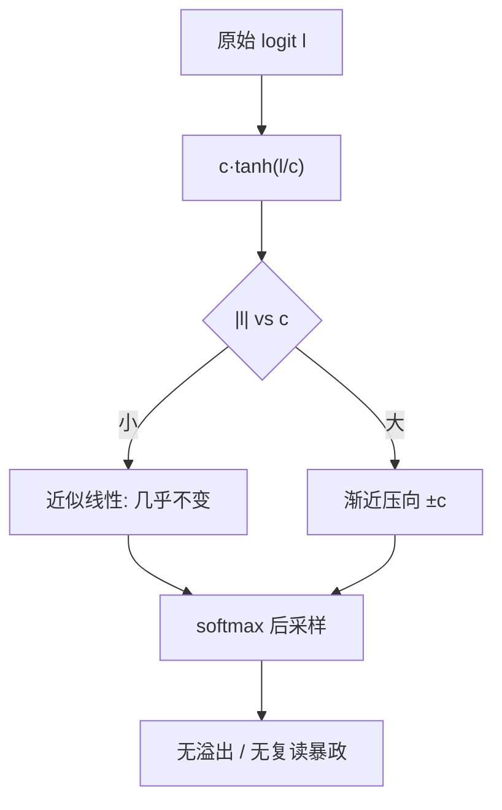
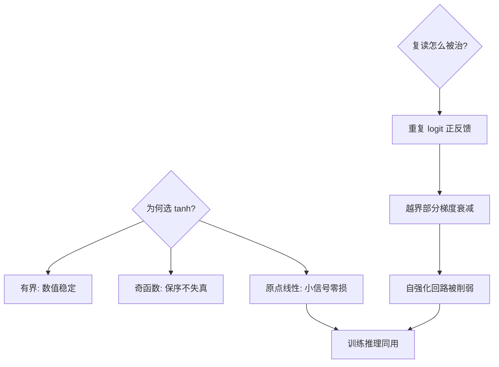

# logit-softcap

采样前给每个 logit 套一道 tanh 软上限：越界的信号被压弯而不是剪断——模型话痨与复读，往往是一个没封顶的 logit 闹的。

<footer>—— 据 Gemma 2 技术报告（2024）final logit softcap；Grok 与 SilasTron 实现</footer>

[QK-Clip](/llm/qk-clip) 在训练期给注意力 logit 动手术，本课在推理与输出侧给最终 logits 上护栏。缺口是 **logit 软上限**：$c\cdot\tanh(l/c)$ 把无界 logit 压进 $(-c,c)$——大值压弯、小值不动。它是 Gemma 2 稳定训练与改善采样的公开秘方之一。本课不进 logits 后处理的采样链（top-p/min-p 各有专课）。

## 问题

最终层 logit 本质无界：异常激活（重复 token、对抗前后缀）会让某 token 的 logit 冲到几十甚至上百，softmax 后概率逼近 1——模型进入复读或退化输出；fp16 下还会数值溢出。硬截断（clip 到 ±c）在边界造成梯度死区；温度缩放则压不平「正常分布与异常峰」的双重需求。缺口：**平滑压顶**。

术语翻译：softcap = $c\cdot\tanh(l/c)$，$c$ 是上限常数（Gemma 2 输出层用 30）；「软」在 tanh 的渐近——logit 无限大时输出趋近 $c$ 但永不过界，梯度 $1-\tanh^2$ 平滑归零而非硬归零。

数字实例：$c=30$。正常 logit 5 → $30\tanh(1/6)\approx 4.9$（几乎不动）；异常 logit 80 → $30\tanh(8/3)\approx 29.6$（压到界内）；softmax 里 29.6 与 4.9 的差距 $\approx 24.7$，仍保区分度但不再是「100 分 vs 0 分」的暴政。

## 方法

两处可选挂点：**最终 logits**（Gemma 2 的用法，控采样与训练稳定性）与**注意力 QK logits**（Gemma 2 同时在每层注意力用 50 的 cap，与 QK-Clip 形成对照方案）。实现一行：`logits = cap * tanh(logits / cap)`；训练推理同用，无状态开销。与温度的关系：cap 先行、temperature 后行——先封顶再缩放，两层护栏各司其职。

直觉类比：像给音轨加 limiter（限幅器）而非剪切——正常音量原样通过，爆音被柔性压扁但保留轮廓；硬 clip 是「过阈全剪」，听感发劈（梯度死区），limiter 是「过阈弯腰」，动态还在。

## 机制

为什么 tanh 是对的形状：它是有界、奇函数、原点线性（$\tanh(x)\approx x$）——三个性质分别给出「有上界」「保序」「小信号不扰动」。训练侧的收益来自两点：**数值稳定**（logit 有界则交叉熵的指数项不再溢出，fp16 友好）；**梯度健康**（越界 logit 的梯度被 $1-\tanh^2$ 自然衰减，重复循环里的「自我强化」路径被削弱——复读本质是 logit 正反馈）。代价是精度损失：cap 过小会把排序压平（softmax 分辨力下降），$c=30$ 量级下实测对损失的影响在 0.5% 内，Gemma 2 用它换到了更大的 batch 稳定域。

常见误区：把 softcap 当成采样参数乱调——$c$ 是模型训练时定死的架构常数，推理时另换 $c$ 会让模型处于「训练时没见过」的分布；另一误区是与 min-p/top-p 叠加过猛——cap 已把暴政峰压平，再叠多层截断会把长尾掐死，输出趋向无聊。

## 边界

Cap 改变模型的概率分布——训练时不用、推理时用的「半路 cap」是分布漂移；反之亦然。对 cap 的替代方案：logit 归一化（除以范数）、注意力侧的 QK-norm 与 [QK-Clip](/llm/qk-clip)（训练期手术）——工程界当前偏好「训练期根治，推理期不设防」，softcap 是训练期根治族里最廉价的一员。适用性：从零预训的模型直接内置；拿开源模型做推理时，若它没内置 cap，别自己加——先试重复惩罚与 [min-p 类采样修正](/llm/speculative-decoding)同族的推理侧工具。

直觉类比：cap 是「出厂限速器」——发动机（模型）造好时限速 30，正常驾驶无感，失控踩死油门也顶到限速；事后自己改装限速器（推理时加 cap），等于让出厂调校作废，先查原厂手册。

## 小结

- $c\cdot\tanh(l/c)$：有界、保序、小信号无损，一行代码。
- 训练推理必须同用，$c$ 是架构常数不是采样旋钮。
- 治复读靠削弱 logit 正反馈；治溢出靠有界化。
- 出处：Gemma 2 技术报告 2024；Grok/SilasTron 开源实现；QK-Clip 2025 对照。
