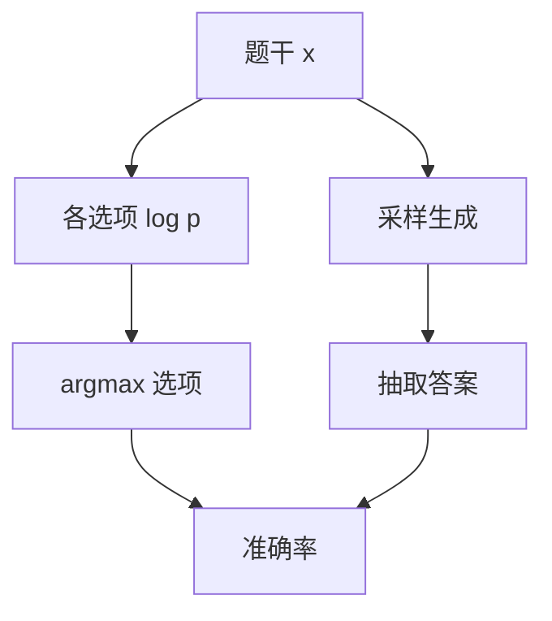

# 对数似然对生成式评测

选择题可以不生成一个字母：比较各选项续写的对数概率即可。那测的是条件似然，不是模型在对话里会写出什么。

<footer>—— 对照 EleutherAI 评测套件与 HELM 对 completion / likelihood 协议的区分</footer>

[上一课](/llm/perplexity-eval-pitfalls)把 PPL 从能力声明里拿掉。缺口立刻出现：[MMLU](/llm/mmlu) 一类卷面仍常按选项对数似然计分，而产品走的是采样生成。本课钉这两种协议不可互换。后课提示格式敏感默认：你已经知道「同一个准确率」可能来自完全不同的解码器。

## 问题

对数似然协议：把题干当前缀，对每个选项算 $\log p(y_i\mid x)$（或长度归一后的平均），取最大者。优点是对基座稳、省解码、可微近似分类。缺点是模型从未被要求「只输出 B」；聊天模型还可能先道歉再给答案，似然协议看不见这条路径。

生成式协议：让模型自由续写，再从文本里抽答案。它更接近产品，但耦合温度、最大长度、停止符、抽取器。Gao 等人的 lm-eval 把两套都实现了，同一模型在同一科目上可以差出数个点——那不是随机噪声，是仪器。

指令模型用似然协议时，必须决定：选项要不要带聊天模板、要不要在「Answer:」之后再算续写概率。模板一变，似然排名就变。

## 方法

写报告先锁协议名：`loglikelihood` 还是 `generate_until`。似然侧要声明：是否按 token 数归一、是否把选项字母与选项文本一起条件、是否忽略公共前缀。生成侧要声明：温度、top-$p$、停止串、是否只看第一个字母。

基座对比优先似然，避免「还不会按格式答题」被算成无知。对话模型与产品声明优先生成。两套都跑时分表，禁止平均成一个「MMLU」。

## 机制

似然协议问的是：在教师强迫的前缀下，哪一段续写更像训练分布。生成协议问的是：自回归采样路径能否落到可抽取的正确槽里。前者对「会但说不出来」友好，后者对「会说但校准差、爱解释」惩罚。对齐后的模型常常生成更好、裸似然更乱，因为 RLHF 改的是采样路径上的偏好，不一定抬高选项续写的相对似然。

长度归一是隐性先验：不归一则长选项吃亏（多项连乘）；归一则短而含糊的干扰项可能被抬高。必须写进协议，不能当实现细节。

## 边界

代码与数学的 pass / 精确匹配只能走生成（再执行）。下一课提示格式敏感会说明：哪怕锁死了似然还是生成，空格与冒号仍能改排名。

## 小结

- 选项似然与生成抽取是两套考试，准确率不能横比。
- 基座用似然，产品声明用生成；并存必须分表。
- 对齐可以抬生成、搅乱裸似然。
- 出处：EleutherAI lm-evaluation-harness；Liang 等 HELM；MMLU 原文的 few-shot 设定。
