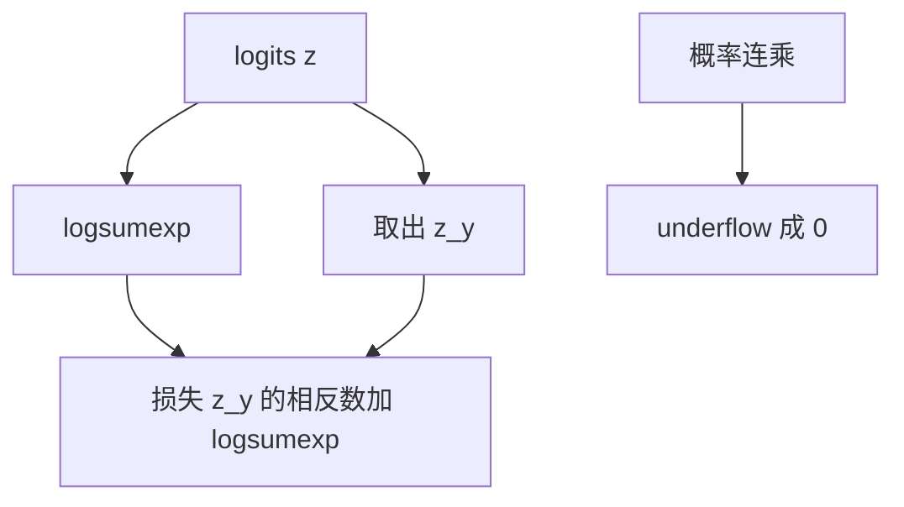

# 对数空间与 underflow

概率连乘很快小于浮点能表示的最小正数；改成对数相加，再在 logsumexp 里只指数化相对值。

<footer>—— 据 Goodfellow, Bengio &amp; Courville, Deep Learning, 2016；Press, Teukolsky, Vetterling &amp; Flannery, Numerical Recipes 整理</footer>

[交叉熵与极大似然](/llm/cross-entropy-mle)把损失写成 $-\log p_y$。本课不重推 $p-y$。缺口是：实现里若先算出 $p$ 再取 $-\log$，或把许多概率乘在一起，会先 underflow 成 $0$，再对 $0$ 取对数得到 Inf。方法是全程在对数空间工作：用 $\mathrm{logsumexp}$ 直接从 $z$ 得到 $\log\sum\mathrm{e}^{z_k}$，序列上的联合似然改成对数相加。

## 问题

float32 的最小正正规数大约 $10^{-38}$。几十项小于 $0.1$ 的概率相乘就会变成 $0$。softmax 的分母是 $\sum\mathrm{e}^{z_k}$，若 $z$ 很负，指数先变成 $0$，归一化变成 $0/0$。交叉熵要的其实不是 $p$ 本身，而是 $\log p_y$。缺口因此不是新的损失函数，而是同一条似然的数值通道：只传递对数，不传递接近零的概率。

序列模型把 $P(t_{1:n})=\prod_i P(t_i\mid t_{<i})$ 写成乘积。下一课会把每一项当成分类；本课先规定：这个乘积只在对数里存在，$\sum_i\log P(t_i\mid t_{<i})$。任何「先算联合概率再取对数」的实现，在长度超过几十时就已经不可信。

### $\mathrm{logsumexp}$ 不是「先 softmax 再 $\log$」

代数上 $\log p_y=z_y-\mathrm{logsumexp}(z)$。若先做 softmax 得到 $p$ 再 $\log p_y$，中间的 $p_y$ 在错误类极确信时会下溢成 $0$，损失变成 Inf，梯度变成 NaN。$\mathrm{logsumexp}$ 先减最大值再在对数里加回，中间量的量级由相对分数决定，不经过接近 $0$ 的 $p$。框架的 `cross_entropy` 走的是这一条，不是两条算子的串联。

$\mathrm{logsumexp}(z)=m+\log\sum_k\mathrm{e}^{z_k-m}$，$m=\max z$。减 $m$ 与 softmax 课相同，差别是这里返回对数配分函数，不返回 $p$。需要 $p$ 时再指数化 $\log p$，而且往往只在评估时才需要。

## 方法

对一组 logits $z\in\mathbb{R}^{K}$：

$$
\log\sum_k\mathrm{e}^{z_k}=\max(z)+\log\sum_k\exp\bigl(z_k-\max(z)\bigr).
$$

交叉熵实现为 $-z_y+\mathrm{logsumexp}(z)$。若有一批独立事件的对数概率 $\ell_i$，联合对数似然是 $\sum_i\ell_i$，平均负对数似然再除以项数。比较两个假设时，比较的是对数似然差，不要把对数变回概率再除——比值会再次下溢。

需要在对数空间混合两个分布时，用 $\mathrm{logaddexp}(a,b)=\log(\mathrm{e}^a+\mathrm{e}^b)$，同样先提出较大者。本课不把这写成注意力的另一条公式；它只是同一数值原则：指数只作用在平移后的差值上。

## 机制

浮点加法在量级相差过大时会吞掉小数。$\mathrm{logsumexp}$ 把所有指数的自变量限制在 $(-\infty,0]$，最大项是 $\mathrm{e}^0=1$，其余项 $\le 1$，求和不会溢出；若所有项都极负，求和可能下溢成 $0$，但此时 $\log$ 之前已经加回了 $m$，损失仍是有限的大数，而不是 NaN。这是「用平移保住相对尺度」与 softmax 课同一技巧，对象从 $p$ 换成了 $\log Z$。

训练循环里应默认损失在对数空间闭合：前向出 logits，损失出标量，不要为了日志去把整批 $p$ 物化。评估 perplexity 时，$\mathrm{e}^{L}$ 才从 nat 变回「有效分支数」；若 $L$ 已经平均过，再指数不会 underflow。先对每个 token 的 $p$ 连乘再开 $n$ 次方，才会在长序列上崩掉。

## 边界

本课不定义语言模型的时间展开，只准备好对数可加。下一课[下一词分类](/llm/clm-as-next-token)把每个位置当成一次 $K=|V|$ 的分类。混合精度下更小的指数范围，是工程课的事。后课默认：看见「概率的积」，就改写成对数的和；看见交叉熵实现，就认为它走 logsumexp，而不是 softmax 再 log。

## 小结

- 概率连乘会 underflow；联合似然只在对数空间以求和存在。
- 交叉熵应写成 $-z_y+\mathrm{logsumexp}(z)$，不要先物化 $p$。
- $\mathrm{logsumexp}$ 先减最大值，与稳定 softmax 同一平移，返回的是对数配分。
- 评估 perplexity 时对平均负对数似然再指数，不要对概率连乘开方。
- 出处：Goodfellow et al., Deep Learning, 2016；Numerical Recipes 对溢出与对数求和的处理。
