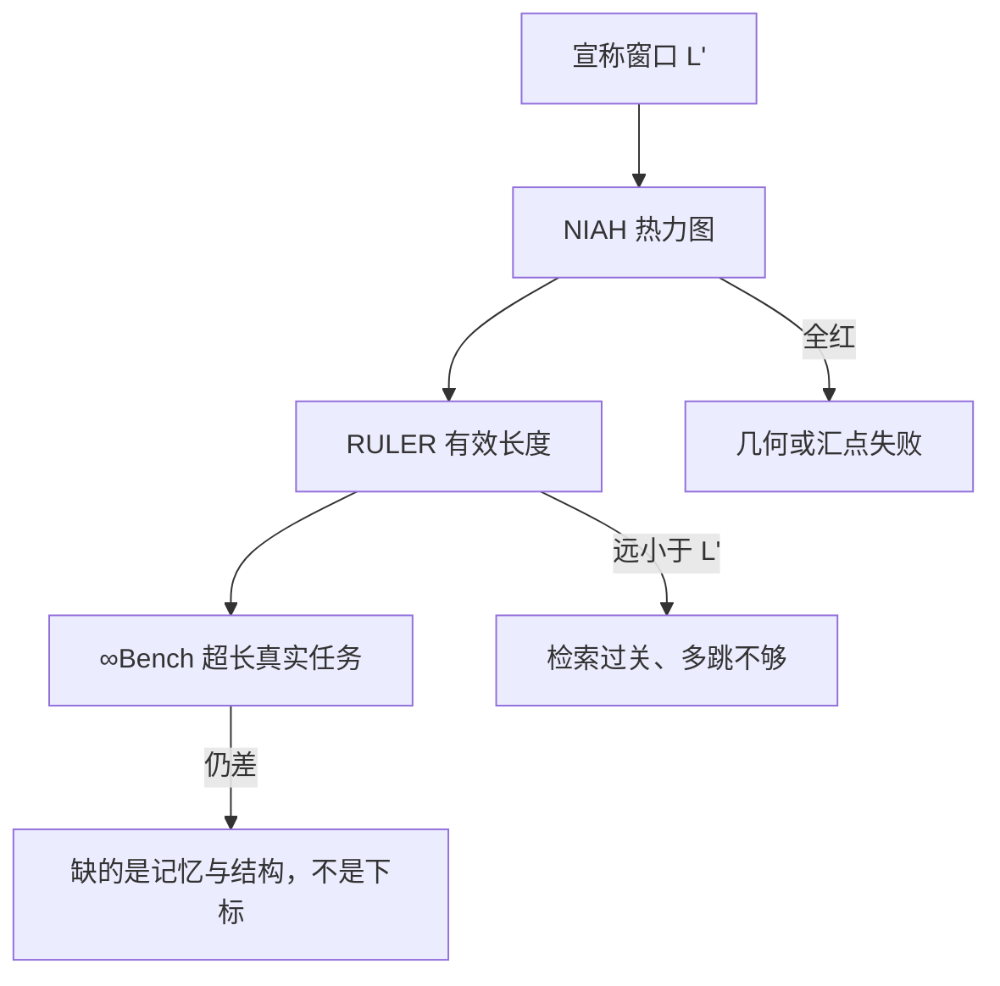

# 位置外推评测

能把 128k 个标记送进模型，只说明掩码和位置下标没炸；能不能在这个长度上找回事实、跟上变量、做完篇章题，要另搭一套考场。

<footer>—— 针与草堆（NIAH）、RULER、∞Bench 所划出的评测分层</footer>

[位置插值](/llm/position-extrapolation) 与 [YaRN](/llm/yarn) 把「算得动」和「相位还在支撑集里」当成第一道关。过关之后，产品仍会写出「支持 128k」——这句话在工程上至少有三层含义：数值稳定、语言建模困惑度没有崩、下游任务在该长度上仍然可用。后两层必须靠评测集，而不是靠 `max_position_embeddings` 这个配置项。NIAH、RULER、∞Bench 大致对应从「找得到一根针」到「合成多跳」再到「超十万 token 的真实任务」。本篇讲怎么考位置外推，不把任何一种延窗方法重写一遍。

## 问题

短窗口模型在训练长度 $L$ 内，注意力、[RoPE](/llm/rope) 相位、软最大值尺度都与数据一致。推理拉到 $L'$ 时，失败可以来自几何（相位出界）、来自分配（熵塌到句首或句尾）、来自能力（从来没学过要用那么远的键）。这三类在损失曲线上可能长得像：都是「一长就笨」。若不拆开考，插值、温度、检索、换解码器会轮流被当成灵药。

更糟的是单一数字。只报「在 $L'$ 上 PPL 仍可」，会放过「中间位置的事实全部丢失」。只报 NIAH 全绿，会放过「多跳追踪和聚合在远小于 $L'$ 处已经垮」。评测的问题因此是：用一组难度递进的探针，把「长度」从配置改写成有效上下文——模型在哪种任务上、在多深的位置上，准确率仍高于可用阈值。有效上下文通常短于宣称窗口。RULER 一类工作反复显示：NIAH 能过的模型，换多跳或变量追踪后，可靠长度可能打到宣称值的几分之一。宣传 128k 时，应同时报任务族和深度。

## 方法

### NIAH：一根针、一张热力图

Needle-in-a-Haystack 把一条与上下文无关的陈述（针）插入长填充（草堆）的某个深度，再在末尾提问。横轴是总长度，纵轴是针的相对深度，格子是是否找回。理想外推是整张图全绿；典型失败是：超过 $L$ 立刻全红（几何崩）、只在开头和结尾绿而中间红（lost-in-the-middle）、或只有最近邻绿（窗口/滑窗模型的真实感受野）。

NIAH 考的是单点检索与位置通道是否还编码「那句话在哪」。它几乎不考推理，也不考针与草堆同分布时的干扰。作为冒烟测试极好：红了就能否定「窗口已延长」；全绿不能肯定「长上下文已可用」。

### RULER：合成任务把有效长度读出来

RULER（Hsieh 等人）在可控长度上堆检索、多跳追踪、聚合、问答等合成题，专门对付「NIAH 过了但有效上下文虚高」。多跳要求沿一条链在长序列里跳几次；聚合要求在大量噪声项里计数或比较；变量追踪要求记住远处的绑定。准确率相对长度的曲线会给出一个有效长度：例如宣称 32k 的模型，在较难合成题上可能 8k 就开始掉。这个数字比 PPL 更接近产品体验。

$$
L_{\mathrm{eff}}(\tau)=\max\bigl\{n:\mathrm{Acc}(n)\ge\tau\bigr\}
$$

阈值 $\tau$ 要预先钉死（如 0.85），并按任务族分别报，否则又会退回单一数字。RULER 的价值是把「外推成功」从布尔值变成一条随任务变难而左移的曲线。

### ∞Bench：十万以上的真实长任务

∞Bench（Zhang 等人）把评测推到 100k token 量级，题型贴近长书、长代码、长对话上的检索、问答、数学与调试，而不是无限可加长的合成填充。它回答的是另一句宣传：「我们能跑 100k+」之后，在真实文档结构里是否还做对。合成集可以精确控制针深；真实集不能，但能暴露分块、标题、代码作用域这些 NIAH 填不出来的结构。

## 机制

位置外推评测能分开失败型，是因为不同探针碰到的是不同通道。NIAH 几乎只要求：查询与针的键在点积上仍能赢过草堆，且针的位置下标没有把 RoPE 转成噪声。若 PI / YaRN / 距离封顶把相位拉回支撑集，NIAH 往往先变绿。RULER 的多跳还要求中间结果在很长的干扰下不被覆盖，这已经是工作记忆与注意力熵的问题，相位正确也不够。∞Bench 再叠加文档先验：模型必须在训练里见过类似的长程结构，或在推理时用压缩、检索、分块去造结构。

因此「外推评测」不是单一基准的别名，而是一条证据链。PPL 随长度的曲线仍要画：它便宜，能抓住数值爆炸和全面崩溃。但不能停在 PPL。长度 $n$ 上的损失

$$
\mathrm{PPL}(n)=\exp\Bigl(\tfrac{1}{n}\sum_{t}\ell_t\Bigr)
$$

会把「只有 1% 的 token 需要长程」平均掉；那些 token 恰恰是用户在意的针。同一条 YaRN 续训，PPL 平滑、NIAH 全绿、RULER 有效长度只有宣称值一半——这不是评测打架，而是三层关卡都该写进报告。只摘最绿的那张图，等于没评外推。

深度也很关键。针插在开头、中间、结尾，对应汇点偏置、lost-in-the-middle、近邻偏置。热力图比「平均准确率」多一个维度，能直接指向该换温度、该留 sink，还是该改位置编码。

## 边界与工程取舍

合成任务可以无限加长，真实任务有版权、清洗和长度分布问题；∞Bench 再长也覆盖不了所有产品文档。内部评测仍应加一条与业务同分布的长文档集，否则会出现「三个公开榜都好看、合同条款检索仍瞎」的缝。

评测成本随 $n$ 线性到二次膨胀。每次改 RoPE 基数就跑全套 ∞Bench 不现实。合理的门禁是：提交前 NIAH 热力图必跑，RULER 抽一两个难任务看 $L_{\mathrm{eff}}$ 有没有回归，长真实集放在发布前。不要用「能完成 128k 前向」当作 CI 绿灯。

另一边界：训练已经是长窗口的模型，与短训再外推的模型，应分开表。前者的 NIAH 失败更像数据或注意力设计问题；后者才是位置外推。混在一张排行榜里会让 YaRN 与原生 128k 预训练看起来像同一项技术。针的措辞、草堆是否含干扰事实、提问是否泄漏格式，都会让 NIAH 虚高。评测规范要冻结针模板和随机种子，否则「我们的热力图更绿」可能只是针更好找。

## 小结

- 宣称窗口只保证能前向；有效上下文必须按任务族和针深来测。
- NIAH 是检索冒烟测试，全红能否定延窗，全绿不能肯定可用。
- RULER 用多跳、聚合、追踪把有效长度 $L_{\mathrm{eff}}$ 读成一条随难度左移的曲线。
- ∞Bench 覆盖 100k 以上更接近真实文档与代码的任务，补合成集没有的结构。
- PPL、NIAH、RULER、真实长任务是递进证据，不可互相替代。
- 热力图的深度维能区分相位失败、中间丢失与近邻偏置。
- 出处：Kamradt 的 NIAH 设定（2023 起被广泛采用）；Hsieh 等，*RULER*，2024；Zhang 等，*∞Bench*，2024。延窗方法本身见 YaRN、位置插值与后文流式 / 分组方案。
