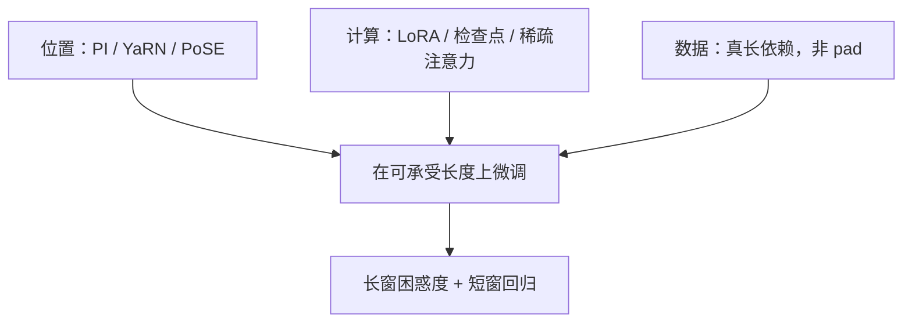

# 长上下文微调

窗口拉长不是把 SFT 学习率原样跑在 32k 序列上；位置编码要能外推，注意力要付二次方，数据还得真是长依赖，而不是短指令加 padding。

<footer>—— 对照 Chen 等位置插值、Peng 等 YaRN（2023）、Xiong 等 Effective Long-Context Scaling（2023）、Chen 等 LongLoRA（ICLR 2024）</footer>

[上一课](/llm/lora-vs-full-lr)把 LoRA 与全参的 $\eta$ 分开。长度一涨，账变了：显存被激活与 KV 吃掉，有效批次塌成个位数，全参那条「批次要大」的默认先破产；RoPE 下标走出训练窗，不调位置几何，再小的 $\eta$ 也在拟合 OOD 相位。本课写长上下文微调相对普通指令 SFT 多出来的三件事——位置、计算、数据——并链到已有的 [YaRN](/llm/yarn) 与 [PoSE](/llm/pose)。不把领域词表（[下一课](/llm/domain-adaptation-ft)）混进来。

## 问题

基座上下文长度 $L_c$（如 4k），目标 $L_t\gg L_c$。直接在 $L_t$ 上做因果 LM 或 SFT：注意力激活近似 $\Theta(L_t^2)$，微批次掉到 1，[打包](/llm/sft-packing-mask)若只是拼接短指令，模型从未见到跨万级 token 的真依赖，却付了长序列的算力。同时 [RoPE](/llm/rope) 的高频相位在 $L>L_c$ 上卷绕，困惑度在某一长度断崖。

因此「长上下文微调」若只改 `max_length` 而不改位置方案、不改数据，得到的是又贵又短视的指令微调。缺口是把**位置外推**、**可承受的注意力**、**长依赖监督**分成可检查的三项。

### 短样本装进长窗口不算长微调

把 ShareGPT 平均 1k 的对话 pad 或打包到 32k，统计上仍是短程语言建模。要学「前文第 20k 个 token 的约束」，数据里必须有那种约束：书籍、仓库级代码、多文档问答、长会话纪要。否则窗口只增加噪声键，[仅回复损失](/llm/response-only-loss)还在短答案上，模型没有理由去读远处。

Xiong 等人（Meta，2023）强调持续预训练 / 微调时逐步加长，并配上在长程上仍有预测信号的数据。Chen 等人的 LongLoRA 则用移位稀疏注意力降低微调成本，推理可回到稠密。

## 方法

位置：先选外推配方再训——线性位置插值、NTK-aware、[YaRN](/llm/yarn) 分段缩放，或 [PoSE](/llm/pose) 用短物理长度覆盖长相对距离。不要在原 RoPE 上对 $L_t$ 盲外推还指望 SFT 自己「学好位置」。

计算：满长度全参往往不可行。选项包括：梯度检查点；[LoRA](/llm/lora) / LongLoRA 只训适配器与少量层；PoSE 把物理长度锁在 $L_c$；序列并行。有效批次用累积补回，**不要**因为微批次=1 就把 $\eta$ 按全参短上下文再降一档直到静止。学习率仍按[LoRA 对全参](/llm/lora-vs-full-lr)的参数化选，再为更噪的长序列梯度略保守。

数据：[模板](/llm/chat-template)不变，但样本要真长。书本续写、长仓库指令、需要引用远处段落的问答。损失仍仅回复——若回复本身很短，应设计必须绑定远处证据的回答，否则梯度不经过长程注意力。

评测必须双栏：目标长度上的针检索 / 长文 QA，以及原 $L_c$ 上的短指令与通用基准。只报 Needle 会选出牺牲短程的配方。

## 机制

RoPE 把相对位置写进相位。插值把下标压回训练过的弧长，模型看到的「相对 $k$ 步」重新落在学过的区间；代价是高频分辨力，YaRN 用分频段处理补这块。微调则在新几何下校准注意力温度与内容键的配合：位置对了，内容仍要用长程数据才能把值读过来。

LongLoRA 的移位使训练时注意力局部化，参数更新针对「能在稀疏图上工作的特征」；推理稠密相当于把训练过的局部模式嵌回全图。这能成，是因为长程依赖往往稀疏，不是因为稀疏训练等价于稠密训练。PoSE 则让位置通道见过大正 $\Delta$，内容通道仍是短块语言——对「位置 OOD」有效，对「必须单次看见全文」的任务仍不够。

[仅回复](/llm/response-only-loss)在长提示短答案上极度不平衡：几乎全部算力用在条件编码，梯度只从几十个答案 token 回来。需要证据的答案、或对长完成计损失，否则长微调退化成昂贵的短 SFT。

## 边界与工程取舍

法律、代码仓库、多轮客服才值得付 $L_t$ 的成本。普通助手 SFT 把窗口开到 128k 却仍用 Alpaca 单轮，是预算浪费。位置配方与基座绑定：换 YaRN 系数等于换任务，需重训。合并 [LoRA](/llm/lora) 后推理窗口仍受位置方案限制，不是适配器自动给无限上下文。

遗忘：长微调若全参、数据又偏书本，短指令格式会掉，要用短数据回放（后课[持续学习](/llm/continual-replay)）。本课只要求评测里留下短窗栏。

## 小结

- 长上下文微调要同时处理位置外推、二次方算力、真长依赖数据。
- 短指令 pad 到长窗不是长微调；回复过短则梯度不经过长程。
- 位置用 PI / YaRN / PoSE 等已有课；计算用 LoRA、检查点或跳步训练。
- 有效批次靠累积维持；$\eta$ 仍按 LoRA/全参分叉，勿因微批次=1 而学死。
- 评测保留短窗回归，避免只优化针检索。
- 出处：Peng 等，YaRN，2023；Xiong 等，Effective Long-Context Scaling，2023；Chen 等，LongLoRA，ICLR 2024；Zhu 等，PoSE，ICLR 2024。
