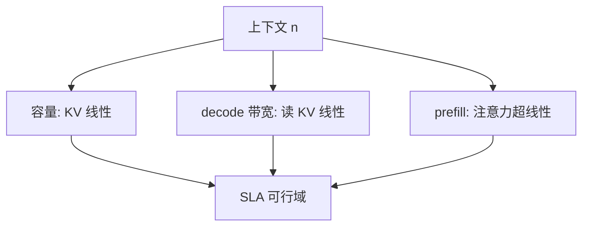

# 长上下文的显存曲线

上下文从 4K 走到 128K，KV 线性胀，注意力时间超线性胀；能「塞进去」与「还能按 SLA 吐词」是两条曲线。

<footer>—— KV 线性见 Pope et al., 2022；分页减碎片见 Kwon et al., vLLM, SOSP 2023；精确注意力仍二次见 Dao et al., FlashAttention, NeurIPS 2022</footer>

[上一课](/llm/serving-cost-model)的 $C_{\mathrm{tok}}$ 还像一个点。本课把它拉成 $n$ 的函数：容量、带宽、二次计算三条曲线不同时拐弯。长上下文产品只报「支持 128K」是容量声明；TPOT 与成本必须沿 $n$ 再画一遍。[分页注意力](/llm/paged-attention)让你不必按 128K 预留，但正在用的字节仍按[容量公式](/llm/kv-cache-size-math)走。本单元「算清楚再优化」到此收束，下一单元才进编译器与内核。

## 问题

$n$ 增大时：（1）KV 线性，容量墙先打中并发；（2）每步读 KV 线性，带宽墙上 TPOT 涨；（3）prefill 注意力 $\Theta(n^2)$，TTFT 涨得更陡。三条墙的交点不同。只优化其中一条（例如只开分页）会在另一条上失败：请求能进，首 token 要数秒，或能进且 TTFT 可接受，但 $N=8$ 投票立刻 OOM。缺口是把曲线画全，而不是再解释一次 FlashAttention 的 IO。

前缀缓存、会话复用把「名义 $n$」与「新算的 $n$」拆开：命中时 TTFT 掉下来，KV 容量仍按会话峰值占用。成本模型必须用占用，不是用「新算 FLOPs」。

FA 使 HBM 上不出现 $n\times n$ 的 $A$，训练激活墙缓解；推理 decode 的 KV 墙还在。长上下文 decode 的时间墙是读 KV + 权重，不是写 $A$。

## 方法

对部署画三张图，横轴 $n$：最大并发 $B_{\max}(n)\approx \mathrm{HBM}_{\mathrm{free}}/\mathrm{KV}(1)$；decode TPOT $(W+\mathrm{KV}(n))/B_{\mathrm{HBM}}$；prefill 时间用实测或 $\Theta(n^2 d)$ 加线性 GEMM。SLA 取三者的可行域交集。GQA/MLA/KV 量化把曲线（1）（2）下移；稀疏或线性注意力才改（3）的阶，那是架构课，不是本课开关。

布局：[HND](/llm/kv-layout) 在长 $n$ 的 decode 上更利于扫序列；预填充仍可能 BSHD。长上下文服务更值得在写入缓存时转成 HND。FlashDecoding 在 $B\times h$ 不够时切 KV，否则长 $n$ 喂不进带宽。

## 机制

可行域随量化与并行度变。张量并行按头切 KV，每卡 KV 除以 TP，但权重也切，通信下一单元再写。多样本在生成段把（1）（2）乘 $N$，长思维链等于把 $n$ 再拉长：同一条曲线上走得更远。这是为什么「开思考」比「开 128K 文档」更容易先撞墙——生成段不可用前缀缓存摊掉。

## 边界与工程取舍

不要用 4K 的 TPOT 乘 $32$ 当 128K 的 TPOT：权重项不随 $n$ 放大那么多，线性外推会错。不要把能跑通的最大 $n$ 当默认提示长度。本单元之后，优化转向 *如何让核与编译器逼近这些公式已经允许的屋顶*，而不是再改会计恒等式。

出处：Pope et al., 2022；Kwon et al., SOSP 2023；Dao et al., NeurIPS 2022。

## 小结

- 长上下文是三条曲线：容量线性、decode 带宽线性、prefill 超线性。
- 分页减预留，不减占用；前缀缓存减计算，不减占用。
- SLA 取可行域；投票与思维链走生成段，更易撞墙。
- 布局与 FlashDecoding 影响能否贴近带宽公式。
- 会计到此够用；下一课 torch.compile。
- 出处：Pope et al., 2022；Kwon et al., 2023；Dao et al., 2022。
