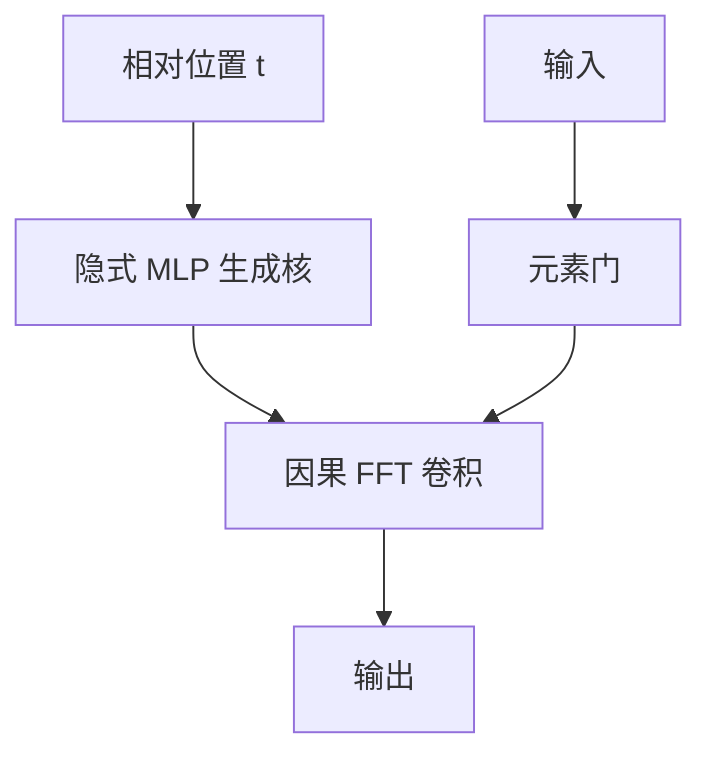

# 长卷积

用覆盖整个上下文的卷积核代替逐步状态；训练是 FFT 卷积，参数是滤波器而不是随时间改写的权重。

<footer>—— Poli et al., Hyena Hierarchy, 2023；连续核的前身见 Romero et al., CKConv, NeurIPS 2021</footer>

[上一课](/llm/ttt-layers)每步改内环权重。[S4](/llm/hippo-s4) 已经说明时不变 SSM **等价于**一条长卷积核。本课把卷积本身当设计对象：核由隐式 MLP 生成（CKConv / Hyena），或由 SSM 展开，强调**无选择性、无测试时更新**时还能做什么。后课混合比要决定哪些层用卷积/SSM、哪些层用注意力；本课先给卷积槽位一个干净定义。

## 问题

逐步扫描、TTT、delta 都维护随 $t$ 变化的状态。时不变长卷积问的是反面：若核 $k_{1:n}$ 在整段上固定（或只随相对位移变），一条 FFT 卷积 $y=k*x$ 能否承担中远程混合，把二次注意力留给少数层？缺口是核怎么参数化才既长又稳：直接学 $n$ 个抽头，长度一变就失效；隐式核用位置 $t$ 的函数 $k(t)$，长度外推更自然。

Hyena 把这种长核叠成层级，中间插入元素级门，接近「用卷积搭一条表达力更强的 S4」。选择仍弱于 Mamba，因为核不随内容改形状，只靠门调制输入。

短卷积（多 token 注意力里宽度 3、5）是局部归纳。本课的核长度与上下文同阶，对象不同。

## 方法

隐式核：$k_t=\mathrm{MLP}(\psi(t))$，$\psi$ 为位置特征（指数衰减窗口、正弦等）。窗口保证远端衰减，避免核在远距仍有大能量导致不稳定。前向用 FFT 卷积，复杂度 $\Theta(n\log n)$，优于朴素 $\Theta(n^2)$，弱于逐步线性里极小常数的扫描——但实现成熟、无递归数值链。

层级：若干长卷积与门控交替，感受野迅速覆盖全文。因果靠核的负位移为零或用因果 FFT 技巧。与 SSM 的关系：若 $k_t=C A^{t} B$，则退回 S4；Hyena 的 MLP 核更自由，不一定对应低维状态，推理就不能改成常数状态循环，除非再做有理逼近。

### 推理接口

FFT 卷积在自回归解码时不友好：每步扩展序列要重做或用增量滤波。若核来自 SSM，应改回循环。若核是自由 MLP，解码要么缓存卷积状态（等价 FIR 滤波器，状态长度等于核长，可能很长），要么放弃该层用于生成主干。这是长卷积进 LLM 的硬边界。

## 机制

时不变核实现的是与内容无关的混合：位置 $t$ 对 $t-\delta$ 的权重只看 $\delta$。门控（输入逐点乘）注入内容，使「这一层要不要启用卷积通道」可学，但不改核形状。因此长卷积擅长平滑、局部到中程的模式、声学与时间序列；不擅长「在不确定距离上找那个唯一的变量名」。

$\Theta(n\log n)$ 在中等 $n$ 上常快于尚未融合的扫描；极大 $n$ 上线性扫描常数更重要。课序比较的是归纳偏置，不单比渐近符号。

自由长核没有低维状态，SSD 对偶不自动成立。不要把 Hyena 层塞进 Mamba-2 核。

## 边界

生成解码是长卷积的弱项，除非核有 SSM 实现。选择性缺席，召回基准通常差。下一课不会再展开新的线性算子，而是问一层注意力掺几层这类线性模块——混合比。把全部层换成 Hyena 再指望精确拷贝，会被后课的召回瓶颈打脸。

## 小结

- 长卷积用与上下文同阶的核做时不变混合，隐式 MLP 生成核以便外推。
- 训练常用 FFT，$\Theta(n\log n)$；若核无低维 SSM 实现，自回归状态可能长达核长。
- 门改输入不改核形状，选择性弱于 Mamba。
- 与宽度为个位数的局部卷积不是同一课。
- 出处：Poli et al., 2023；Romero et al., NeurIPS 2021。
