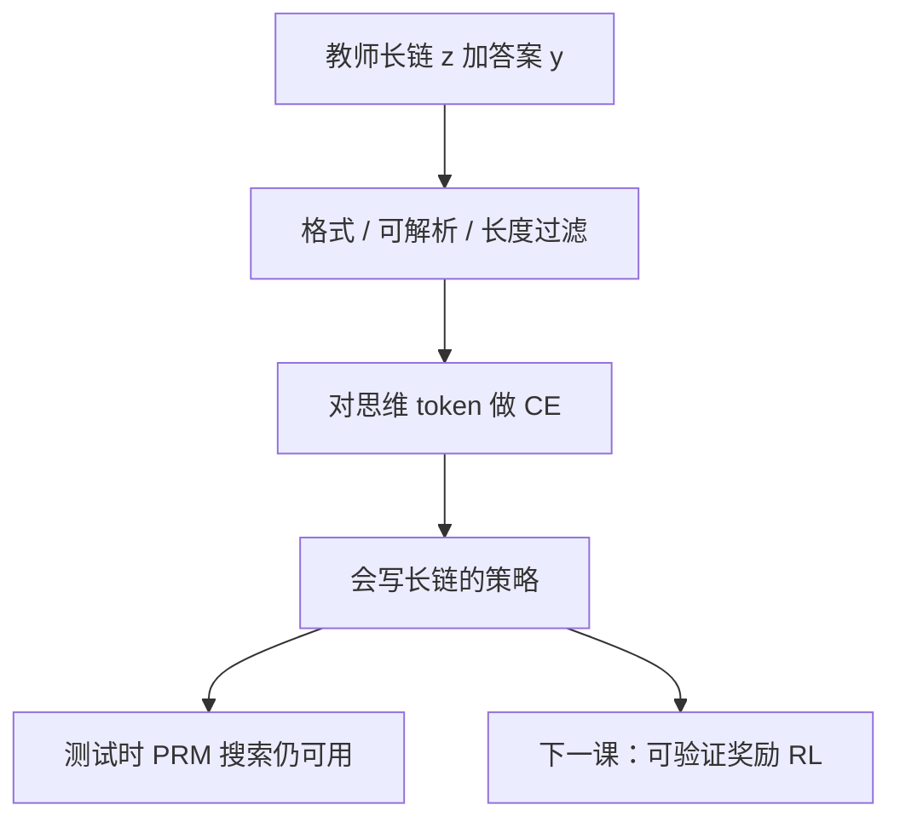

# Long CoT SFT

先把「愿意写很长、结构完整的推理链」写成模仿目标，测试时搜索才有合格的提案分布；只靠过程奖励在树上剪，剪的是还不会写长链的模型。

<footer>—— 对照 o1 类系统的监督冷启动；Muennighoff 等 s1 用精选长链做 SFT</footer>

[上一课](/llm/prm-guided-search) 把过程奖励用在**测试时搜索**：生成器仍是普通策略，PRM 只打分、剪枝。缺口是提案本身：若模型只会写短答或只会写「看起来像步骤」的短句，束再宽也搜不出 DeepSeek-R1 / o1 那种可达数百到数万 token 的链。Long CoT SFT 用教师轨迹做监督微调，把长链的格式、自我检查与停写条件写进 $\pi$。后面的可验证奖励与 RL 闭环默认策略已经会产出可解析的长推理，而不是从零教它「先写 Step 1」。

## 问题

PRM 引导搜索不更新生成器权重。计算加在推理期，训练分布仍是短指令跟随。要把测试时算力变成训练时技能，至少需要一条模仿路径：在 $(x,z,y)$ 上最大化 $\sum\log\pi_\theta(z_t\mid x,z_{\lt t})$，其中 $z$ 是长思维链，$y$ 是答案。教师可以是更强的闭源推理模型、人类解答、或已有 RL 检查点的拒绝采样。s1 表明：精心筛选的约 1K 条也可以改变长度–准确率斜率；R1 的冷启动则用更大的长链语料。本课不争论 1K 还是百万，只规定 **SFT 在闭环里的位置：RL 之前的格式与长度先验**。

缺口还有停写。长链 SFT 若只模仿「一直写」，模型学会不结束；若教师链偏短，RL 阶段再拉长度会与 SFT 先验打架。预算强迫（到点插入结束标记、或插入 Wait 续写）是解码期补丁，见 s1；训练期则要在数据里同时出现「该停」与「该再想」的例子。

### 过程切分要与后课 PRM 对齐

[过程奖励搜索](/llm/prm-guided-search) 强调切步器是接口。Long CoT 语料若用另一套换行习惯，后续 PRM 进训练环时分数会对错跨度。SFT 阶段就应固定步骤边界（编号、特殊 token、或「段落=一步」），并在文档里冻结。不要把 Long CoT SFT 写成「再做一次普通指令微调，只是 max_length 开大」。普通 SFT 的目标是最终回答；这里的损失必须落在思维 token 上，否则模型学会藏起推理、只吐短答案，搜索与 RL 都看不见过程。

## 方法

### 数据过滤与损失落点

数据：$x$ 为题，$z$ 为思维，$y$ 为可核对答案。损失只在 $z,y$（或只在 $z$ 若 $y$ 由程序填）。过滤：格式合法、答案能通过校验器（为下一课铺路）、长度分布覆盖目标预算的分位数，而不是只要最长。过长且循环的教师链会教复读。

训练就是标准 CE，但包装不同：特殊起止标记包住 $z$；推理时可选择是否对用户隐藏 $z$。上下文窗口必须大于目标链，否则 SFT 在教截断句。packing 不得把一条链从中间切开到下一样本——切开等于教残缺 CoT。

## 机制

SFT 改变的是先验 $\pi(z\mid x)$ 的支撑集：以前概率接近零的长前缀现在有质量。PRM 搜索的提案变好，同一束宽下更常碰到对的链。这不是 RL；没有奖励梯度，模型也不会为「更对」而探索与教师不同的算法，只会复述教师的风格与错误。教师错解若没被过滤，会高置信地被模仿——长链把错误写得更像证明。

长度与准确率在 SFT 后常常正相关：更愿意写的模型在数学上更好，因为预算本身来自教师的「难的题写得长」。这会把「难度」与「话多」绑死，下一课的长度预算 RL 要再拆开。SFT 阶段至少应在数据里混入短而对的题，避免策略认为短等于错。

从指令模型而不是基座做 Long CoT SFT，遗忘普通聊天的风险更高；从基座做，则格式与拒答要另补。选择取决于产品是否允许推理专用检查点。R1 类做法把冷启动当作闭环的第一段，而不是唯一段。

### 与测试时缩放的分工

Best-of-N、束、PRM 搜索继续加在 SFT 之后，仍然有效，而且通常比加在短答模型上更值。但 SFT 之后再只靠搜索、不加 RL，探索仍锁在教师风格邻域。若教师已经很强且覆盖目标域，产品可以停在 SFT + 搜索；若要对齐竞赛数学或新工具，必须进入可验证奖励。

## 边界与工程取舍

长链占满窗口，batch 内真实题数下降，[批次与学习率](/llm/batch-vs-lr) 的 $B$ 按 token 计会看起来很大、按题计很小。应按**题数**看是否学到多样性，按 token 看优化噪声。梯度累积要按题对齐，避免一条超长链主导更新。

蒸馏闭源链有许可与污染问题：评测题若在教师轨迹里出现，SFT 变成背答案。过滤要用题面哈希与基准对照，与评测课的污染是同一纪律。不要把 Arena 文风的长回答当成 Long CoT——没有可解析步骤与答案锚点的长散文，对后课校验器无用。

s1 的 budget forcing 是推理干预，不是本课的训练损失。可以在 SFT 模型上用 Wait / 截断画测试时曲线，用来验收「长度先验是否已内化」。曲线完全平，说明 SFT 没教会可变长度思考，只是学会了一种固定模板。

## 小结

- Long CoT SFT 把长推理链写进策略的模仿分布，补的是 PRM 搜索改不了生成器这一缺口。
- 损失必须落在思维 token；步骤边界与后课 PRM 共用切分器。
- 它不提供探索，会复制教师错误；短而对的样本要混入以免「短=错」。
- 题级 batch 与 token 级 $B$ 要分开记账。
- 过滤可解析答案，为可验证奖励铺路。
- 出处：o1 类冷启动叙述；s1 的精选长链 SFT；R1 闭环中的监督段。
