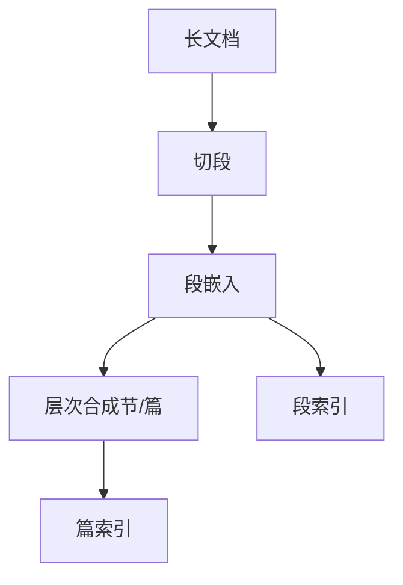

# 长文档嵌入

均值池化在两千 token 上把互相无关的小节平均成一个主题分类向量。检索对象必须先定义成「编码器能稳定表示」的长度。

<footer>—— 对照切分课的块设计；层次化与晚切分是对超长输入的补丁</footer>

[上一课](/llm/mteb)多数任务偏短句与短段。手册、论文、财报超出嵌入模型的训练长度后，单向量开始塌成主题。主干[切分](/llm/rag-chunking)已从工程上切块；本课写表示侧：层次编码、滑动窗口、晚切分。缺口是长输入下的几何，不是再讲倒排。后课多模态嵌入换模态，长度问题同构。

## 问题

编码器有最大输入。超长则截断，信息在尾部丢失；或硬切后对块向量再平均，等于二层池化，细粒度更差。查询若针对某一节，全篇向量会对上「像这本手册」而不是「超时配置」。需要：要么把检索对象保持在训练长度附近（切分课），要么用层次模型先段后篇，使篇向量由段向量可解释地合成。

晚切分（先对长文编码再切向量）依赖能处理长上下文的骨干，位置编码与显存是约束。短模型上硬做晚切分没有奇迹。

标题路径拼进块文本（「手册 > 网络 > 超时」）往往比把 $d$ 加倍更能救长文档检索。这是特征，不是新损失。

## 方法

默认仍切块，块长落在嵌入训练分布。层次：段向量再过一层浅网络得节/篇向量，查询同时对段与篇检索，命中篇则展开段。滑动窗口重叠规则与切分课一致，避免边界短语失踪。评测用长文档问答或手册检索，不要用 MTEB 短句 STS 代理。

## 机制

对比学习在短正对上训练时，模型从未被迫把「第一节与第九节」放进可加的几何。直接平均是分布外池化。层次合成若也用对比（篇级正对），篇向量才有余弦意义，否则只是段向量的无监督平均。长上下文骨干能看见全篇注意力，但仍只有一个池化出口时，一样会主题化——多向量或切段仍必要。

## 边界

法律与代码的「长」还带结构（条款、函数）。按 token 切会切断引用。下一课多模态：图文同空间，长度变成视觉 token 数。

## 小结

- 长文单向量易塌成主题；检索对象应对齐训练长度。
- 层次合成需要篇级对比，不能只平均段向量。
- 用手册级任务评测，不用短句榜代理。
- 出处：切分与层次检索工程传统；晚切分依赖长上下文骨干。
