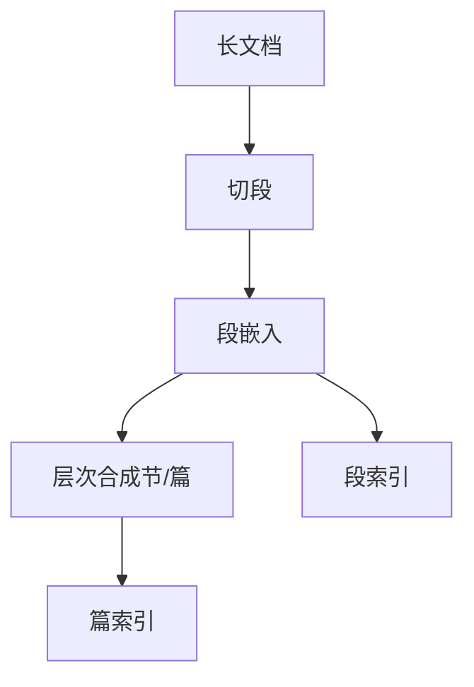
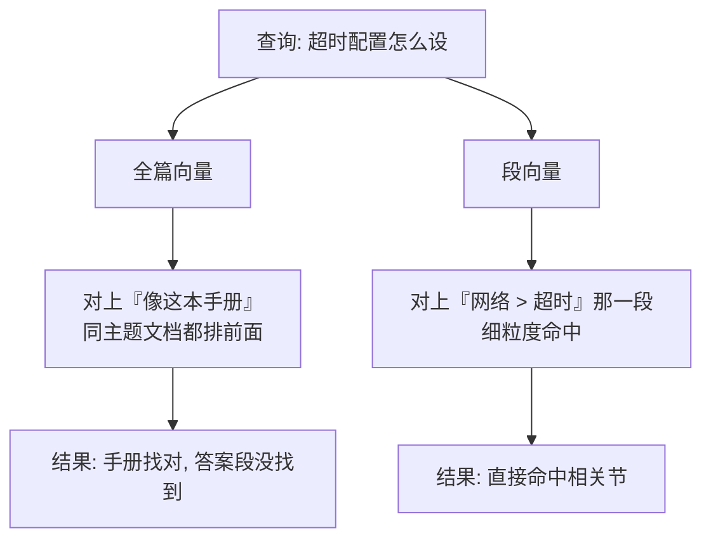

# 长文档嵌入

均值池化在两千 token 上把互相无关的小节平均成一个主题分类向量。检索对象必须先定义成「编码器能稳定表示」的长度。

<footer>—— 对照切分课的块设计；层次化与晚切分是对超长输入的补丁</footer>

[上一课](/llm/mteb)多数任务偏短句与短段。手册、论文、财报超出嵌入模型的训练长度后，单向量开始塌成主题。主干[切分](/llm/rag-chunking)已从工程上切块；本课写表示侧：层次编码、滑动窗口、晚切分。缺口是长输入下的几何，不是再讲倒排。后课多模态嵌入换模态，长度问题同构。

## 问题

编码器有最大输入。超长则截断，信息在尾部丢失；或硬切后对块向量再平均，等于二层池化，细粒度更差。术语翻译：「池化」就是把一串 token 向量压成一个向量，最常用的是取平均。可以想成把一整部电影压成一张海报：主题还在，情节没了。均值池化在长文档上尤其狠——第 3 节的细节被第 7 节平均掉，查询那句精确的话自然对不上。查询若针对某一节，全篇向量会对上「像这本手册」而不是「超时配置」。需要：要么把检索对象保持在训练长度附近（切分课），要么用层次模型先段后篇，使篇向量由段向量可解释地合成。

晚切分（先对长文编码再切向量）依赖能处理长上下文的骨干，位置编码与显存是约束。短模型上硬做晚切分没有奇迹。

标题路径拼进块文本（「手册 > 网络 > 超时」）往往比把 $d$ 加倍更能救长文档检索。这是特征，不是新损失。

## 方法

默认仍切块，块长落在嵌入训练分布。层次：段向量再过一层浅网络得节/篇向量，查询同时对段与篇检索，命中篇则展开段。滑动窗口重叠规则与切分课一致，避免边界短语失踪。数字实例：嵌入模型训练长度常见 512 token，一份 20 页手册约 1 万 token——直接编码等于扔掉约 95% 的内容还毫不报错，剩下的恰好是文档开头那些最没有信息量的标题页。这是长文档检索「看起来能跑、结果总差点」的常见底因。评测用长文档问答或手册检索，不要用 MTEB 短句 STS 代理。

```mermaid
flowchart TD
  LONG["长文档"] --> CH["切段"]
  CH --> E["段嵌入"]
  E --> H["层次合成节/篇"]
  E --> IX["段索引"]
  H --> IX2["篇索引"]
```

## 机制

对比学习在短正对上训练时，模型从未被迫把「第一节与第九节」放进可加的几何。直接平均是分布外池化。层次合成若也用对比（篇级正对），篇向量才有余弦意义，否则只是段向量的无监督平均。长上下文骨干能看见全篇注意力，但仍只有一个池化出口时，一样会主题化——多向量或切段仍必要。同一个查询走「全篇向量」与「段向量」两条路，命中对象完全不同：

```mermaid
flowchart TD
  Q["查询: 超时配置怎么设"] --> FV["全篇向量"]
  Q --> SV["段向量"]
  FV --> M1["对上『像这本手册』<br/>同主题文档都排前面"]
  SV --> M2["对上『网络 > 超时』那一段<br/>细粒度命中"]
  M1 --> R1["结果: 手册找对, 答案段没找到"]
  M2 --> R2["结果: 直接命中相关节"]
```

常见误区：初学者以为换个 32k 长上下文的嵌入模型就能整篇入库。骨干确实能读完，但只要最后还是压回一个向量出口，池化就把细节抹平了——长输入不是解药，多向量或层次检索才是。

## 边界

法律与代码的「长」还带结构（条款、函数）。按 token 切会切断引用。下一课多模态：图文同空间，长度变成视觉 token 数。

## 小结

- 长文单向量易塌成主题；检索对象应对齐训练长度。
- 层次合成需要篇级对比，不能只平均段向量。
- 用手册级任务评测，不用短句榜代理。
- 出处：切分与层次检索工程传统；晚切分依赖长上下文骨干。
