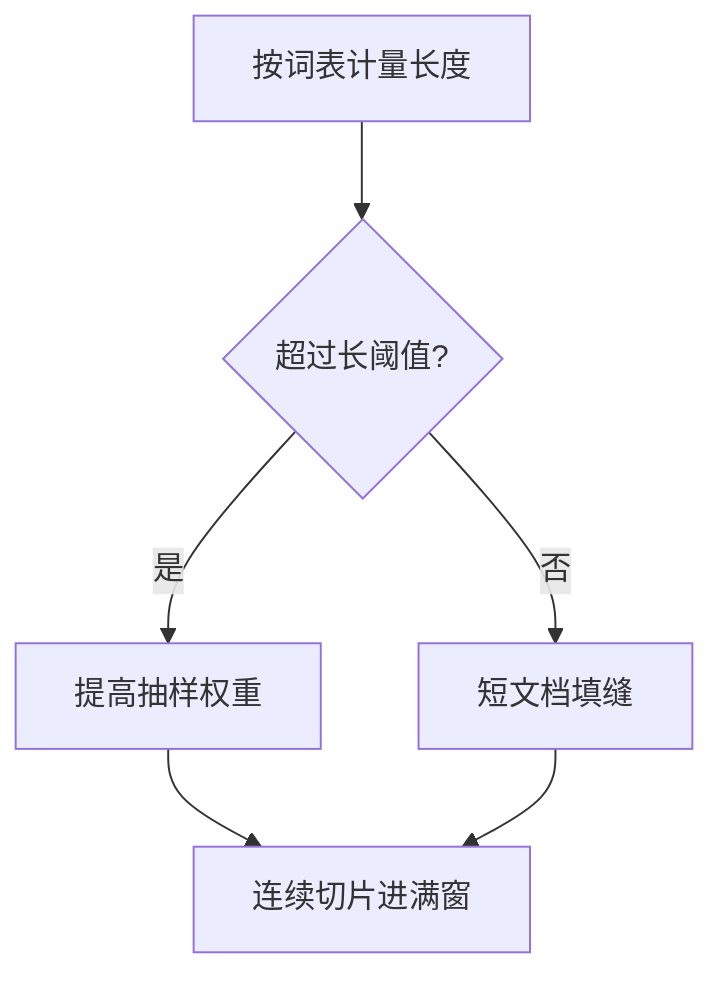

# 长文档上采样

随机打包会把短网页填满窗口，模型很少在预训练里见到接近上下文上限的连贯文档；要长上下文，先要在数据里真的出现长序列。

<footer>—— 据 Xiong 等对基础模型长上下文扩展、Fu 等对 128K 数据工程的讨论整理</footer>

[上一课](/llm/fim-training)改了条件方向，窗口长度仍由打包说了算。网页为主的混合物里，多数文档远短于 8k 或 128k，朴素拼接会得到「许多短篇拼成的假长上下文」：注意力看见的是文档缝，不是篇章依赖。本课不重讲 FIM 哨兵。缺口是长度分布：如何上采样真正的长文档，并减少跨文档注意力的误导，为后面的指令进预训练与退火留出「已经见过长跨度」的底座。

## 问题

[配比定律](/llm/data-mixture-laws) 的桶通常按来源，不按长度。书籍、论文、仓库超文档是长跨度的主要来源，但 token 份额可能很小。Xiong 等人在扩展 Llama 2 上下文时强调，继续预训练的数据必须含长序列；Fu 等人把 128K 的数据工程写成可操作的过滤与采样。缺的是与现有配比栈的接口：α、仓库排布、FIM 都改变了「一条训练样本长什么样」，长度必须作为独立轴，否则长窗口只在微调阶段突然出现，位置编码外推会脆。

另一面是浪费：把所有短文档丢掉只训书，覆盖崩掉。上采样不是删除短文档，而是提高长文档被抽到的概率，或在打包时优先把长文档放进完整窗口、短文档去填剩余。

### 假长与真长

拼接短文档得到长度 $L$ 的序列，对计算是长的，对语义是许多条短依赖。评测若用针在稻草堆里找事实，模型可以利用「文档边界特殊 token」作弊，也可以彻底失败。训练日志应分别报：单文档跨度的分位数、以及打包后的序列长度。只报后者会假装已经在做长上下文。

清洗规则若丢掉没有终结标点的行，书籍与列表会被误杀，长文档来源先枯竭。长度轴要与网页启发式解耦。

## 方法

为每条文档记录 token 长度（用冻结词表）。设阈值 $L_{\mathrm{long}}$（与目标窗口同量级或为其分数）。对超过阈值的文档赋予更高的抽样权重，或单独开一个「长」桶，用人工 / DoReMi 给它非零 $w$。打包策略改为：先放一条长文档的连续切片（可重叠以覆盖中部），再用短文档填微批里的空洞；切片尽量不在句子中途切断。仓库超文档算长文档，但切片应尊重文件边界，以免假长。

继续预训练到更长窗口时，上采样比例通常再提高，短网页降权。这与后面退火课的「后期提高质量」可以共用时间表，但本课的自变量是长度不是质量标签。

### 与 fertility 的交叉

高 fertility 语言的「长」更容易达到阈值，只因切得碎。阈值应按字符或按句子，或按语言分位，否则 α 采样与长度采样会双重偏向碎语言的「假长」。

FIM 在长切片上挖中间，编辑任务更真实，也更贵。应设上限，避免每个长窗口都做重排。

## 机制

位置编码与注意力只有在训练分布里见过较大的相对距离，才会对大距离给出稳定的分数。数据里若最大真跨度远小于窗口，多出来的位置是外推。上采样把真跨度的支撑往右推。它不改变 SDPA 的二次代价——那是并行课的序列并行要付的账——只改变优化看到的距离分布。

## 边界

上采样救不了词表对长数字、长代码行的碎切；窗口会被 fertility 吃掉。也不等于检索：超长书仍可能要 RAG，那是另一门课。下一课把「已经能看长」的序列里掺进指令格式，让协议 token 在预训练里就不是 glitch。

## 小结

- 本课不重讲 FIM；只补真长跨度在混合物里太稀。
- 按长度加权重或单独开长桶，打包时连续切片，短文档只填缝。
- 区分打包长度与单文档跨度；阈值要防 fertility 造假长。
- 为窗口扩展提供训练支撑，不降低注意力的计算复杂度。
- 出处：Xiong et al., *Effective Long-Context Scaling of Foundation Models*；Fu et al., 128K 数据工程；书籍来源对照 Gao et al., The Pile。
