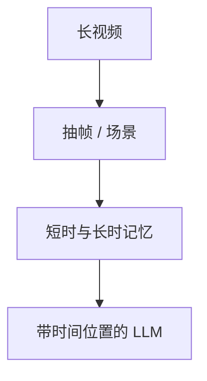

# 长视频理解

小时级视频的问题不是「再多几张图」，而是哪些帧进上下文、记忆里留什么、问的是哪一秒。

<footer>—— 对照 Video-LLaVA / Video-ChatGPT 的短视频对话；MovieChat、LongVA 的长上下文与记忆</footer>

[上一课](/llm/chart-table-understanding)在单张结构画布上读数。主干[视频 token](/llm/video-tokens) 已写抽帧与时间位置。本课缺口是长：超出现场窗口的叙事、重复镜头、要检索的事件。后课多模态推理默认你已经能指向「哪一段」，再谈用看见的当证据。

## 问题

短视频 VLM 把 $T$ 帧各编成 $N$ 个 patch，序列是 $TN$，再加文本。分钟以上会先打爆窗口，相邻帧还高度冗余。均匀低帧率会丢掉闪光与口型；只留关键帧又会丢掉连续动作。问「开头穿什么、结尾有没有同一只包」需要跨段比较，不是当前几秒的 caption。

MovieChat 把短时记忆与长时记忆分开：近段高分辨率，远处摘要。LongVA 一类把长上下文能力迁到视觉帧序列。没有记忆层次时，所谓长视频只是截断后的短视频。

时间位置必须对齐绝对时间，见视频 token 课。只按「第几张输入帧」编号，2 fps 与 10 fps 下同一物理事件对不上。

## 方法

三件套：采样策略（均匀 / 动态 FPS / 场景切）；记忆（滑窗、摘要 token、检索过去帧）；提问接口（时间戳、第几分钟）。视觉前端仍是 [ViT](/llm/vit-as-encoder) + [投影器](/llm/llava-projector)，只是 $T$ 与压缩改变 $N_{\mathrm{total}}$。评测要含长时针（事件顺序、跨段指代），不要只用短剪辑 VQA。与生成式视频模型分开：本课是理解，不采样像素。

## 机制

注意力只在当前窗口内混合。长程依赖要么靠把关键帧留在窗口里，要么靠记忆写出的摘要 token——摘要一旦丢掉物体，后面的指代只能靠语言先验，幻觉会回来。因此长视频理解的上限经常是记忆写什么，不是再加一层投影。

## 边界

窗口与记忆都有损。下一课在「已经看见」的前提下做多步推理，而不是再加帧。

## 小结

- 长视频是采样 + 记忆 + 时间协议，不是多图拼接。
- 摘要会丢物体，跨段指代会退回语言先验。
- 评测必须含跨段事件，不只短剪辑 caption。
- 出处：Video-LLaVA、Video-ChatGPT；MovieChat；LongVA。
