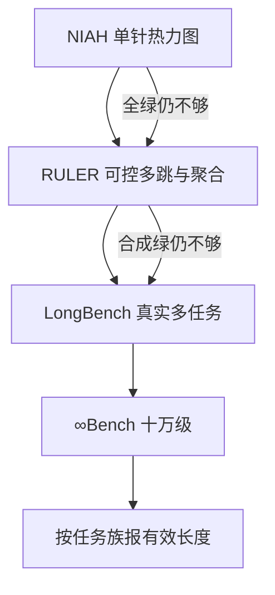

# LongBench / RULER / ∞Bench

针测全绿只说明独特事实找得到；真实长文档要摘要、多篇问答和代码，合成尺则要把长度、针数和聚合运算当成可旋的旋钮。三套考场叠在一起，才谈得上有效上下文。

<footer>—— Bai et al., LongBench；Hsieh et al., RULER；∞Bench 把评测推过十万 token</footer>

宣称窗口是配置，有效上下文是测量。单针 [NIAH](/llm/niah) 能画出长度×深度热力图，却几乎不要求推理、聚合或多文档对齐。Bai 等人的 LongBench 用双语、多任务的真实（或近真实）长输入，把「长」从检索探针改回阅读理解、摘要、少样本和代码。Hsieh 等人的 RULER 走相反方向：全部合成、长度精确可控，在同一套生成器上加多键检索、变量追踪与聚合，专门打「NIAH 已过、下游仍垮」的模型。∞Bench 再把输入推到十万 token 量级，用长篇小说、长代码和超长结构化检索问「窗口配置写 128k 之后到底有没有任务还活着」。本篇写这三层怎么分工，以及为什么只报其中一张表会把有效长度说满。更宽的外推分层见 [位置外推评测](/llm/long-context-eval)。

## 问题

长上下文的产品句是「支持 $n$ token」。这句话至少混了三件事：前向算不算得动、单条独特信息找不找得到、在该长度上做真实任务还剩多少准确率。第一件是工程冒烟；第二件是 NIAH；第三件才接近合同摘要、仓库问答、多报告对比。实验室若只优化第二件，热力图会变绿，用户的长 PDF 仍然答非所问——因为用户要的不是找回一句魔法密码，而是在噪声文档里聚合、追踪指代、按题型作答。

反过来，只跑真实任务也有洞。真实文档的长度分布不齐、答案位置不可控、难度与语言缠在一起，涨分说不清是窗口真的变好了，还是模型更会做那种题。需要一条合成尺：长度、针数、跳数、聚合宽度都是参数，才能把「在 $n$ 上哪一类运算先死」写成曲线。LongBench 与 RULER 分别填真实与合成两端；∞Bench 填「比常见 8k–32k 评测再长一个数量级」的那一端。

### 平均任务分会把中间塌掉的长度藏起来

LongBench 若只报二十一任务的宏平均，一个在单文档问答上强、在多文档上崩的模型可以看起来「长上下文还行」。RULER 若只报各长度的平均准确率，多跳先死、单针仍绿会被平均成平缓下降。正确的读法是：真实集看任务族，合成集看长度曲线的**最差子任务**，再与 NIAH 热力图对照。有效长度应定义为「某任务族、某阈值下仍可用的最大 $n$」，而不是配置文件里的数。

双语是 LongBench 的一等设定，不是附录。中英文分词密度不同，同样「8k token」在中文里覆盖的字符与信息量不同。只报英文子集，不能签发中文长窗口。

## 方法

LongBench 覆盖六类：单文档问答、多文档问答、摘要、少样本学习、合成任务、代码。输入典型在数千到一万多 token，含中英文。评分按任务用 F1、Rouge、准确率或编辑类指标，不能全部改成「LLM 当法官打 1–10」——那会把长上下文评测变成文风评测。协议要固定截断方向：超长时切头还是切尾，会把答案所在的段落切掉，分数就不再测窗口。

RULER 的生成器按目标长度填草堆，再插入可配置的检索与追踪题。四类运算反复出现：检索（含多键、多值）、多跳追踪（绑定链条）、聚合（计数、最值）、以及嵌在长上下文里的问答。Hsieh 等人的关键实证是：许多在 NIAH 上仍高分的模型，换 RULER 的多跳与聚合后，可靠长度远小于宣称窗口。这不是 RULER「更难」这么简单，而是它把 NIAH 故意删掉的运算加回去了。

∞Bench 的样本以 $10^5$ token 量级为目标，任务含长书问答、长代码理解、长上下文数学与检索。它首先是可行性与协议考场：分词后是否真能塞进去、KV 是否放得下、解码是否在超时前结束。任务分数必须带着硬件与实现脚注；同一权重在不同推理引擎上，可能一个 OOM、一个能跑完但中间全忘。

$$
L_{\mathrm{eff}}(\tau,\mathcal{T})=\max\bigl\{n:\min_{t\in\mathcal{T}} A_t(n)\ge\tau\bigr\}
$$

$\mathcal{T}$ 是任务族。只让 $\mathcal{T}=\{\mathrm{NIAH}\}$ 会得到乐观的 $L_{\mathrm{eff}}$；把 RULER 多跳和 LongBench 多文档放进 $\mathcal{T}$，数字才会接近产品。

### 合成与真实必须对着读

RULER 绿、LongBench 红：模型会做可控检索与追踪，但不会在真实文档的措辞、表格和无关章节里分配注意力。LongBench 绿、RULER 一拉长就红：短真实任务可能根本没用满窗口，看起来的「长」是题偏短。∞Bench 能跑、前两套在 32k 已垮：只证明工程链路能吞 100k，不证明 100k 有用。三套一起看，才能分开「实现」「检索通道」「真实任务」。

## 机制

真实长任务失败，常见不是「完全读不进」，而是分配。摘要会塌成开头段的复述；多文档问答会抓住第一篇或最后一篇；代码任务会只看最近的函数。这与 *Lost in the Middle* 的位置偏置同源，但被题型放大：摘要的监督信号在训练里本就偏短文，模型没有「必须覆盖第 40 页」的训练目标。LongBench 的价值是把这些产品失败变成可复现的分项。

RULER 的多跳与聚合则对准注意力与状态：模型要在长序列上维持键的绑定，而不能只靠针句与问句的表面重叠。单针 NIAH 的问句往往改写了针，点积就能赢；多键干扰下，正确值必须在许多相似键里被选中；聚合还要求 vis 过一整组标记而不是一个峰值。这就是为什么 NIAH 不是 RULER 的充分统计量。变体清单见 [NIAH 变体](/llm/niah-variants)。

### 长度不是唯一坐标

同样 32k，小说叙事、JSON 日志、源代码的信息密度和重复结构不同，注意力汇点表现也不同。∞Bench 的长书与长代码不是可互换的压力测试。报告有效长度时，应写明草堆或文档类型；把代码仓库窗口和聊天日志窗口报成同一个「128k 能力」，是在混合两种机制。

截断策略会伪造长上下文分。从左边切掉「过长」的前缀，等于把评测退回短窗口，还假装跑了 128k。必须报实际送进模型的 token 数分布，而不是数据集字段上的标称长度。

## 边界与工程取舍

LongBench 的真实题会过时、会被爬进语料，长文档比短选择题更难做 n-gram 查重，污染估计更糊。RULER 合成、不易被「背题」，但与产品分布有隙：用户的针不会总是 UUID，干扰也不会按生成器的干净模板来。∞Bench 样本少、跑一次贵，不适合当每次提交的 CI；它更像发布前的压力测试。

工程上，这三套对推理栈的压力不同。LongBench 中等长度、吞吐尚可；RULER 要扫许多长度点，费用随网格涨；∞Bench 受 KV 与预填充时间主导，评测预算会倒逼量化、[KV 压缩](/llm/kv-int8-fp8) 或分块预填充。若评测时开了与产品不一致的压缩，测到的不是权重的有效上下文，是压缩后的有效上下文——应分列。

不要用单一「长上下文 SOTA」合并三张表。任务不同、长度不同、指标不同，合并需要预先声明的加权，而加权就是产品优先级。没有加权声明的总分，只是把不可比的数加起来。

位置插值与 YaRN 会改变 RULER 曲线的拐点，却未必同幅度抬升 LongBench 摘要。几何修的是相位，真实任务还缺训练目标。外推方法的消融应在合成尺上看拐点，在真实集上看是否搬家。

## 小结

- LongBench 用双语真实多任务测长输入上的理解、摘要与代码；RULER 用可控合成任务量可靠长度；∞Bench 把压力推到十万 token。
- NIAH 全绿不是后两者的充分条件；有效长度应按任务族与阈值定义。
- 真实与合成对着读，才能分开「题偏短」「只会找针」「实现能吞 100k」。
- 截断方向、实际 token 数、KV 压缩和双语子集都必须写入协议。
- 三套指标不可加总成一个无加权的 SOTA。
- 出处：Bai et al., *LongBench*；Hsieh et al., *RULER: What's the Real Context Size of Your LLM?*；Zhang et al., *∞Bench*。
