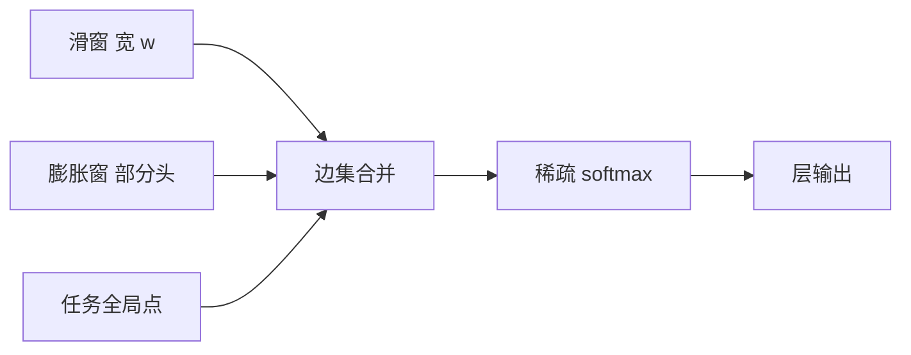

# Longformer 稀疏注意模式

    
每一层以滑窗为底盘，部分头做膨胀以扩大感受野；再只给任务指定的少数标记开全局通道。边集是设计出来的，不是学出来的。

    <footer>—— Beltagy, Peters & Cohan, Longformer: The Long-Document Transformer，arXiv:2004.05150，2020</footer>

Beltagy、Peters 与 Cohan 的 Longformer 要把预训练编码器从 512 词接到几千词的文档，关键不是新的打分函数，而是**注意力图的边集**。满注意力的 $n\times n$ 在文档长度上先爆显存；稀疏之后，谁看见谁必须写清楚，否则层叠的窗会留下盲区，任务需要的全局读又会被窗切断。本篇按原文把三种模式——滑窗、膨胀窗、全局点——如何拼成一张线性复杂度的图写完。任务驱动的续训与 LED 见 [Longformer](/llm/longformer)；图论对照见 [稀疏模式](/llm/sparse-attention-patterns)。

## 问题

自注意力默认是完全图：位置 $i$ 对 $1\ldots n$ 都有一条边。文档级 $n$ 到 4K，分数矩阵与中间激活按 $n^2$ 走，当时的 BERT/RoBERTa 只能截断。截断把答案留在窗外；滑窗集成没有层内的远程边，跨段指代要靠启发式。需要一张图，使：(1) 相邻 token 始终互相可见，以继承已经学好的短程句法；(2) 深度方向上感受野能覆盖整篇；(3) 分类符或问句这类「必须读全文」的位置有度数 $\Theta(n)$ 的通道；(4) 每层边数对 $n$ 线性，以便自定义核不必物化掩码矩阵。

边不能全靠内容学习——那会回到另一套动态 gather，2020 年的编码器续训也没有这条预算。Longformer 的选择是**确定稀疏**：窗宽、膨胀、全局位置都是超参与任务标注，训练只学投影权重，不学边。

### 感受野必须随层扩张，而不能指望单层满连接

一层宽度 $w$ 的对称窗，每个位置只看见半径 $w/2$。堆 $L$ 层，理论感受野约为 $L\cdot w$（不计膨胀）。$w=512$、$L=12$ 时已经可以跨过数千 token，前提是信息真能沿残差逐层传，而不是在某一层被局部噪声盖住。单层满连接没有这个问题，但也没有线性代价。膨胀把同一边数铺到更大半径，代价是隔掉的位置在该头上不可见，必须靠其它头或其它层补。

确定图与内容稀疏（Routing、LSH）的分工在这里就要划清：Longformer 不根据点积选边，问句之所以看见全文，是因为任务把那些位置标成了全局。换任务就要改标注，图不是模型自己发现的。

## 方法

### 滑窗

设窗宽为 $w$（偶数便于两侧对称）。编码器设定下，位置 $i$ 的可见集是 $\{i-w/2,\ldots,i+w/2\}$ 与序列边界的交。因果语言模型则只保留过去一侧。复杂度每层 $O(nwd)$。窗是底盘：所有层、所有头至少拥有这组局部边，避免表示变成袋模型。实现上不能先形成 $n\times n$ 再掩码——那只是把零乘得很快，显存仍按平方走。原文用自定义 CUDA 按带状模式计算，这是线性宣称成立的条件。

### 膨胀窗

膨胀窗在窗内插入空隙：可见位置变成 $i\pm 1, i\pm(1+d), i\pm(1+2d),\ldots$，直到大约 $w$ 条边用完。同一层的不同头可以取不同 $d$，有的头密看近邻，有的头稀看更远。这直接借自膨胀卷积：边数不变，理论半径变大。空隙中的 token 在该头上不相邻，依赖其它头的密窗或全局点中转。原文把膨胀主要用于深层，浅层保持密窗，以免一开始就把局部句法拆碎。

### 全局点

少量位置 $g_1,\ldots,g_G$ 被标成全局：每个 $g$ 看见全体位置，全体位置也看见每个 $g$。边数增加 $O(Gn)$，只要 $G$ 视为常数（CLS、问句 token、若干分隔符），总复杂度仍线性。分类任务通常只标 CLS；抽取式 QA 把问题侧全部标全局，使每个文档 token 都能直接读到问句，问句也能汇聚全文。全局点是**对称双向**的：不只是「CLS 读大家」，也包括「大家写 CLS」。少了后一半，全局通道就只是汇聚、不是广播。

三种模式在图上取并：位置 $i$ 的可见集是窗（或膨胀窗）并上全部全局点；若 $i$ 本身是全局点，可见集是全体。softmax 仍在各自的可见集上做，打分函数还是缩放点积，没有改核。

## 机制

滑窗提供局部全连接，信息沿深度做扩散：第 $\ell$ 层的有效上下文大约是半径 $\ell w/2$ 的金字塔。膨胀加速扩散，类似卷积里的空洞：同一深度可以跨过更远，但金字塔变得有孔。全局点把直径压到常数级——任意两点至多两跳，经由某个全局枢纽。这解释了为何 QA 必须把问句设为全局：否则问题与远离窗的证据只有经多层扩散才能相遇，而扩散在有损残差里不保证送达。

### 任务图与预训练图不是同一张

继续 MLM 时，图往往只有 CLS 一类少量全局点，窗宽扩到目标长度所需的局部覆盖。下游微调把问句标成全局，图的度数突变。模型要在微调里学会「这些新的度数为 $n$ 的通道」。若微调数据少、全局点又多，优化会把质量堆到全局通道上、局部窗被架空，或反过来从不使用全局边。原文用任务格式保证全局点在输入里语义明确（这是问句、这是 CLS），而不是让模型从随机位置里找枢纽。

LED 把同一套编码器稀疏图接到解码器上做长摘要。解码器自注意力仍可是因果满注意力（输出通常短）；交叉注意力的源长度等于编码器输出长度。编码器稀疏不等于交叉免费，但源侧可以先被线性图吃下。不要把 LED 写成「编解码两侧都线性且对称」。

## 边界与工程取舍

确定稀疏的代价是图与任务绑定。核心ference、摘要、分类、QA 的全局位置不同；做成通用解码器 LM 时，「哪些 token 该全局」没有自然答案——不能把每个生成步的当前 token 都标全局，那会回到平方。这也是 Longformer 停在编码器主场、而不是直接成为 GPT 类层规范的原因。膨胀在语言上不如在视觉卷积里直观：token 网格没有像素那种平移等变，过大的 $d$ 会切开短语。

窗宽 $w$ 是显存与局部质量的旋钮。$w$ 取 512 时，单层局部能力与 BERT 相当，线性项的常数很大；$w$ 取太小，即使堆层，浅层句法也会伤。自定义核的实现细节决定「线性」是真是假：PyTorch 稠密加掩码在 2020 年就能训一个「逻辑上稀疏」的模型，却训不出论文宣称的长度。复现必须核与图一致。随机边不在原文图里；那是 [BigBird](/llm/bigbird-theory) 为直径与理论完备性另加的一类边。把 Longformer 写成「窗加随机加全局」，是把两篇论文的图并成一张。

位置嵌入仍是绝对表。图改成 4K 之后，512 行的 RoBERTa 位置表要外插或复制。稀疏模式不自动解决长度外推：它只解决「4K 上算得动」。外推是另一条线（ALiBi、RoPE、YaRN）。

### 与满注意力可视化的差别

稀疏图上的注意力权重不能按稠密热图来读。窗外是结构零，不是分数低。全局点行与列会吸走大量质量，看起来像「模型只看 CLS」，其实是图强迫的枢纽交通。分析头功能时应把强制边与学到的窗内尖峰分开；否则会把任务标注误认成涌现出的全局头。

## 小结

- Longformer 的稀疏模式是滑窗底盘、可选膨胀、任务指定的全局点三者取并。
- 复杂度 $O(nwd+Gnd)$；$G$ 当常数时对 $n$ 线性，前提是不物化 $n\times n$。
- 全局点对称：枢纽读全体，全体也写枢纽；QA 标问句，分类标 CLS。
- 边集确定、不按内容选边；换任务就要改哪些位置是全局。
- 感受野靠深度与膨胀扩张；单层仍是局部的，除非该位置被标全局。
- 出处：Beltagy, Peters & Cohan，*Longformer: The Long-Document Transformer*，arXiv:2004.05150，2020。
