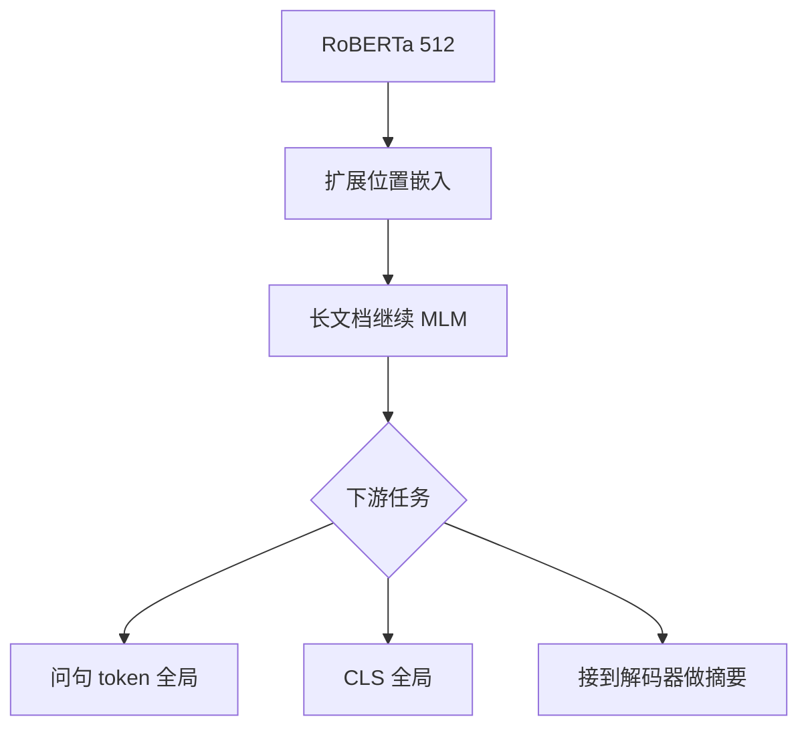

# Longformer

把滑窗当成每一层的底盘，再只给任务指定的少数标记开全局通道，编码器就能在线性代价上读几千 token 的文档。

<footer>—— Beltagy, Peters & Cohan, Longformer, 2020</footer>

BERT/RoBERTa 把长度钉在 512，不是因为文档只有 512 词，而是因为满注意力的显存。Beltagy、Peters 与 Cohan 的 Longformer 要做的是一篇**长文档编码器**（以及后来的编码器–解码器 LED）：从已经训好的短上下文检查点出发，改注意力图、继续 MLM，再接到分类、问答、核心与摘要。窗、膨胀、全局点如何拼成图，已经写在 [稀疏模式](/llm/sparse-attention-patterns)、[滑窗](/llm/sliding-window-attention)、[膨胀](/llm/dilated-attention)、[局部–全局](/llm/local-global-attention) 里，本篇不把那张图再讲一遍。这里写原文的问题设定、任务驱动的全局点、续训协议，以及它为何停在编码器主场。

## 问题

2018–2019 年的预训练编码器在句子和段落上很强，一到 WikiHop、TriviaQA 长文、整篇新闻或论文，就只能截断或滑窗再集成。截断丢答案；滑窗集成没有层内的全局通道，跨窗指代要靠启发式。需要一种与 RoBERTa 权重兼容的注意力替换：短句行为别塌，长文档算力按长度近似线性，并且**任务知道哪些 token 必须看见全文**（CLS、问句）。

这与「训练一个从零开始的超长解码器 LM」不是同一命题。Longformer 的成功标准是：在文档级基准上超过截断的 RoBERTa 与当时的层次化基线，并把可处理长度推到 4K 量级（LED 摘要更长），而不是在语言建模困惑度上打 Transformer-XL。

### 从 512 词的编码器出发

继续预训练的好处是：局部窗可以继承已经学好的短程句法，不必在长图上从随机初始化爬起。坏处是：位置嵌入只有 512 行，必须外插或复制才能到 4K；注意力图从满矩阵变成稀疏，训练动态会变。原文用继续 MLM 来适应新图和新位置，而不是声称「只改掩码就能零成本换长度」。任何复现若跳过续训、直接在 4K 上微调，比较的就不是论文方法。

全局点是任务输入的一部分，不是模型自己发现的记忆槽。换任务就要改哪些位置标成全局。这和后来可学习压缩槽、地标块不同：那些槽的位置由架构或内容决定，不由「这是问句 token」的标注决定。

## 方法

注意力图取稀疏模式专文中的 Longformer 配置：宽度为 $w$ 的滑窗提供局部边；部分头膨胀以同样边数覆盖更大半径；分类符或问句 token 设为全局，与所有位置互连。复杂度相对 $n$ 近线性，常数含 $w$ 与全局点数 $g$。实现上，当时用自定义 CUDA 以避免物化 $n\times n$ 掩码；用稠密核加掩码声称线性，只是把零算得很快，显存仍可能按 $n^2$ 走。

继续预训练：从 RoBERTa 初始化，在长文档上做 MLM，位置嵌入扩展到目标长度。下游：QA 把问题侧标全局，分类把 CLS 标全局，核心任务按标注习惯选择。LED 把同样的稀疏编码器接到解码器上做生成式摘要（arXiv 等长文），解码器侧仍需处理交叉注意力的源长度——编码器稀疏不等于解码交叉免费，但源长可以先被编码器吃下。

### 任务指定的全局点

全局点是这篇论文相对「只有滑窗」的编码器增量。没有它们，远距离只能靠层叠隐状态，文档级 QA 的问句无法在一层内对准任意证据。把问句设为全局，等于在图里加星形枢纽，枢纽的身份来自任务格式，训练稳定、实现确定。代价是：$g$ 随问句变长而变，过长的问句会把线性常数抬起来；而且枢纽是双向的，不能原样贴到因果解码器里——解码器里的「全局」通常只读过去，见局部–全局专文。

### 续训与 LED

LED 表明稀疏编码器可以进入 seq2seq，而不必先有一个从零训的长编码器。摘要任务的证据分散在全文，截断 512 会系统性丢章节。原文用这条线把「长文档」从理解任务扩到生成任务，但仍是文档输入、较短输出，不是聊天式无限生成。位置外插是否优雅，不是论文的理论贡献；它是续训能开始的工程前提，质量靠 MLM 与微调来补。

## 机制

机制上，Longformer 赌的是：文档任务的重要长程路径可以预先标出来。这个赌在 QA、分类、带明显任务前缀的输入上成立；在「不知道哪一句会成为枢纽」的纯语言建模上不成立——除非人为把某些位置标成全局，而 LM 没有 CLS。所以它没有试图替换 Transformer-XL 的记忆故事。膨胀头用来减少固定窗的盲区，属于模式设计，细节见膨胀专文；论文层面的主张是「确定图 + 任务枢纽 + 续训」这一配方。

与层次化 Transformer（先编码句子再编码文档）相比，Longformer 保持 token 级全局通路，不必先做句向量瓶颈。与满注意力长 Transformer 相比，它在 2020 年的 GPU 上能先跑起来。这两条对照构成原文的经验贡献。

线性是对 *编码器自注意力边数* 而言。下游若还有解码器对全体源位置的交叉注意力，端到端仍可能出现 $n_{\mathrm{tgt}}\times n_{\mathrm{src}}$。LED 的卖点是源可以很长且编码器先压住自注意力；交叉项要单独记账。

### 编码器主场的限度

双向全局与 BERT 式 MLM 绑定。因果 LLM 预训练很少采用「任务指定全局 token」，因为没有任务格式，也因为随机或指定的全局点与 Flash 内核、KV 缓存不和。今天解码器里出现的滑窗，多半更接近 Mistral 式每层局部，而不是 Longformer 的窗 + 膨胀 + CLS 星形。引用 Longformer 作为「现代长上下文 LLM 的来源」时，应缩小到「局部底盘」这一祖先，而不是整张图。

## 边界与工程取舍

主基准是文档 QA、分类、核心、长摘要，长度以千到数万 token 为工作区，不是百万级检索。自定义核增加了复现门槛；现在若用 Flash 加块稀疏掩码，常数与论文表格不必相同。全局点依赖正确的任务预处理：忘了把问句标全局，模型就退化成滑窗编码器，分数会掉，却看起来像「Longformer 不行」。

它不提供万能逼近证明——那是同年 BigBird 的理论部分。经验上两者常被并列，但 Longformer 的叙事是 *从 RoBERTa 出发的长文档应用*，BigBird 的叙事多一层 *稀疏仍通用*。不要用这篇去论证随机边或图灵完备。

位置嵌入从 512 拉到 4K 的方式（复制、插值、可学习外推）会显著影响续训是否稳。报告长度时写清位置如何扩展，否则别人无法复现你的 MLM loss 曲线。

## 小结

- Longformer 原文贡献是：用确定稀疏图加任务全局点，把预训练编码器接到长文档任务，并用继续 MLM 适应新长度。
- 图的零件见稀疏/滑窗/膨胀/混合专文；本文强调配方与任务枢纽，而不是再画一遍边。
- LED 把稀疏编码器送进 seq2seq 长摘要，交叉注意力仍要按源长记账。
- 全局点由预处理指定，换任务即换图；不是可学习记忆。
- 主场是双向文档模型，不是因果 LLM 服务栈。
- 实现须避免用稠密核假装线性。
- 出处：Beltagy, Peters & Cohan, *Longformer: The Long-Document Transformer*, 2020。
